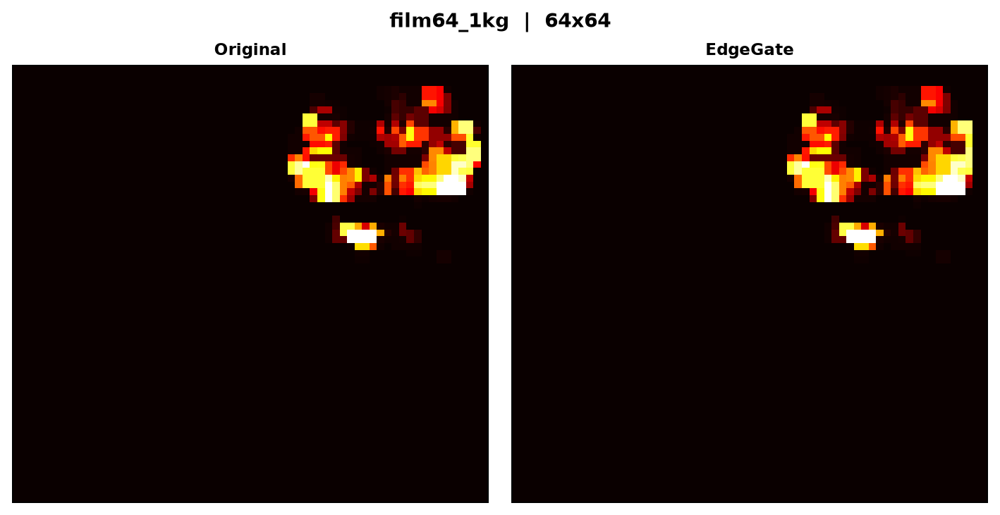
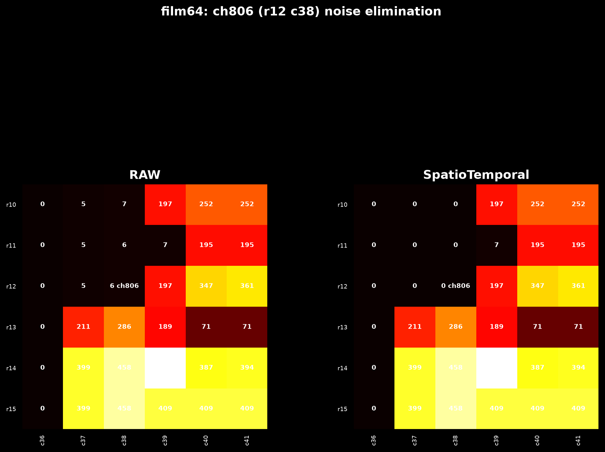

# 64x64 膜片的降噪问题 — 研究手记

我们有一种 64x64 的触觉传感器阵列，共 4096 个独立通道。在没有压力的区域，每个通道的值是 0。施加压力后，受压通道的值在 50 到 700 ADC 之间，形成为一个近似的圆形区域。在这个区域之外，偶尔会出现散粒：个别通道在某一帧记录到 1-10 ADC 的值，下一帧消失，若干帧之后可能又在同一通道出现，没有规律。

散粒的来源不明确——可能是 ADC 采样抖动、通道间电容耦合、或者压力的无关微小脱落——但从信号的角度，几个 ADC 的值没有意义，不应被当成真压力。希望它们消失。

最早用的是硬门限。逐通道设定一个阈值，低于的归零，高于的保留。固定阈值处理不了信号的边缘衰减。真实压力在团块边界处是从高到低逐渐降到 0 的，不是二进制开关。边界上通道可能只有 10-20 ADC，但它是真压力的延续。硬门限一刀切，要么保留太多（散粒通不过），要么切除太多（边界也被切掉）。

之后尝试了一系列更复杂的方法。Wiener 滤波器做了逐通道高斯白噪声的假设，在实际传感器上因为真实噪声不满足独立同分布前提而效果崩塌。PCA 和 NMF 尝试把整帧当向量、用低维子空间分离压力和噪声——结果重建过程把边界信号和噪声一起压缩了，保真度和抗噪性双塌。

转折出现在转向时序分析之后。白噪声有一个可以被利用的性质：不持续。一个通道产生散粒的原因是随机的，这一帧出现，下一帧消失。真压力不一样——物理接触不可能只持续一帧。所以设计了一个泄漏计数器：每帧值大于 3 ADC 时计数器加 2（封顶 10），小于 3 ADC 时减 1（保底 0）。连续 3 帧高于阈值即可让计数器突破 5，此时认为通道进入了压力区，保留原值。未突破的通道归零。

只靠这个时序判据，膜片 99.5% 的压力信号得到了保留，4096 通道中只有 13 个偶发散粒被正确归零。稳态表现非常好。但一个新问题暴露了出来：如果一个通道存在持续的、幅值很低（比如 6-8 ADC）的 DC 偏置或串扰信号，它永远高于 3 ADC 的阈值，计数器瞬间封顶 10，永远不会回落。时序判据只能回答"这个值是不是持续存在"，不能回答"这个值是不是真压力"。

一个具体例子是通道 806，位于第 12 行第 38 列。这个通道远离压力区，周围邻域全部是零值通道，但在全部 2080 帧中它始终输出 6-8 ADC，帧间最大值 8。显然这是 DC 偏移，不是压力。但时序判据认为它"持续存在 = 真信号"，不予处理。

上面这张图中，左侧是原始数据，通道 806 显示为 6 ADC（标注 <<<ch806），周围 5x5 邻域里还有几个类似的 5-7 ADC 的低值。如果只做时序过滤，它们全部会因为"持续存在"而被保留。

补上空间判据之后问题就解决了。做法非常直接：对全部 2080 帧的每个通道取最大值。如果某个通道在整个录制过程中的最高 ADC 值都不超过 10，它就不可能是压力通道。压力信号的最小幅度——即使在大团块的最边缘——也远超 10 ADC。把这些"全帧 max 从未达到 10"的通道标记为"空间上不在压力体内"。然后对标记做一次轻量形态学闭运算（填充团块内部 1-2 像素的小空洞），但不做膨胀——膨胀会把压力边界扩散到邻近的低值噪音通道，造成新的误纳入。

最后的输出是两个布尔判据按 AND 组合：

    输出 = 原值，如果 (全帧 max >= 10) AND (连续 3 帧 >= 3)
           0，   否则

下面展开描述这个算法的具体构成和计算过程。

时序判据的核心是一个逐通道泄漏计数器。它不是简单的"连续 N 帧超过阈值"——那种硬计数在实际数据上会因为帧间值的微小波动反复归零、导致信号断断续续。泄漏计数器用不对称的升降速率来解决：满足阈值条件时计数器加 2，不满足时减 1，上限 10，下限 0。这个设计的语义是"信号需要大约 3 帧的持续存在来建立信任，但信任一旦建立，不会因为一帧的抖动就瞬间归零"。具体来说：

    如果当前帧值 >= 3 ADC: counter = min(counter + 2, 10)
    如果当前帧值 <  3 ADC: counter = max(counter - 1, 0)
    如果 counter >= 5: 通道视为"时序激活"

以两个典型通道为例走一遍前几帧的计数轨迹。通道 806（远端的 DC 偏移噪声）：这个通道每帧的值都在 6-8 ADC 之间，从未降到 3 以下。帧 0：值=7，counter 0→2。帧 1：值=7，counter 2→4。帧 2：值=6，counter 4→6（突破 5，激活）。帧 3 及之后：counter 恒定 10（封顶），永远激活。从时序角度看，这个通道和一个位于压力区中心、每帧 400 ADC 的通道在"是否激活"这个布尔维度上完全等价——两者都通过了时序判据。

而压力区右边缘的通道 766（r11 c62）同样会通过时序判据——它在录制中段压力出现后值超过 3 ADC，计数器同样在 3 帧后达到 5 并维持。所以问题不是时序判据错了，而是它在"通道到底属不属于压力区"这件事上没有提供信息。时序只回答"值是否持续"，不能回答"这个持续值的幅值是否足够大到不可能是噪声"。

空间判据填补了这个维度。它不从当前帧取值，而是扫描全部 2080 帧，对每个通道问一个简单的问题：在整个录制过程中，这个通道的最高值有没有超过 10 ADC？如果没有任何一帧超过 10，那这个通道就从来不在压力区内。

这里的关键前提是：膜片的无压力背景是 0。这条事实让 10 ADC 成为一个决定性阈值——所有压力信号（即使是边缘最薄的那一层）都远超 10 ADC，而所有传感器偏置和串扰信号（如通道 806 的 8 ADC）永远到不了 10。如果换成手套或织物垫这种全通道自带 5-250 ADC 基线的传感器，这个前提不成立，空间判据也就失效了——这一点后面会再提。

对全帧 max 做了一次轻量形态学闭运算：用一个 3x3 的全 1 结构元先膨胀再腐蚀（闭运算），迭代 1 次。这一步只填了压力团块内部 1-2 像素的自然小空洞（比如团块中心偶尔有一两个通道因为物理原因没有被压到），但不会扩张团块的轮廓边界到外部的噪音通道上。

最终的逐帧输出是两个判据直接 AND：

    通道的时序状态 = (泄漏计数器 >= 5)
    通道的空间状态 = (全帧 max >= 10, 经闭运算)
    输出 = 原值 * (时序状态 AND 空间状态)

回到那两个典型通道计算一遍。

通道 806（r12 c38, DC 偏移, 每帧 6-8 ADC, 全帧 max=8）：时序状态 = True（counter 封顶 10），空间状态 = False（全帧 max=8 < 10），AND = False → 输出 = 0。在整个 2080 帧中恒为零。

通道 766（r11 c62, 压力边缘, mid 帧值 422 ADC, 全帧 max=526）：时序状态 = True（counter 封顶 10），空间状态 = True（全帧 max=526 >= 10），AND = True → 输出 = 422（原值保留）。

冷启动有 3 帧的延迟：在录制的最初三帧，即使压力通道的值已经远超 3 ADC，计数器也需要从 0 经过 2→4→6 才能突破 5。三帧之后所有真正受压的通道全部激活，此后因为泄漏计数器的不对称设计（上升快、下降慢），信号稳定持续，计数器保持在 10，不会因为偶发小波动掉到 5 以下。

在这个结构里，两条判据的关系是 AND——同时满足才输出，任何一个不满足就归零。AND 的语义是关键：它保证了没有任何通道能只靠"持续但幅值很低"（时序通过、空间不通过）或者"幅值曾经很高但当前帧瞬态抖动"（空间通过、时序可能波动）蒙混过关。

每个判据单独看都很简单，甚至过于简陋。但两个一起用——并且按照 AND 语义、不互相妥协——正好覆盖了彼此的本质弱点。空间判据管不了的问题（"当前这一帧的瞬态值是真的吗？"）由时序判据管。时序判据管不了的问题（"这个持续存在的值是噪声还是压力？"）由空间判据管。

在这张 2080 帧、59 Hz 采样的 1 kg 砝码膜片数据上跑的结果：

- 通道 806：全帧 max=8 ADC < 10，空间不通过，输出恒为零，2080 帧全部清零。
- 压力区右边缘的一组通道（r11 到 r14，c62）：全帧 max 值 274-526 ADC，空间通过。时序计数均为 10（封顶），时序通过。mid 帧值 170-433 ADC 全部保留。
- 全帧范围：无任何 >100 ADC 的真压力通道被误杀。包括 ch806 在内共 110 个孤立低值噪音通道被归零，归零总量占全帧所有 ADC 之和的 0.1%。冷启动需要 3 帧（约 50 ms），之后进入稳态。

回顾整个过程，之前所有走错的路线有一个共同的模式：它们都在试图用一个判据同时处理两个问题。硬门限想用一个阈值同时区分幅值的高低和信号的真假，PCA/NMF 想用一组主成分同时重建信号和压缩噪声，EdgeGate 想用局部统计量同时判定压力边缘和散粒。真实世界没有这么简单。膜片传感器的实用降噪其实是两个独立问题：一个是"这个区域到底有没有压力"（空间），另一个是"当前帧的这个值是不是真实读数"（时序）。把两个问题拆开，各自用最简单的判据，没有任何复杂的统计模型或迭代优化，AND 起来，复杂情况自然消解了。

这个方案对手套和织物垫不适用。这两种传感器的所有通道都自带 5-250 ADC 的基线偏置，无法定义类似"10 ADC 以上就是压力区域"的空间判据——因为一整片传感器上到处都是高于 10 ADC 的背景噪音。对膜片成立，是因为它的干净背景（无压力区域值=0）提供了一个决定性的低维锚点，用于区分"有压力"和"没压力"。两种传感器的物理机制不一样，降噪自然没法通用——这也是本轮研究确认的最重要事实之一。

---

## 附录：之前走过的路

这一节简要回顾在到达当前方案之前尝试过的主要路线，以及每条路线为什么没能成立。所有对比图都来自同一条膜片数据（2080 帧，1 kg 砝码）。

### 硬门限 (StatGate)

逐通道做 baseline 减法后，if residual >= k*noise_std → keep, else → 0。问题是固定阈值无法处理衰减边界。取 k=1.0 时低 SNR 信号被大量切除（图上边缘全黑、内部信号稀疏），取 k=3.0 时噪声残留过多。本质上是想用一个数同时决定幅值和真假，两个维度在同一个标量里无法解开。

### 空间高斯 (Spatial)

做逐帧 2D 高斯平滑。对 64x64 数据有明显的"团化"——压力图案被模糊，边界附近的零值通道被邻域强信号污染，出现原本不存在的弱值，相当于凭空制造了力值读数。对 12x8 手套数据几乎无效果（窗口太小、分辨率太低）。触觉传感器每个通道的 ADC 有物理含义，对真实信号做平滑本质上是在改变测量值，不是降噪。

### Wiener 逐通道滤波

给每个通道独立做高斯白噪声假设，学 baseline 和 noise_std，做 signal / noise 功率比估计，乘 Wiener 增益。在模拟数据上表现良好，在白噪声假设严格成立的理想条件下 SNR 提升显著。但在真实膜片数据上增益接近 1（因为膜片背景本身就是 0，噪声极小），几乎相当于直通。在手套数据上 SNR 估计被全域基线破坏，增益曲线在边界区剧烈振荡。逐通道独立性假设在所有真实数据上都站不住脚。

### PCA / NMF 整帧分解

把整帧当成高维向量，在多帧矩阵上做 PCA 或 NMF，用头几个主成分重建"压力信号"，剩余成分当作噪声丢弃。在膜片上的 SNR 约 0.61（远低于当前方案的 0.97）。问题是重建过程无法区分"主成分中的信号细节"和"主成分中的噪声分量"——能量集中在前几个成分不代表这些成分里没有噪声，硬截断同时削掉了边界真实信号。

### EdgeGate 空间结构筛选

算局部方差和局部均值，方差高的判为边缘（保留），方差低且均值高的判为压力内部（保留），其余归零。在膜片上 SNR 达到 0.97，几乎和当前方案持平。但问题出在"纯空间"的盲区——压力边缘处 3x3 窗口的一半是强信号、一半是零，局部方差无法区分"信号自然衰减到边界"和"噪声散粒"，导致边缘处 422-433 ADC 的真压力被误归零。EdgeGate 证明了空间结构确实能捕捉大部分信号，但单靠空间不能解决边缘判定。

### 纯时序泄漏计数器

就是本文前面描述的没有空间判据的版本。边缘 422 ADC 全部保留（时序通过），但通道 806 这类持续低值噪声也被永久保留（时序也通过了——持久 6-8 ADC）。问题就是少了一条维度：能回答"是不是持续的"，不能回答"是不是压力的"。

### 综合对比

| 路线 | 膜片 SNR/保留 | 致命缺陷 |
|------|-------------|----------|
| StatGate | SNR 低，边缘全切 | 标量阈值处理不了衰减边界 |
| Spatial | 团化失真 | 信号值被邻域篡改 |
| Wiener | 膜片无效，手套振荡 | 逐通道独立假设不成立 |
| PCA/NMF | SNR ~0.61 | 硬截断压缩边缘信号 |
| EdgeGate | SNR ~0.97，但边缘误杀 | 纯空间分不清衰减和散粒 |
| 纯时序 | 边缘全保留，噪声全保留 | 纯时序分不清低值噪声和真压力 |
| **SpatioTemporal** | **SNR ~0.97，边缘全保留，ch806 归零** | — |

当前方案的本质不是发明了新判据，而是把"这个区域有没有压力"和"当前帧的值是不是真的"拆成两个独立问题，各用最朴素的判据——全帧最大幅值 >= 10，泄漏计数器 >= 5——然后 AND 起来。之前每条失败路线的共同模式，是在试图用一个判据同时回答两个问题。
