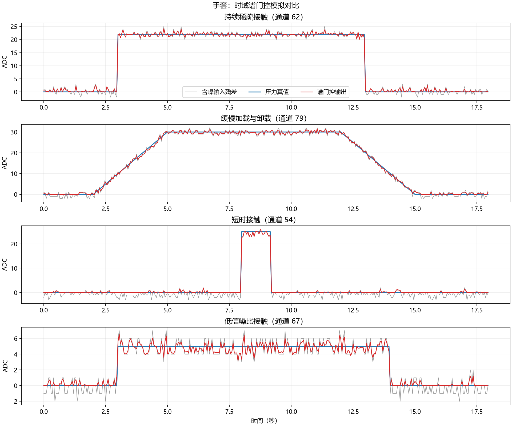
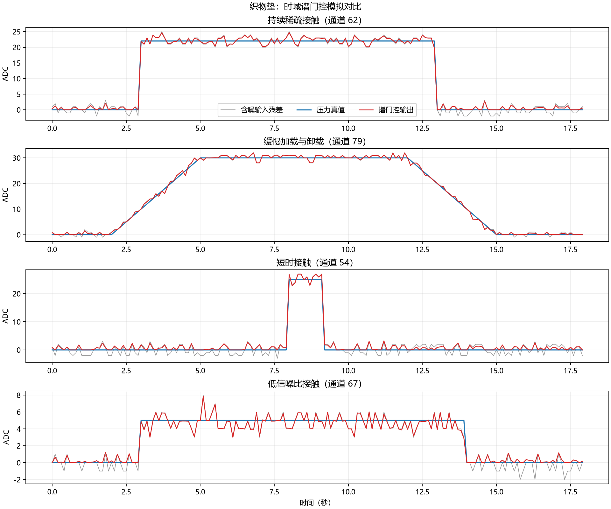
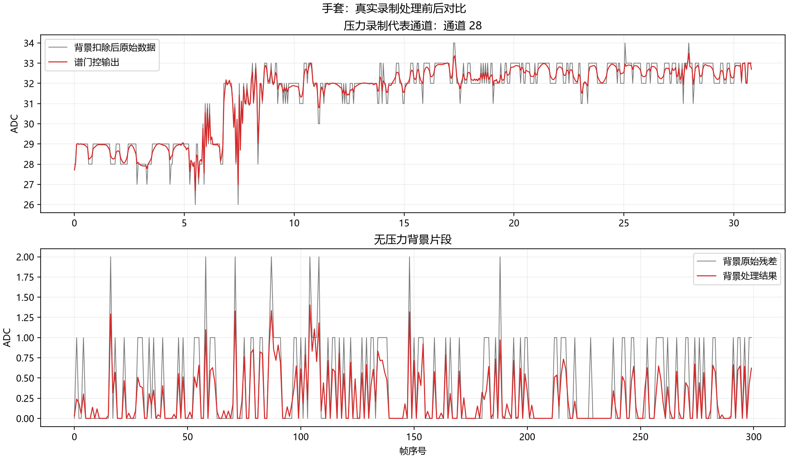
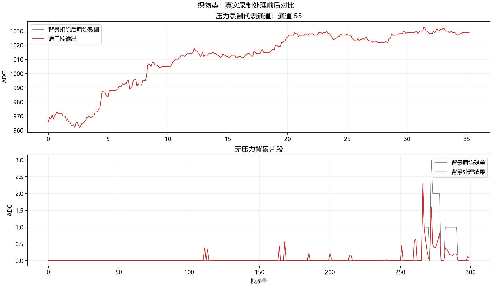
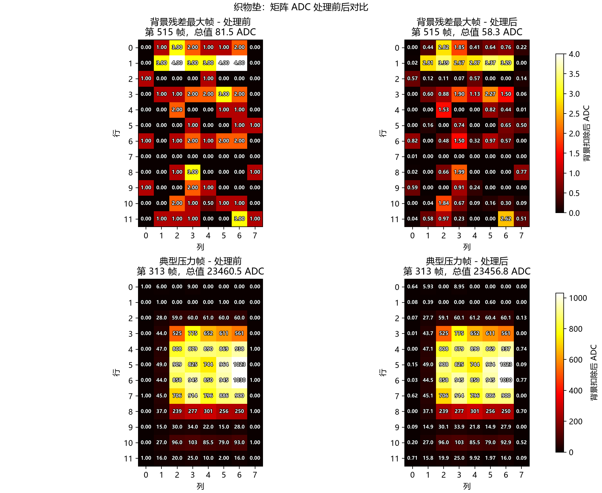
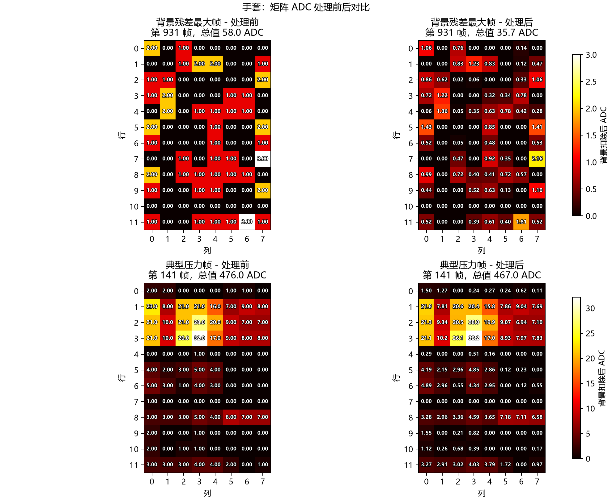

# beta2 stage1 研究设计与实验记录

## 1. 目标

验证类似音频谱降噪的方法能否在不依赖二维物理邻接的条件下，抑制手套和织物垫的随机白噪声，并保持持续、渐变和短时压力信号。

## 2. 问题是如何一步步收敛的

这里记录的是可复核的工程推导，不把“用了频域算法”直接当作结论。

### 2.1 第一步：先区分碳膜噪声和织物噪声

碳膜的主要问题是受力团块边缘出现零散小值，其特征偏向空间孤岛或边缘毛刺，因此可以利用矩阵邻域和连通区域。

手套与织物垫不同：没有受力时，各通道也会持续出现小幅随机跳动；受力后，同一通道的压力通常持续多个采样点。这里最稳定的判别信息不是“相邻 Cell 是否一起变大”，而是“某个 Cell 的变化在时间上是否具有持续结构”。因此 beta2 不继续把空间边缘检测作为织物类的主算法。

### 2.2 第二步：排除统一 ADC 硬阈值

如果直接使用“ADC 小于 10 就归零”，至少会遇到三个问题：

1. 手套和织物垫的通道基线不同，织物垫部分通道背景中位数远高于 10。
2. 同一设备内不同通道的背景水平也不同，统一阈值会对某些通道过强、对另一些通道过弱。
3. 低幅真实接触可能与噪声幅值重叠，硬阈值会把需要保留的信号直接删除。

所以第一项必要操作不是门限，而是为每个通道分别估计背景基线和噪声统计。

### 2.3 第三步：为什么不只做移动平均

移动平均确实可以压低白噪声，但它把所有变化一视同仁：窗口越长，噪声越平滑，同时压力上升沿、下降沿和短接触也越迟钝。手套为 20 Hz、织物垫为 10 Hz，若固定使用相同帧数，两个设备还会产生不同的实际时间延迟。

需要的是一种能够区分“随机快速成分”和“持续压力成分”的软处理方式，而不是对整个时序使用相同强度的低通平滑。

### 2.4 第四步：为什么转到短时频谱

在一个有限时间窗内，随机白噪声的能量会分散到较多频点；持续压力、缓慢加载和稳定接触则会在低频或少数稳定频点上形成更高的局部信噪比。短时傅里叶变换可以把每个通道的时间序列拆成“时间窗 × 频率”，然后针对每个时间频点决定保留多少，而不是整段统一平滑。

这里使用短时频谱并不表示触觉信号与音频完全相同，只是借用了音频降噪中可迁移的部分：先从纯背景学习噪声功率谱，再对观测信号做软增益估计。

### 2.5 第五步：为什么使用软 Wiener 型增益

硬频谱门限会把低于阈值的频点直接置零，容易产生断裂、伪峰和窗间不连续。Wiener 型增益来自最小均方误差估计：噪声占比高时增益接近 0，信号占比高时增益接近 1，中间区域连续过渡。这比“保留/删除”的二值判断更适合当前低幅压力可能与噪声重叠的问题。

### 2.6 第六步：如何验证不是只把曲线画平滑

验证分成两层：

1. 模拟数据使用已知压力真值，检查 RMSE、信号保持率、背景抑制和峰值保持。
2. 真实数据同时画时序曲线和 12×8 Cell 矩阵。时序图检查压力动态是否被改变，矩阵图检查客户实际看到的每个 Cell 在处理前后发生了什么。

## 3. 数据观察

| 设备 | 背景帧数 | 采样率 | 逐通道背景中位数 | 典型 MAD |
|---|---:|---:|---:|---:|
| 手套 | 1833 | 20 Hz | 3 ADC | 1.48 ADC |
| 织物垫 | 542 | 10 Hz | 12 ADC | 1.48 ADC |

织物垫存在明显的通道间基线差异，不能用统一 ADC 阈值处理；两类设备的帧间变化幅度都远小于稳定压力段的持续变化。

## 4. 数学模型与公式推导

### 4.1 观测模型

对通道 `c`、采样时刻 `t`，把原始 ADC 写成：

$$
y_c[t] = b_c + s_c[t] + n_c[t]
$$

其中：

- $y_c[t]$：实际采集到的 ADC；
- $b_c$：该通道稳定背景基线；
- $s_c[t]$：希望保留的压力信号；
- $n_c[t]$：随机噪声。

目标不是直接预测力值，而是从 $y_c[t]$ 中估计非负的压力残差 $s_c[t]$。

### 4.2 背景基线为什么取中位数

使用纯背景录制，对每个通道计算：

$$
\hat b_c = \operatorname{median}_t(y_c^{bg}[t])
$$

随后得到背景残差和待处理残差：

$$
n_c^{bg}[t] = y_c^{bg}[t] - \hat b_c
$$

$$
x_c[t] = y_c[t] - \hat b_c
$$

选择中位数而不是均值，是因为背景录制中可能存在少量偶发尖峰；中位数不容易被这些异常值拉偏。残差保留正负两侧，避免在频谱分析前先做非负截断而引入额外直流分量。

### 4.3 按采样率定义时间窗

窗长使用秒定义，再换算成帧数：

$$
L = \operatorname{round}(1.6 f_s)
$$

因此手套在 20 Hz 下使用约 32 帧，织物垫在 10 Hz 下使用约 16 帧。重叠率为 75%，步长为：

$$
H = L(1-0.75)
$$

这样两个设备使用的是相同实际时间尺度，而不是相同帧数。Hann 窗用于减小每个分帧边界带来的频谱泄漏，高重叠用于降低重建时的窗间跳变。

### 4.4 从背景得到噪声功率谱

对背景残差执行短时傅里叶变换：

$$
N_c(k,m) = \operatorname{STFT}\{n_c^{bg}[t]\}
$$

其中 $k$ 是频率索引，$m$ 是时间窗索引。对应的噪声功率为 $|N_c(k,m)|^2$。每个通道、每个频点的噪声功率谱估计为：

$$
\hat\Phi_{n,c}(k) = \operatorname{median}_m |N_c(k,m)|^2
$$

仍然使用中位数，是为了降低偶发背景尖峰对整个噪声模型的影响。代码还设置了极小正数下限，避免某个频点功率为 0 时发生除零。

### 4.5 从最小均方误差推到 Wiener 增益

对待处理残差做短时傅里叶变换：

$$
X_c(k,m) = S_c(k,m) + N_c(k,m)
$$

用一个实数增益 $G_c(k,m)$ 估计干净信号：

$$
\hat S_c(k,m) = G_c(k,m)X_c(k,m)
$$

如果要求均方误差

$$
E\left[|S_c-G_cX_c|^2\right]
$$

最小，在信号与噪声不相关的假设下，可得到经典 Wiener 增益：

$$
G_c(k,m) = \frac{\Phi_{s,c}(k,m)}{\Phi_{s,c}(k,m)+\Phi_{n,c}(k)}
$$

实际中不知道信号功率 $\Phi_s$，只能从观测功率减去背景噪声功率进行估计。先定义后验信噪比：

$$
\gamma_c(k,m) = \frac{|X_c(k,m)|^2}{\hat\Phi_{n,c}(k)}
$$

再使用过减系数 $\alpha$ 估计先验信噪比：

$$
\xi_c(k,m) = \max(\gamma_c(k,m)-\alpha, 0)
$$

当前 $\alpha=1.0$，表示先减去一份背景噪声功率。代回 Wiener 形式：

$$
G_c(k,m) = \frac{\xi_c(k,m)}{\xi_c(k,m)+1}
$$

当观测功率接近背景噪声功率时，$\xi$ 接近 0，增益下降；当压力信号明显强于噪声时，$\xi$ 变大，增益接近 1。这个公式正是从“背景噪声有可学习功率谱”与“希望最小化重建均方误差”两项条件推导出来的。

### 4.6 为什么还要增益下限和幂次整形

直接使用 $G$ 可能对低 SNR 频点衰减过强，因此实际增益为：

$$
\tilde G_c(k,m)=\max(G_c(k,m),G_{min})^p
$$

当前参数为：

$$
G_{min}=0.08, \qquad p=0.7
$$

$G_{min}$ 避免频点被完全挖空，$p<1$ 会把 0 到 1 之间的增益向上抬，使处理更保守、更偏向信号保持。代价是低 SNR 噪声也可能被保留，这正是本轮低 SNR 峰值偏大的来源之一。

### 4.7 重建与非负约束

处理后的频谱为：

$$
\hat S_c(k,m)=\tilde G_c(k,m)X_c(k,m)
$$

通过逆短时傅里叶变换恢复时序：

$$
\hat s_c[t]=\operatorname{ISTFT}\{\hat S_c(k,m)\}
$$

最终输出：

$$
s_c^{out}[t]=\max(\hat s_c[t],0)
$$

因为当前研究对象是相对背景增加的压力 ADC，负残差不作为有效压力输出。

### 4.8 算法完整流程

TemporalSpectralGate 分为背景分析和压力处理两步：

1. 对每个通道计算背景中位数并得到有正有负的背景残差。
2. 按采样率把 1.6 秒换算为窗长，使用 Hann 窗和 75% 重叠执行短时傅里叶变换。
3. 以背景频谱功率的时间中位数作为逐通道噪声功率谱。
4. 对待处理数据计算后验信噪比，使用软 Wiener 型增益抑制接近噪声谱的成分。
5. 逆变换并恢复原长度，最后只保留非负压力残差。

该方法不读取行列坐标。通道之间共享窗长、重叠率和增益规则，但保留各自的背景基线与噪声谱。

## 5. 模拟实验

每个设备均使用真实背景残差重采样，并叠加五类已知压力真值。

| 设备 | 工况 | RMSE | SRR | BNSR | 峰值保持 |
|---|---|---:|---:|---:|---:|
| 手套 | 持续稀疏接触 | 0.441 | 0.999 | 7.18 dB | 1.097 |
| 手套 | 渐变接触 | 0.452 | 1.001 | 7.00 dB | 1.052 |
| 手套 | 短接触 | 0.444 | 0.955 | 7.02 dB | 1.036 |
| 手套 | 重叠接触 | 0.453 | 1.005 | 7.04 dB | 1.073 |
| 手套 | 低 SNR | 0.446 | 0.901 | 7.07 dB | 1.305 |
| 织物垫 | 持续稀疏接触 | 0.655 | 1.019 | 4.93 dB | 1.122 |
| 织物垫 | 渐变接触 | 0.673 | 1.026 | 4.60 dB | 1.065 |
| 织物垫 | 短接触 | 0.644 | 1.035 | 4.72 dB | 1.077 |
| 织物垫 | 重叠接触 | 0.674 | 1.011 | 4.79 dB | 1.042 |
| 织物垫 | 低 SNR | 0.669 | 0.985 | 4.90 dB | 1.575 |

### 5.1 手套模拟时序图怎么读

这张图有四行，每行对应一种模拟工况。横轴是时间，纵轴是已经减去逐通道背景中位数后的 ADC 残差。每行自动选择该工况中真值峰值最大的通道，因此四行不一定是同一个 Cell。

- 灰线 `Noisy residual`：人工压力真值叠加真实手套背景残差，是算法实际接收到的含噪输入。
- 蓝线 `Ground truth`：构造模拟数据时已知的干净压力真值，只在模拟实验中存在。
- 红线 `Spectral gate`：TemporalSpectralGate 的输出。

四行从上到下分别表示：

1. `sparse_steady`：持续稳定接触，用来检查算法是否把长时间恒定压力误当成基线删除。
2. `slow_ramp`：缓慢加载和卸载，用来检查上升沿、平台和下降沿是否被移动或压缩。
3. `short_contacts`：短时接触，用来检查 1.6 秒分帧是否会吞掉短脉冲。
4. `low_snr`：压力只有 3 至 5 ADC，用来检查真实信号与背景噪声幅值重叠时是否仍能区分。

判断原则不是只看红线是否平滑，而是看红线是否贴近蓝线，同时远离灰线中的随机抖动。手套前三类常规场景基本满足这一点；低 SNR 行的红线仍会被残余噪声抬高，对应峰值保持率 1.305。

表格中的 `overlap_contacts` 也参与了量化计算，只是为了保持图片可读性没有再增加第五行。

### 5.2 织物垫模拟时序图怎么读

颜色、坐标和选通道规则与手套模拟图完全相同，但噪声来自织物垫自己的真实背景录制，采样率为 10 Hz，1.6 秒窗对应约 16 帧。

持续、渐变、短接触和重叠接触的 SRR 为 1.011 至 1.035，说明主要压力能量没有被明显削弱。低 SNR 工况虽然 SRR 为 0.985，但峰值保持率达到 1.575，表示总能量接近真值并不等于每一个瞬时峰值都正确：部分背景随机成分可能与真值叠加形成伪峰。这也是下一阶段不能只优化 SRR、必须单独约束峰值的原因。

## 6. 真实数据实验

| 设备 | 背景抑制 | 压力能量相对保持 | 压力峰值相对保持 |
|---|---:|---:|---:|
| 手套 | 4.18 dB | 0.994 | 0.960 |
| 织物垫 | 3.12 dB | 1.000 | 1.000 |

### 6.1 手套真实时序图怎么读

上半图从压力录制中选择平均残差最大的通道：

- 灰线是减去背景中位数后的原始压力残差；
- 红线是算法输出；
- 横轴是秒，纵轴是 ADC。

这部分用于检查真实压力主曲线是否被整体压低、延迟或产生额外振荡。下半图使用同一个通道，展示背景录制前 300 帧的处理前后结果，用于检查没有压力时的随机跳动是否下降。

真实数据没有蓝色真值线，所以这里只能确认“输出相对原始压力没有明显改变”和“背景抖动有所降低”，不能证明灰线中的每一个小值究竟是噪声还是真压力。

### 6.2 织物垫真实时序图怎么读

选通道和颜色规则与手套真实时序图相同。上半图的压力 ADC 远高于背景噪声，因此灰线和红线几乎重合，这说明算法在高信噪比区域的增益接近 1，没有为了追求背景平滑而压缩主要压力。下半图用于观察同一通道在无压力背景中的残余跳动。

这张图只展示一个代表通道，不能代替完整 12×8 矩阵检查，因此还需要下面的 Cell 热力图。

### 6.3 织物垫矩阵图怎么读

矩阵图为 2 行 × 2 列：左列是处理前，右列是处理后。

- 上排 `Worst background frame`：从背景录制中选择所有 Cell 残差总和最大的帧，相当于主动选择最不利的背景时刻。
- 下排 `Representative pressure frame`：选择压力帧总值最接近第 90 百分位的帧，避免只取绝对最大值造成偶发尖峰偏差，同时仍代表明显受力状态。
- 每一个 Cell 中的白色数字是该 Cell 的背景扣除后 ADC 值。数字使用白色并带黑色细描边，使低 ADC 的深色区域和高 ADC 的亮色区域都尽量可读。
- 同一排处理前后共用完全相同的 `vmin/vmax` 色标，所以左右颜色可以直接比较；背景排和压力排使用各自色标，因为两者幅值相差数百倍。

上排总值从 81.50 降至 58.29 ADC，可以逐 Cell 查看哪些小值被压低、哪些仍然残留。下排总值从 23460.50 变为 23456.78 ADC，主要高压 Cell 的数字基本不变，说明高信噪比压力没有被明显削弱。

图中的 12×8 排列只用于还原客户看到的矩阵显示，算法本身没有读取相邻 Cell，也没有利用这张图中的空间关系。

### 6.4 手套矩阵图怎么读

结构、选帧规则、共享色标和白色 Cell ADC 数字与织物垫矩阵图相同。它的作用是检查手套全部 96 个通道，而不是只依赖真实时序图中选出的一个代表通道。手套与织物垫使用同一绘图口径，才能比较算法在不同背景基线和采样率下是否表现一致。

由于通道编号不一定对应手套上的真实几何邻接，这张图不能用于证明压力团块形状正确；它只能证明每个编号 Cell 的数值在处理前后如何变化。

真实压力录制没有干净真值，上表只能证明算法没有明显改变相对原始压力能量，不能证明所有低幅压力都被正确保留。

## 7. 阶段结论

1. 音频式噪声谱学习路线成立，明显优于 beta1 中对织物类信号造成大幅能量损失的重建路线。
2. 常规模拟场景的 SRR 全部位于 0.955 至 1.035，背景抑制为 4.60 至 7.18 dB。
3. 低 SNR 场景的峰值保持率达到 1.305 和 1.575，超过目标上限，当前版本不能作为最终算法。
4. 通道任意重排后的输出在恢复原顺序后数值一致，验证了算法不依赖二维通道邻接。
5. stage2 应增加跨时间频点的增益平滑或伪峰约束，并设计因果在线版本。
