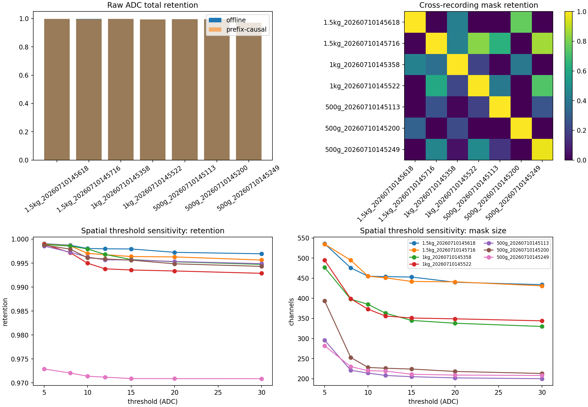
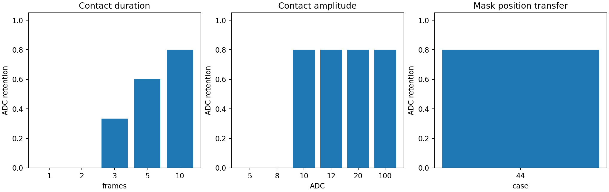

# 64×64 膜片算法与真实数据合理性评估

> 评估日期：2026-07-13  
> 对象：beta1 stage2 的 `SpatioTemporal` 时空门控  
> 结论性质：研究审计，不修改主程序，不构成产品验收

## 1. 结论摘要

当前算法可以作为“单条、固定位置、持续受压录制的离线清理基线”，但不能作为通用实时降噪算法。

在七条现有压力录制上，同一条录制生成并应用自身空间掩膜时，原始 ADC 总值保持率为 0.9714–0.9980。六条录制的 `>=100 ADC` 高值保持率约为 0.999，第三条 500g 录制仅为 0.9733，因此“高值压力无丢失”不被本次复核支持。

更关键的是，空间掩膜由整段录制的逐通道最大值生成，使用了未来帧。它属于离线 oracle，而不是因果在线算法。将某条录制的掩膜应用于其他录制时，非同录制组合的总值保持率平均仅 0.2323，最低为 0，多组接触被完全删除。

因此建议将原结论由“膜片算法已解决/已形成可用算法”修正为：

> 当前七条稳定、长时间、固定位置受压数据上的离线基线成立；在线、新位置、短接触、移动接触、低压力、跨设备及真实压力无损均未通过验证。

## 2. 被评估算法

空间门控：

```text
spatial_mask = max(raw over all frames) >= 10 ADC
spatial_mask = 3×3 binary closing(spatial_mask)
```

时序门控：

```text
value >= 3 ADC  → counter +2
value < 3 ADC   → counter -1
counter >= 5    → active
output = raw × spatial_mask × active
```

算法保留通过门控的原始 ADC，不执行幅值平滑。其优势是不会主动压缩已通过门控的样本；其主要风险是二元判决会把未通过的真实接触直接置零。

## 3. 真实数据合理性

### 3.1 数据构成

现有数据包括七条压力录制：500g 三条、1kg 两条、1.5kg 两条；压力录制约 31–39 秒，采样率约 52.6–58.8 Hz。另有一条 67 帧、2 Hz、全零背景录制。

压力数据从首帧到末帧均处于受压状态，没有完整的“稳定背景—加载—保持—释放—恢复”过程，也没有同步测力计、加载机构位置或接触真值。因此它适合检查处理前后原始 ADC 的相对变化，不足以证明噪声与真实压力被正确分类。

同载荷重复录制差异明显。例如 500g 三条录制的帧总值大致分布在 3.66–6.37 万 ADC，1kg 两条约为 6.80–11.57 万 ADC。载荷质量与 ADC 总值不呈稳定一一对应关系，可能受接触位置、受力面积、放置姿态、膜片迟滞和设备状态影响。因此不能把砝码标签直接作为逐像素或总 ADC 真值。

### 3.2 同录制离线结果

| 指标 | 七条数据范围 | 可以说明什么 |
|---|---:|---|
| 原始 ADC 总值保持率 | 0.9714–0.9980 | 对当前固定接触录制改动较小 |
| `>=100 ADC` 高值保持率 | 0.9733–0.9991 | 大部分高值保留，但并非无损 |
| 低值总量删除率 | 0.1842–0.4991 | 删除了部分 `<10 ADC` 值 |
| 改动样本比例 | 0.0046–0.0119 | 输出整体接近输入 |
| 离线/前缀因果分歧比例 | 0.0007–0.0043 | 当前稳定录制中差异不大，但不消除未来信息问题 |

保持率接近 1 只表示输出接近含噪原始数据。由于没有同步干净真值，它不能证明被删除的是噪声，也不能证明保留的是完整真实压力。

第三条 500g 录制的总值保持率为 0.9714，高值保持率为 0.9733，是对“高值压力无丢失”的真实数据反例。需要结合热图和加载位置进一步定位被空间掩膜排除的高值区域。

### 3.3 背景数据证据不足

唯一背景录制全部为零，因此任何保持零输出的算法都能获得完美背景结果。它不能用于估计真实电子噪声、漂移、坏点、温漂或长时间误触发率。

背景采样率为 2 Hz，而压力数据约为 53–59 Hz。低采样率会漏掉瞬态毛刺，也不能验证时序门控在实际采集频率下的行为。当前背景数据不能支持“算法有效抑制真实运行噪声”的强结论。

## 4. 关键算法风险

### 4.1 使用未来信息

整段最大值只有录制结束后才能计算。如果某个位置在末尾才出现接触，离线算法会从第一帧开始就把该位置标记为可能受压。在线系统在接触发生前不可能获得该信息。

本次提供 `process_prefix_causal` 仅用于量化这种差异：每一帧只使用截至当前的历史重新估计掩膜。它仍不是推荐的流式实现，因为掩膜会随历史永久扩张，无法自然遗忘旧位置，也会把历史偶发毛刺永久写入允许区域。

### 4.2 空间掩膜不能跨位置泛化

七条录制两两交叉应用掩膜。排除同录制组合后：

- 掩膜 Jaccard 平均为 0.1330，范围 0–0.4919。
- 目标总值保持率平均为 0.2323，范围 0–0.8627。
- 多个组合的总值和峰值保持率均为 0。

这说明空间掩膜主要记住了该条录制的接触位置，而不是学习了可迁移的噪声规律。产品中如果接触位置变化，固定旧掩膜会产生灾难性漏检。

### 4.3 短接触与启动损失

计数器从 0 开始，每个有效帧增加 2，达到 5 才激活，因此前两帧固定被删除。在现有采样率下延迟约 34–38 ms。

合成测试结果：

| 接触持续时间 | ADC 保持率 |
|---:|---:|
| 1 帧 | 0 |
| 2 帧 | 0 |
| 3 帧 | 0.3333 |
| 5 帧 | 0.6000 |
| 10 帧 | 0.8000 |

这不是简单显示延迟，而是输出数据中真实能量被永久删除。对敲击、滑动边缘、快速抓握等短事件尤其危险。

### 4.4 低幅与移动接触

持续 10 帧的单点接触在 5、8 ADC 时保持率为 0；达到空间阈值 10 ADC 后保持率为 0.8，损失来自前两帧。

移动接触测试中，接触点每帧移动一个像素，每个像素只出现一帧。尽管整段存在明确的 100 ADC 接触轨迹，最终保持率为 0。算法把“单像素持续性”当成真实接触必要条件，不适合直接处理快速滑动轨迹。

### 4.5 形态学闭运算改变支持域

3×3 closing 会填补小孔并连接邻近区域。它可能改善团块完整性，也可能把原本未达到 10 ADC 的像素纳入空间允许区域。当前没有像素级接触真值，无法判断这种扩张是修复真实边缘还是引入误保留。

### 4.6 阈值证据局限

空间阈值从 5 提高到 30 ADC 时，掩膜规模明显缩小，但七条稳定录制的总值保持率变化相对有限。这只能说明主要能量集中在高值团块，不能证明 10 ADC 是跨设备、跨温度、跨老化状态的最优阈值。低压力触摸可能恰好集中在受影响区间。

## 5. 证据等级

### 已被当前数据支持

- 对七条固定位置、长时间稳定受压录制，自身离线掩膜通常只改变少量样本。
- 算法能够删除一部分低值样本，并原样保留通过门控的 ADC。
- 当前实现具有约两帧的启动损失。

### 仅有弱证据

- “压力主体基本保留”：依据是相对含噪原始数据的保持率，不是真值误差。
- “低值为噪声”：没有独立接触真值证明所有低值都应删除。
- “3×3 closing 修复边缘”：没有像素级接触面积真值。

### 当前证据不支持

- 高值压力完全无损。
- 算法可实时部署。
- 掩膜可用于新接触位置或其他录制。
- 短接触、移动接触和低压力可靠保留。
- 500g、1kg、1.5kg ADC 可直接比较或用于标定。
- 算法跨膜片、跨批次、跨温度稳定。

## 6. 建议的后续实物实验

后续采集应让每条数据包含可判定事件边界，并同步记录外部真值。详细通用采集规范可沿用 beta2 stage1 的补充数据说明；膜片建议至少增加以下实验：

1. **空载长录制**：按实际 50–60 Hz 连续采集不少于 30 分钟，覆盖预热、稳定、温度变化和轻微机械扰动，统计误触发率与漂移。
2. **完整加载周期**：每条包含 5 秒背景、可控加载、10 秒保持、可控释放、5 秒恢复，禁止从首帧起一直受压。
3. **低载荷阶梯**：从刚可检测载荷开始逐级增加，特别覆盖像素峰值约 3、5、8、10、15、30 ADC 的区间。
4. **位置网格**：中心、四角、四边和随机位置重复加载，训练与测试位置必须分离。
5. **动态事件**：1、2、3、5、10 帧等效持续时间的敲击，以及不同速度的直线、曲线滑动。
6. **接触面积**：相同总载荷使用不同直径压头，区分压力大小与受力面积影响。
7. **同步真值**：使用测力计或加载台记录力值与时间戳；用压头几何和位置编码器提供接触位置/面积真值。
8. **重复性与泛化**：每个工况至少 10 次，覆盖多张膜片、多次重新装夹、不同日期和温度。

验收时应按“录制留出、位置留出、设备留出”分别测试，禁止用目标测试录制自身的整段最大值建立空间掩膜。

## 7. 推荐的下一版算法方向

如果目标是在线通用降噪，应取消整段 oracle 掩膜，改为因果状态机：

- 使用仅基于过去窗口的局部空间一致性，不永久记住所有历史接触位置。
- 将启动帧放入短缓存，确认接触后回填，或明确接受并量化延迟与能量损失。
- 对移动接触采用邻域轨迹连续性，而不是要求同一像素持续激活。
- 阈值基于长时间空载数据逐像素估计，并设置设备级、温度级校准策略。
- 同时报告漏检、误检、事件延迟、峰值误差、积分误差和空间 IoU，不能只报告相对原始数据保持率。

## 8. 复现内容

实现与测试：

- `scripts/membrane_spatiotemporal.py`：被审计算法的独立复现。
- `tests/test_membrane_spatiotemporal.py`：五项逻辑与失效模式单元测试。
- `scripts/evaluate_membrane.py`：真实录制、阈值和跨录制评估。
- `scripts/evaluate_counterexamples.py`：短接触、低幅、位置迁移和移动接触反例。

机器可读结果：

- `data/membrane_real_metrics.csv`
- `data/membrane_cross_recording.csv`
- `data/membrane_threshold_sweep.csv`
- `data/membrane_background_metrics.csv`
- `data/membrane_synthetic_counterexamples.csv`

图片：





复现命令：

```powershell
python "Document\Update\v1.0.10 - research\beta2\stage2\tests\test_membrane_spatiotemporal.py"
python "Document\Update\v1.0.10 - research\beta2\stage2\scripts\evaluate_membrane.py"
python "Document\Update\v1.0.10 - research\beta2\stage2\scripts\evaluate_counterexamples.py"
```

