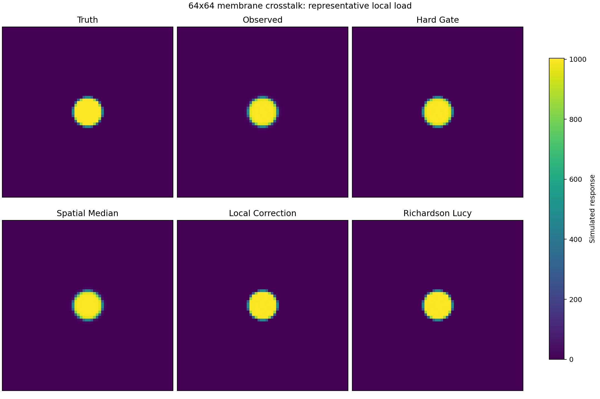
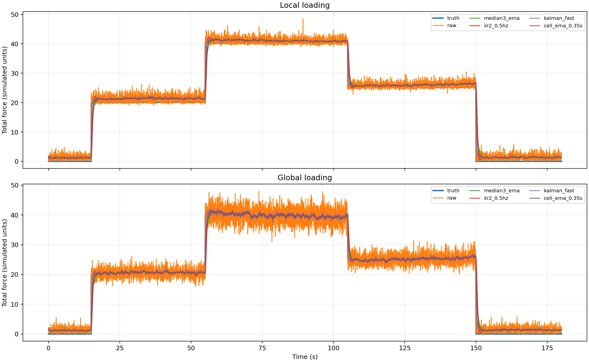
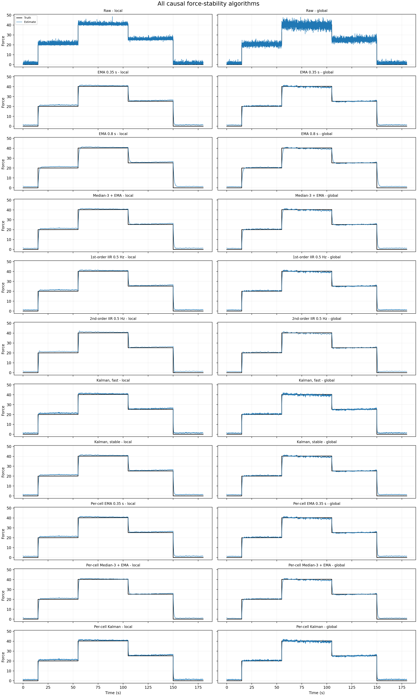
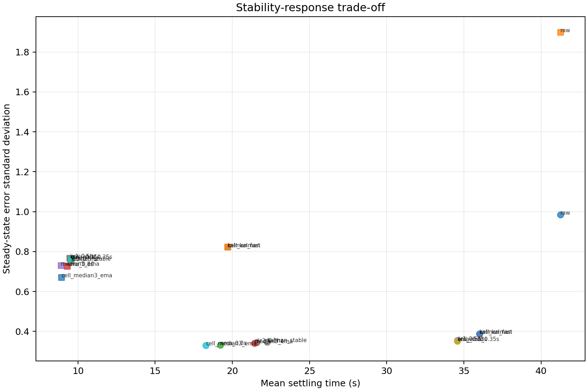
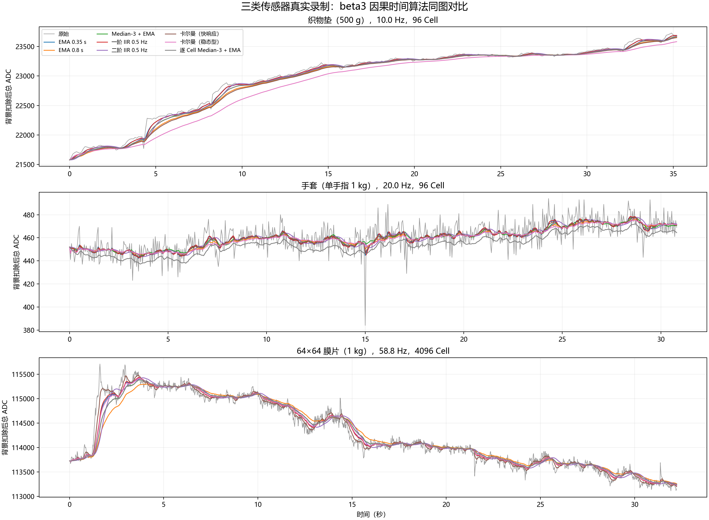

# beta3 仿真研究报告

> 日期：2026-07-13  
> 随机种子：`20260713`  
> 研究性质：合成数据上的方法筛选，不是最终算法验收

## 1. 研究目的与边界

本轮按照 `研究约束.md` 和 `工作计划与初步调研.md`，分别研究两个问题：

1. 64×64 膜片受压后，外围微弱响应被视为串扰候选时，哪些空间算法值得进入实物验证。
2. 长期稳定受压场景下，哪些因果时间算法能够减少总力跳动，并比较“逐 Cell 滤波后求和”与“先求和后滤波”。

本轮不研究快速敲击、滑动和瞬时冲击；织物类以局部压力为主，膜片同时覆盖局部与全局压力。嵌入式被视为原样上报 ADC，不假设其已扣基线、平滑或截断。

仿真只能回答“在给定模型成立时，算法逻辑是否合理”，不能证明真实膜片串扰一定线性、平移不变，也不能证明平滑后的数值就是真实力。最终参数和算法取舍必须使用实物数据完成。

## 2. 可复现设置

### 2.1 环境与入口

研究代码位于 `scripts/`，使用 Python、NumPy、SciPy 和 Matplotlib。统一运行命令为：

```powershell
$env:MPLBACKEND='Agg'
python "Document\Update\v1.0.10 - research\beta3\scripts\run_simulation.py"
```

运行后覆盖生成：

- `data/membrane_crosstalk_metrics.csv`
- `data/force_stability_metrics.csv`
- `output/membrane_crosstalk_comparison.png`
- `output/force_stability_comparison.png`
- `output/force_stability_all_algorithms.png`
- `output/force_stability_pareto.png`

### 2.2 膜片模型

膜片观测按下式生成：

```text
y = K * x + e
```

- `x` 为 64×64 合成真实响应。
- `K` 为中心响应加 8 邻域泄漏的 3×3 非负核，核总和为 1。
- 泄漏比例取 0.08、0.16、0.28。
- `e` 为仅叠加在非零响应区域的弱随机扰动；零压力区域仍保持 0 的硬件认知。
- 场景包括中心局部加载、边缘局部加载、多点加载、全局均匀加载和全局梯度加载。
- “匹配模型”向算法提供真实核；“模型失配”使用非对称真实核，但算法仍使用偏弱的对称核。

该模型有意验证线性串扰补偿的上限及失配敏感性，不代表真实设备已经被证明符合卷积模型。

### 2.3 总力模型

总力仿真采用 55 Hz，包含多个稳态加载档位及最终释放，分别模拟局部和全局加载。观测中加入：

- 固定 Cell bias，并在算法前模拟已知 bias 校正；
- Cell 间共同噪声；
- Cell 独立噪声；
- 慢漂移和受压蠕变；
- 偶发尖峰；
- 分段 ADC→力值非线性映射。

因此该模型不仅包含随机跳动，也保留时间平滑无法解决的偏差与漂移，用于防止把“曲线变平”误判为“力值变准”。

## 3. 膜片串扰研究

### 3.1 比较算法

| 方法 | 研究定位 |
|---|---|
| 原始数据 | 无处理基线 |
| 硬门控 | 显示清理和接触掩膜基线，不宣称恢复真实力 |
| 3×3 空间中值 | 常见局部空间平滑基线 |
| 局部串扰校正 | 使用已知 3×3 核做轻量近似逆补偿 |
| Richardson–Lucy | 带非负约束的迭代反卷积 |

评价指标包含 RMSE、总响应比例、峰值比例、接触面积比例、空间 IoU、质心偏移和非接触区残余，避免只看热图是否“干净”。

### 3.2 各空间算法效果图



图中使用中心局部加载、泄漏比例 0.16、模型匹配的代表场景。所有热图使用同一色标：硬门控能清理外围弱响应，但不恢复被删除的量；空间中值会改变边界；局部串扰校正和 Richardson–Lucy 在核匹配时最接近真值。该图只用于直观解释，最终判断仍以下表及全部场景指标为准。

### 3.3 总体结果

下表为全部位置、载荷、泄漏强度和模型条件的平均结果：

| 方法 | RMSE | 总响应比例 | IoU |
|---|---:|---:|---:|
| 原始数据 | 7.856 | 1.000 | 0.844 |
| 硬门控 | 6.499 | 0.995 | 0.989 |
| 3×3 空间中值 | 13.754 | 0.993 | 0.849 |
| 局部串扰校正 | 1.831 | 1.000 | 0.973 |
| Richardson–Lucy | 1.741 | 1.000 | 0.977 |

匹配模型下，局部校正平均 RMSE 为 0.863、IoU 为 1.000；Richardson–Lucy 平均 RMSE 为 0.933、IoU 为 1.000。模型失配后，两者 RMSE 分别上升到 2.799 和 2.549，IoU 降为 0.945 和 0.954，但仍优于原始数据。

局部加载与全局加载都呈现相同方向：两种模型补偿显著优于原始数据，而全局加载的绝对误差更高。全局压力不能只复用局部热图的视觉判断，必须单独验收总响应和边界效应。

### 3.4 解释与决定

1. **算法仍有价值，但优化方向必须从“去随机噪声”改为“识别并补偿受力相关串扰”。** 已知核条件下，局部校正和非负反卷积在合成模型上均有效。
2. **真实点载荷扫描是继续研究的必要条件。** 模型失配已导致性能明显退化；如果真实串扰随位置、载荷、压头面积或设备变化，单一全局卷积核可能不成立。
3. **硬门控可保留为显示或接触掩膜算法。** 它显著改善 IoU，但会删除响应并改变总量，因此不能作为真实力恢复算法。
4. **3×3 空间中值不应作为默认串扰补偿。** 本轮所有场景的总体 RMSE 均比原始数据更差，说明它会侵蚀峰值或改变压力边界。
5. **Richardson–Lucy 暂未形成压倒性优势。** 它在失配模型中略优于局部校正，但复杂度更高；只有实物留出测试稳定获益时才值得使用。

### 3.5 实物数据的最低要求

在实现产品算法前，至少采集以下数据：

1. 使用固定尺寸平头压头，在 64×64 膜片中心、四角附近、四边附近和内部网格位置逐点加载。
2. 每个位置使用至少 3 个砝码档位；每档包含空载、加载、长保持、释放和恢复，并重复至少 5 次。
3. 记录压头直径、砝码质量、目标 Cell 坐标、开始/结束时间、设备编号、采样率、ADC 位宽和饱和值。
4. 增加两个压头尺寸，判断外围响应是固定空间核还是随接触面积变化。
5. 增加局部双点和大面积均匀加载，用于检验线性叠加和全局压力边界效应。
6. 参数选择按完整录制划分；最终至少保留未参与拟合的位置、载荷和设备。

判定顺序应为：先验证零背景，再验证串扰与载荷的线性关系，再验证核是否随位置平移不变，最后才比较局部校正和非负反卷积。

## 4. 总力稳定研究

### 4.1 比较算法与管线

总力管线比较以下因果算法：原始值、0.35 s/0.8 s EMA、一阶/二阶 0.5 Hz IIR、Median-3 + EMA，以及快响应/稳态型标量卡尔曼。

同时比较：

```text
管线 A：各 Cell 完成 bias/标定 → 求和 → 总力时间滤波
管线 B：各 Cell 完成 bias/标定 → 逐 Cell 时间滤波 → 求和
```

指标包括稳态偏差、RMSE、标准差、峰峰值、95% 绝对误差、稳定时间和最终漂移。稳定时间采用进入真值 ±2% 并连续保持 1 s 的严格定义，因此绝对数值只适用于本仿真内部横向比较。

### 4.2 各时间算法效果图



上图用于在同一坐标中观察代表方法的平滑和跟随差异。为避免 11 条估计曲线叠加后互相遮挡，下图按算法拆分，每行一种处理管线，左列为局部加载，右列为全局加载；黑线为合成真值，蓝线为估计值。



精度—响应折中如下。点越靠左表示按本报告严格定义得到的平均稳定时间越短，越靠下表示稳态随机跳动越小；该图不能单独反映 bias、漂移或尖峰吞噬。



### 4.3 总体结果

| 方法 | 稳态 RMSE | 稳态标准差 | 平均稳定时间/s |
|---|---:|---:|---:|
| 原始数据 | 1.660 | 1.442 | 41.250 |
| EMA 0.35 s | 0.931 | 0.558 | 22.057 |
| EMA 0.8 s | 0.911 | 0.529 | 14.266 |
| Median-3 + EMA | 0.874 | 0.536 | 15.166 |
| 一阶 IIR 0.5 Hz | 0.931 | 0.561 | 22.032 |
| 二阶 IIR 0.5 Hz | 0.927 | 0.549 | 15.575 |
| 快响应卡尔曼 | 0.970 | 0.605 | 27.850 |
| 稳态型卡尔曼 | 0.927 | 0.552 | 15.916 |
| 逐 Cell Median-3 + EMA | 0.716 | 0.501 | 13.600 |

局部加载中，原始标准差为 0.984，EMA 0.8 s 降至 0.332；全局加载中，原始标准差为 1.899，EMA 0.8 s 降至 0.727。说明简单因果滤波已能明显减少长期稳定压力下的显示跳动。

### 4.4 为什么本轮卡尔曼没有 EMA 0.8 s 和二阶 IIR 好

本轮标量卡尔曼不是天然更高级的滤波器。在“真实力按随机游走变化、观测为真实力加白噪声”的单状态假设下，当 `Q/R` 固定并经过短暂收敛后，卡尔曼增益趋于常数，更新式

```text
x[k] = x[k-1] + K (z[k] - x[k-1])
```

与 EMA 的形式完全相同。也就是说，本轮卡尔曼主要是由 `Q/R` 自动确定平滑系数的自适应 EMA，而不是利用了额外物理信息。

具体原因有四点：

1. **当前卡尔曼参数比 EMA 0.8 s 更偏向快速跟随。** `kalman_fast` 使用 `Q/R=0.012`，稳态增益约 0.104；`kalman_stable` 使用 `Q/R=0.002`，稳态增益约 0.0437。在 55 Hz 下，它们分别约等效于 0.17 s 和 0.41 s 的一阶 EMA；EMA 0.8 s 的增益约 0.0225，因此对高频随机噪声和尖峰抑制更强。结果中快响应卡尔曼平均稳态标准差为 0.605，稳态型为 0.552，而 EMA 0.8 s 为 0.529。
2. **单状态随机游走模型与仿真误差来源不匹配。** 数据同时包含共同噪声、独立噪声、尖峰、蠕变和慢漂移。标量卡尔曼假设的高斯白噪声不能专门识别尖峰，也没有独立的漂移状态，因此会把一部分非高斯异常和系统漂移当作真实力变化跟随。
3. **二阶 IIR 的滚降更陡。** 在相同 0.5 Hz 截止频率附近，二阶低通对截止频率以上成分的抑制强于一阶 EMA/标量卡尔曼，因而在保留低频加载趋势的同时能更有效压制较快跳动。本轮二阶 IIR 的平均稳态标准差为 0.549，略优于稳态型卡尔曼的 0.552；差异很小，不能据此宣称普遍优势。
4. **稳定时间指标受“连续 1 s 落入 ±2%”影响。** 噪声较大的快速算法可能更早到达目标，却因随后跳出容差带而被记为更晚稳定；较强平滑虽然有相位滞后，却更容易连续保持在容差内。因此 EMA 0.8 s 在本轮得到更短的平均稳定时间，并不表示它对任意阶跃都具有更小延迟。

这不是卡尔曼方法本身失败，而是说明当前单状态模型没有提供超过简单低通的有效先验。若把稳态型卡尔曼继续减小 `Q/R`，可以获得接近 EMA 0.8 s 的平滑度，但响应也会同步变慢，优势仍不明显。只有引入可辨识的动态模型，例如“真实力 + 漂移”双状态、基于固定砝码估计随载荷变化的 `R`，或利用控制/事件信息改变 `Q`，卡尔曼才可能形成简单 EMA/IIR 不具备的优势。

### 4.5 算法优劣对比

| 方法 | 主要优点 | 主要缺点 | 本轮建议 |
|---|---|---|---|
| EMA 0.8 s | 实现最简单、参数含义清楚、稳态抑噪最好之一 | 一阶滚降，快速变化有滞后，不能处理 bias/漂移 | 默认实物基线 |
| 二阶 IIR 0.5 Hz | 高频滚降更陡，稳定度接近 EMA 0.8 s | 状态更多，阶跃可能出现更明显相位延迟或瞬态 | 与 EMA 并列基线 |
| Median-3 + EMA | 先抑制孤立尖峰，再平滑随机噪声 | 中值为非线性，可能吞掉窄脉冲或弱 Cell，并改变 bias | 有尖峰时使用并检查偏差 |
| 快响应卡尔曼 | 跟随较快，可按噪声统计解释参数 | 本轮平滑不足，对尖峰和漂移模型失配 | 仅作响应型对照 |
| 稳态型卡尔曼 | 比快响应版本更稳定，可扩展多状态模型 | 当前效果与一阶低通接近，复杂度没有换来稳定收益 | 暂不作为默认方案 |
| 逐 Cell Median-3 + EMA | 本轮 RMSE 和标准差最佳，可在求和前消除分散尖峰 | 非线性处理会改变各 Cell 贡献，本轮 bias 也发生变化 | 仅在总力与弱 Cell 双重验收后采用 |

### 4.6 解释与决定

1. **首选基线是 EMA 0.8 s 或二阶低通 IIR，而不是直接上卡尔曼。** 当前参数下，稳态型卡尔曼没有显著优于简单方法；卡尔曼只有在过程模型、测量噪声和状态变化具有可辨识物理含义时才有优势。
2. **Median-3 + EMA 适合存在偶发尖峰的数据。** 逐 Cell 版本在本仿真中指标最好，但中值是非线性运算，也使总体平均 bias 从约 0.62 降为约 0.40。这既可能是抑制尖峰的收益，也可能是吞掉弱 Cell 的信号，不能仅按 RMSE 直接采用。
3. **逐 Cell 稳定不等于总力自然正确。** Cell 共同漂移、标定非线性、阈值截断和接触区域切换都可能在求和时累积，必须同时输出 Cell 指标和总力指标。
4. **线性滤波的位置在特定条件下可交换。** 当前 EMA 参数对所有 Cell 相同，因此“逐 Cell EMA 后求和”与“先求和后 EMA”数学等价，结果完全相同；这不是对中值、门控、自适应卡尔曼或不同 Cell 参数的普遍证明。
5. **时间平滑不能消除固定 bias、蠕变和慢漂移。** bias 必须先估计和扣除；蠕变、温漂和迟滞需要独立建模或重新标定，不能靠降低截止频率掩盖。

### 4.7 卡尔曼滤波是否推荐

卡尔曼滤波可以作为对照，但当前不推荐作为默认方案。若后续继续研究，应先定义：

- 状态：真实总力，或真实总力加漂移项；
- 观测：完成 bias 校正和 ADC→力值标定后的总力；
- 过程噪声 `Q`：长期稳定压力仍允许缓慢变化的程度；
- 测量噪声 `R`：在固定砝码稳态段上估计的观测方差。

只有当不同载荷、不同位置和不同设备上，一组可解释的 `Q/R` 能稳定优于 EMA/IIR，才有理由增加卡尔曼的复杂度。若漂移是主要误差，可考虑“力值 + 漂移”双状态模型，但它需要更长的空载与保持数据来区分真实变化和漂移。

### 4.8 实物数据的最低要求

1. **局部加载**：织物垫和膜片均选择中心、边缘和多个内部位置，使用至少 4 个砝码档位。
2. **全局加载**：膜片增加大面积均匀压板；同一总砝码至少比较局部压头与全局压板，判断总力是否依赖接触面积。
3. **每条录制**：空载至少 60 s、加载后保持至少 5 min、释放后恢复至少 60 s；完整记录事件时刻。
4. **重复性**：每个位置和砝码档位至少重复 5 次，并进行升载和降载，识别迟滞。
5. **长期性**：选择代表档位保持 30–60 min，区分随机跳动、蠕变和温漂。
6. **数据字段**：原始逐 Cell ADC、采样时间戳、采样率、设备编号、传感器编号、砝码质量、位置、压头尺寸、环境温度、供电和上电时长。
7. **算法验收**：同时报告稳态均值、标准差、峰峰值、稳定时间、释放恢复、迟滞、漂移、接触区域总力及全阵列总力。

没有同步高精度测力计时，可以使用砝码做稳态弱真值，评价不同档位的单调性、重复性和相对一致性，但不能声称验证了瞬时真实力。

## 5. 推荐的下一阶段顺序

1. 先完成膜片单点扫描，判断串扰核是否线性、平移不变并与载荷无关。
2. 同时采集局部/全局砝码长保持数据，分离随机跳动、蠕变和漂移。
3. 用 EMA 0.8 s、二阶 IIR 0.5 Hz、Median-3 + EMA 建立实物基线；卡尔曼保留为对照。
4. 膜片仅在核验证通过后进入局部校正；若核明显位置相关，则改用分区核或位置相关稀疏矩阵。
5. 按完整录制做位置留出、载荷留出和设备留出，禁止用测试录制调参数。

## 6. 本轮结论

- 膜片算法仍有研究价值，但目标应从“删除边缘噪声”改为“基于实测响应的串扰建模与补偿”。
- 合成模型支持优先验证轻量局部校正；Richardson–Lucy 作为复杂对照，硬门控只用于显示或接触掩膜。
- 总力稳定优先采用简单、可解释的 EMA/IIR；卡尔曼可用，但当前仿真没有证明其优于简单滤波。
- 逐 Cell 非线性滤波可能改善尖峰，也可能引入总力偏差；必须和总力级指标共同验收。
- 本轮没有产出可直接发布的最终算法。真实点载荷扫描和长期砝码保持数据是进入下一阶段的前置条件。

## 7. 真实录制同图对比

按照三类实物都应直接观察算法效果的要求，新增 `scripts/run_real_data.py`，选择以下代表录制：

- 织物垫 500 g：`20260710143312`，独立背景为 `20260710143202`。
- 手套单手指 1 kg：`20260710141208`，独立背景为 `20260710135959`。
- 64×64 膜片 1 kg：`20260710145358`，独立背景为 `20260710144907`。

每类数据先按 Cell 扣除对应背景录制的中位数并截断为非负值，再计算总 ADC，统一叠加原始值、两组 EMA、Median-3 + EMA、两组 IIR、两组标量卡尔曼以及逐 Cell Median-3 + EMA。结果如下：



机器可读结果写入 `data/real_data_filter_metrics.csv`。其中 `first_difference_std` 和 `roughness_retention` 只描述相邻帧跳动，不代表力值准确度。三条录制缺少同步测力计真值和精确加载事件，且织物垫与膜片录制本身存在明显的非零空间响应，所以不能据此计算真实力 RMSE、串扰恢复率或可靠稳定时间；这些结论仍需按第 3.5 和第 4.8 节重新采集数据后确认。
