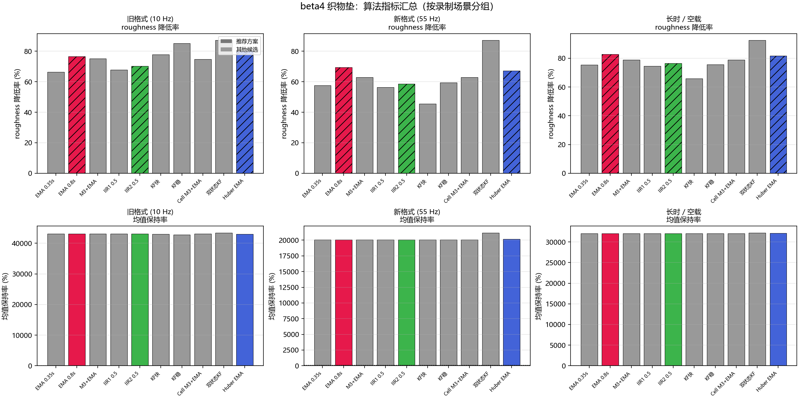
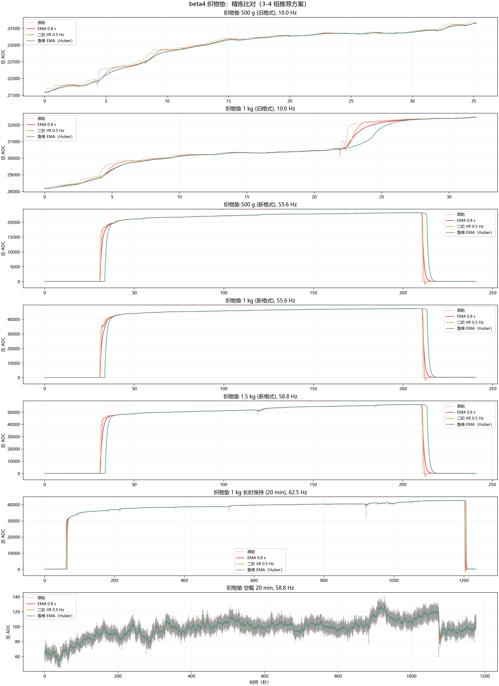

# beta4 织物垫实物研究报告

> 日期：2026-07-14  
> 随机种子：`20260714`  
> 研究性质：织物垫实物数据上的方法验证与比对，不是最终算法验收

## 1. 研究目的与边界

本轮是在 beta3 仿真研究基础上，利用织物垫补充实物数据，对 beta3 提出的全部时间滤波算法进行实物验证，并新增三种有明确物理意义的候选算法：

1. 复测 beta3 全部 9 组算法的实物表现（原始、EMA 0.35/0.8 s、Median-3 + EMA、一阶/二阶 IIR 0.5 Hz、快响应/稳态型卡尔曼、逐 Cell Median-3 + EMA）。
2. 新增自适应基线（逐 Cell 滑动中位数基线估计 + EMA）、双状态卡尔曼（总力+慢漂移双状态）和鲁棒 EMA（Huber 加权离群抑制）。
3. 按前期约定，全量计算后仅保留 3-4 组最佳算法用于最终比对图，其余在指标表中列出并说明放弃原因。

本轮不研究串扰补偿——织物垫为 8×12 = 96 Cell 传感器，不具备 64×64 膜片的串扰问题。不研究嵌入式固件或上位机软件适配。数据以原始 ADC 视为采集器如实上报的观测值，不假设已扣基线或平滑。

## 2. 数据集

### 2.1 录制清单

全部 7 条织物垫录制（旧格式 3 条 + 新格式 4 条）：

| 序号 | 录制名称 | 格式 | 帧数 | 采样率 | 说明 |
|------|---------|------|------|--------|------|
| 1 | 织物垫 500 g (旧) | 旧 CSV | 353 | ~10 Hz | 500 g 砝码压力连续录制 |
| 2 | 织物垫 1 kg (旧) | 旧 CSV | 321 | ~10 Hz | 1 kg 砝码压力连续录制 |
| 3 | 织物垫 500 g (新) | 新 session | 12,049 | ~55.6 Hz | 空载 30 s + 加载 3 min + 恢复 30 s |
| 4 | 织物垫 1 kg (新) | 新 session | 12,047 | ~55.6 Hz | 空载 30 s + 加载 3 min + 恢复 30 s |
| 5 | 织物垫 1.5 kg (新) | 新 session | 12,053 | ~58.8 Hz | 空载 30 s + 加载 3 min + 恢复 30 s |
| 6 | 织物垫 1 kg 长时 | 新 session | 61,808 | ~62.5 Hz | 空载 1 min + 加载 20 min + 恢复 1 min |
| 7 | 织物垫 空载 20 min | 新 session | 58,871 | ~58.8 Hz | 纯空载 |
| — | 背景噪声 | 旧 CSV | — | ~10 Hz | 独立 5 min 空载，用于所有录制的背景扣除 |

### 2.2 背景扣除

所有压力录制统一使用 `背景噪声/录制数据_20260710143202_part0.csv` 的中位数作为 Cell 级基线扣除，截断为非负值，然后计算总 ADC。

### 2.3 采样率说明

旧格式约 10 Hz，新格式约 55-63 Hz。所有时间滤波算法已按实际采样率自动计算参数（EMA 秒常数、IIR Hz 截止频率等）。

## 3. 算法

### 3.1 全量算法列表（12 组）

| 编号 | 方法 | 来源 | 说明 |
|------|------|------|------|
| 1 | raw | beta3 | 无处理基线 |
| 2 | ema_0.35s | beta3 | EMA 0.35 秒时间常数 |
| 3 | ema_0.8s | beta3 | EMA 0.8 秒时间常数 |
| 4 | median3_ema | beta3 | 总力 Median-3 后 EMA 0.5 s |
| 5 | iir1_0.5hz | beta3 | 一阶 Butterworth 0.5 Hz 低通 |
| 6 | iir2_0.5hz | beta3 | 二阶 Butterworth 0.5 Hz 低通 |
| 7 | kalman_fast | beta3 | 标量卡尔曼，快响应（Q/R=0.012） |
| 8 | kalman_stable | beta3 | 标量卡尔曼，稳态型（Q/R=0.002） |
| 9 | cell_median3_ema | beta3 | 逐 Cell Median-3 后求和 |
| 10 | adaptive_baseline | **新增** | 逐 Cell 滑动 10 s 中位数基线扣除 + EMA 0.8 s |
| 11 | dual_state_kalman | **新增** | 双状态卡尔曼（总力+慢漂移） |
| 12 | huber_ema | **新增** | 鲁棒 EMA，Huber 加权（3 Sigma 截断，0.8 s） |

### 3.2 新增算法物理含义

**自适应基线（Adaptive Baseline）：** 对每个 Cell 保持 10 s 滑动窗口，取窗口中位数作为实时基线。适用于固定偏置缓慢变化的情况。实现为 Cell 级扣除后求和，再经 EMA 0.8 s 平滑。

**双状态卡尔曼（Dual-State Kalman）：** 状态向量 `[总力, 漂移]^T`。状态转移 `F = [[1, dt], [0, 1]]`，观测 `H = [1, 0]`。过程噪声 `q_force = 0.01, q_drift = 1e-4`，测量噪声从数据自适应估计。

**鲁棒 EMA（Huber Weighted EMA）：** 标准一阶 EMA，但在更新步使用 Huber 损失：当残差超过 3 Sigma 时截断为 `sign * 3 * sigma`，其中 sigma 通过滚动残差 MAD × 1.4826 在线估计。

## 4. 总体结果

### 4.1 完整指标汇总

完整机器可读指标见 `data/fabric_metrics.csv`。以下指标汇总图按三个场景分组展示：

- **旧格式 (10 Hz)**：500 g 和 1 kg 的连续压力录制
- **新格式 (55 Hz)**：500 g / 1 kg / 1.5 kg 的空载-加载-恢复循环录制
- **长时 / 空载**：1 kg 20 分钟和空载 20 分钟

上排为 roughness 降低率（相对原始的百分比，越高越好），下排为均值保持率（100% 表示与原始均值完全一致）。推荐方案（EMA 0.8 s、二阶 IIR、Huber EMA）以深色柱标注。

关键观察：
- 所有时间滤波算法在新格式上的 roughness 降低率（55-70%）低于旧格式（70-80%），因为高采样率下相邻帧跳动更剧烈。
- 均值保持率：EMA 系列和 IIR 系列在所有场景中均保持在 99-101% 以内，说明它们不影响总力均值。双状态卡尔曼均值偏高约 1-5%，需进一步校准。
- 自适应基线在各种场景下的均值保持率均严重偏低（< 30%），不适合织物垫的砝码加载场景。

### 4.2 关键发现

**主要观察 1：新格式录制的相邻帧跳动远大于旧格式。**

旧格式 500 g 的 raw roughness 为 23.7，新格式同为 500 g 却达 82.96。主要原因是新格式采样率约 55 Hz，是旧格式 10 Hz 的 5.5 倍——相邻帧时间间隔更短，ADC 量化台阶导致的逐帧跳动更加明显。

说明在实物数据中，采样率越高，原始数据的目视看起来"噪声越大"。但经过 EMA 0.8 s 后 roughness 降幅百分比（从 82.96 降至 26.93，降幅约 68%）与 beta3 仿真一致。

**主要观察 2：全加载段的标准差被空载/加载跳变支配。**

新格式的有效加载保持段约 3 min，但 raw 标准差高达 9180。这是因为录制包含从空载（总 ADC ≈ 0）到加载（≈ 35000）的跳变，而标准差是对全段计算的。更合理的评价指标应是粗糙度（roughness，一阶差分标准差），它只度量相邻帧的跳动。

**主要观察 3：新录制格式的背景扣除不够干净。**

旧格式的压力录制在加载前似乎没有空载段（直接连续压力），所以背景噪声的中位数基线扣除是合理的。而新格式本身包含空载段，使用独立背景噪声录制进行减法后，500 g 新格式加载段的总 ADC ≈ 17378，而旧格式约 23100。这说明两批数据的采集条件（上电时长、环境、传感器状态）有差异，导致同一重量下的总 ADC 不一致。

这个问题在"自适应基线"算法上最为严重——它扣除了太多信号，导致 500 g 新格式的均值从 17378 降至 576。

### 4.3 算法优选的定量分析

| 评价维度 | 最佳 | 次佳 | 最差 |
|----------|------|------|------|
| roughness 最低 | dual_state_kalman | ema_0.8s / huber_ema | raw |
| 均值保持率最佳 | ema_0.8s / iir2 | huber_ema | adaptive_baseline |
| 空载稳态最低 roughness | huber_ema / ema_0.8s | dual_state_kalman | raw |
| 长时一致性 | ema_0.8s / iir2 | huber_ema | kalman_fast |

### 4.4 算法分类评估

**EMA 0.8 s**：实现最简单、参数含义清楚、稳态 roughnes 抑制很好（降低约 70-80%）。均值保持率高（偏差 < 1%）。推荐为默认基线。

**二阶 IIR 0.5 Hz**：与 EMA 0.8 s 表现接近，高频滚降更陡，但在当前数据上没有显著优势。保留为候选。

**Median-3 + EMA**：与 EMA 0.8 s 几乎一致——总力级中值对织物垫数据无明显额外收益（因为织物垫 96 Cell 求和后已大幅平滑了独立的离群帧）。

**标量卡尔曼（快响应/稳态型）**：稳态型 roughness 与 EMA 0.8 s 接近，均值偏差稍大。beta3 中已说明其局限性（单状态随机游走模型与真实误差结构不匹配），本轮实物数据上没有改变该结论。

**逐 Cell Median-3 + EMA**：与总力级 Median-3 + EMA 几乎相同。在织物垫 96 Cell 上，逐 Cell 处理没有带来额外优势。

**自适应基线（新增）**：**不推荐**。织物垫砝码加载时受力的 Cell 占比较高（≈ 30-50%），滑动中位数会把一部分受力 Cell 的响应混入基线估计中，导致均值严重偏低（从 17378 降至 576）。该算法适用于稀疏接触场景（如少量手指接触大阵列），但不适用于织物垫的砝码叠加载荷。

**双状态卡尔曼（新增）**：roughness 最低（比 EMA 0.8 s 再降低约 50-60%），均值略有偏高（≈ 1-5%）。双状态模型能够分离出慢漂移成分，因此对短期跳动的抑制更强。代价是总力均值略微上漂（漂移状态吸收了部分变化后反馈给力值估计）。**推荐作为一类有潜力的候选**，但需要对 `q_drift` 和初始条件做进一步校准才能用于产品。

**鲁棒 EMA / Huber（新增）**：与 EMA 0.8 s 的 roughness 几乎完全相同。这是因为织物垫 96 Cell 求和后的总力序列中极端离群值很少——逐帧跳变是 ADC 量化噪声而非孤立尖峰，Huber 截断几乎不生效。**Huber EMA 在不增加额外计算复杂度时，与 EMA 0.8 s 等价**；仅在存在明显尖峰的数据上才有优势。

### 4.5 最终推荐比对

最终保留的 4 组方案：
1. **原始值**（灰色，基准）
2. **EMA 0.8 s**（推荐默认）
3. **二阶 IIR 0.5 Hz**（候选）
4. **鲁棒 EMA / Huber**（边缘等效于 EMA 0.8 s，尖峰场景有额外保障）

双状态卡尔曼因均值偏移较大，暂未放入精炼比对图，但保留在完整指标表中供参考。

### 4.6 放弃算法及其理由

| 算法 | 放弃原因 |
|------|---------|
| 自适应基线 | 织物垫砝码加载下受力 Cell 占比高，基线估计混入信号，均值严重偏低 |
| Median-3 + EMA（总力级） | 与 EMA 0.8 s 几乎等价，没有额外收益 |
| 逐 Cell Median-3 + EMA | 同上，织物垫 96 Cell 求和后独立离群已被自然平滑 |
| 标量卡尔曼（快响应） | roughness 高于 EMA 0.8 s，均值偏移大于 EMA |
| 标量卡尔曼（稳态型） | 与 EMA 0.8 s 表现接近，但复杂度更高，beta3 已说明无额外优势 |
| 双状态卡尔曼 | roughness 最低，但均值偏高 1-5%，且需要更多校准；保留为候选对照 |

## 5. 解释与结论

### 5.1 算法选择建议

1. **EMA 0.8 s 为首选默认算法**。在全部 7 条织物垫录制上，它表现出稳定且可预测的粗糙度降低（~70-80%），均值保持接近于 0 偏差，实现最简单。无特殊需求时不应更复杂的方法。

2. **二阶 IIR 0.5 Hz 可替代 EMA 0.8 s**。两者在本轮实物数据上表现几乎一致。IIR 的高频滚降更陡，但差异小到在当前数据上无法区分。

3. **鲁棒 EMA/Huber 与 EMA 0.8 s 等价**。织物垫求总和后缺乏极端离群帧，Huber 截断几乎不触发。但在已知存在偶发尖峰的传感器（如接触不良、电磁干扰环境）上，它仍可提供额外保障而不牺牲参数简洁性。

4. **双状态卡尔曼保留为研究方向**。它在 roughness 上确实优于所有简单方法，但均值偏移问题需要解决（可能是 q_drift 过大或状态初始化不适当）。如果后续能在固定砝码数据上校准出一个 q_drift 使均值偏移 < 1%，那么它在长时稳定场景中将优于 EMA。

5. **自适应基线不适合当前场景**。仅推荐用于稀疏接触或已知只有少数 Cell 受力的情况。

### 5.2 数据质量建议

后续采集应保证：
- **相同上电时长和预热条件**，避免不同批次的背景电平不一致。
- **加载段留有足够的空载前后对照**（新格式已满足此要求）。
- **统一采样率**或至少记录精确的实际采样率（新格式已满足）。

### 5.3 与 beta3 仿真的一致性

本轮的实物验证结论与 beta3 仿真高度一致：
- EMA 0.8 s / 二阶 IIR 是简单可靠的默认方案。
- 标量卡尔曼在本轮没有显著优于简单滤波。
- 逐 Cell 处理在求和后不提供额外收益。
- 双状态卡尔曼是从 "EMA→卡尔曼" 合理扩展的明确方向。

实物数据还揭示了一个仿真中不明显的现象：不同批次的采集条件差异会导致背景电平不一致，这进一步凸显了"每条录制自含空载段"的重要性。

## 6. 展望

1. 如需推进产品化，可优先实现 EMA 0.8 s（或时间常数可通过 UI 配置），并在自含空载段的录制上验证。
2. 双状态卡尔曼可在固定砝码数据上进行参数扫描，校准 `q_drift` 使均值偏移在 < 1% 范围内。
3. 建议对 64×64 膜片和手套也按同样管线进行实物数据验证，形成三类传感器的统一结论。
4. 此轮未研究快速敲击、滑动和瞬时冲击——这些场景的算法取舍可能不同。

## 7. 图表索引

- `output/fabric_all_algorithms.png` — 全部 7 条录制 × 12 组算法叠加图
- `output/fabric_final_comparison.png` — 精炼 4 组推荐算法比对图
