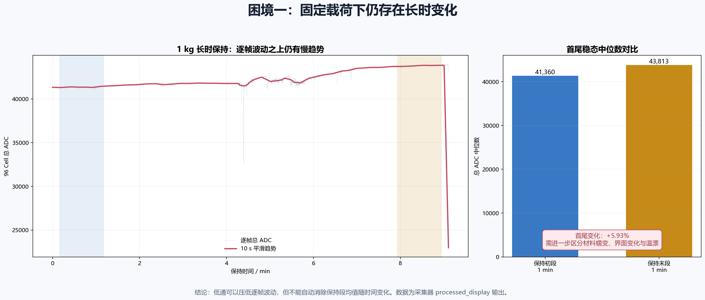
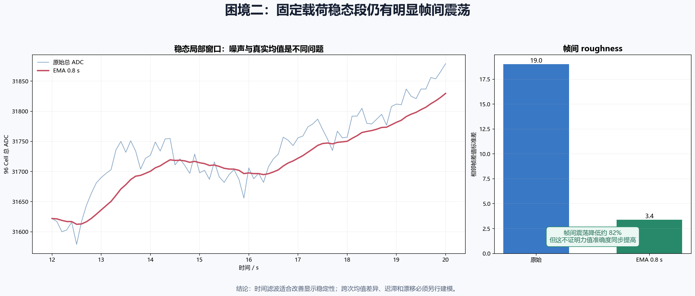
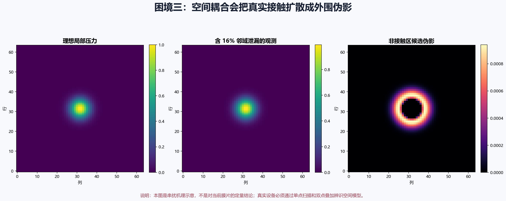
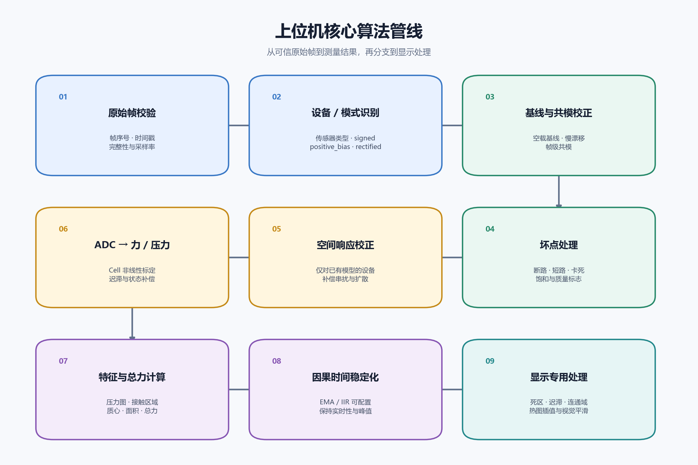
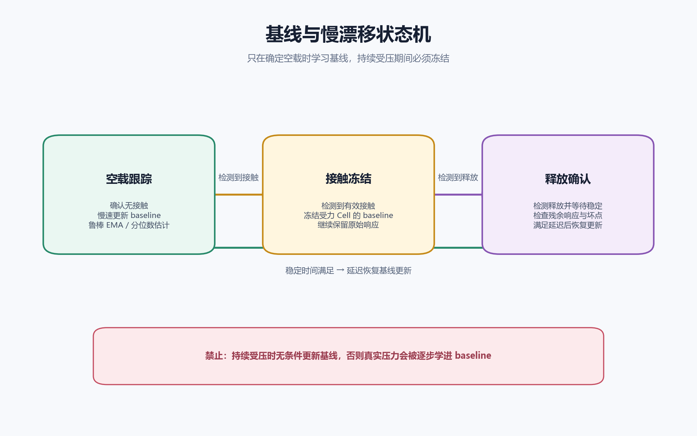
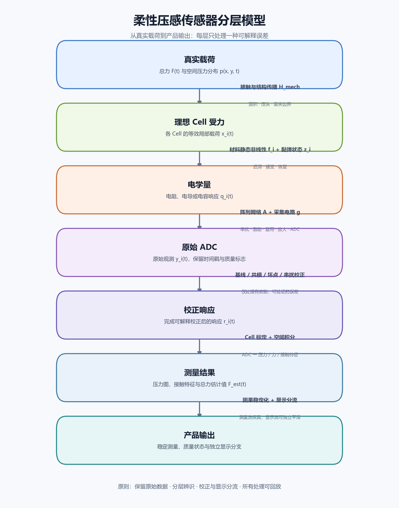

# 柔性压感传感器建模与算法路线图

> 日期：2026-07-16  
> 汇报对象：产品、硬件、嵌入式与上位机研发负责人  
> 依据：`需求.md`、柔性电子相关资料及 `research/` 中 beta2–beta5 的已有研究  
> 目标：从当前问题出发，明确问题性质、评价指标、分层对策、统一模型和近期工作计划。

## 1. 管理摘要：当前不是一个单纯的降噪问题

目前系统暴露出的核心现象包括：

1. **固定载荷下输出仍随时间变化。** 这可能包含材料蠕变、界面变化、温漂和采集链路慢漂移。
2. **稳态数据存在明显帧间震荡。** 时间滤波可以改善显示稳定性，但不能证明测量更准确。
3. **相同砝码重复加载可出现约 15% 的跨次差异。** 这不是保持段内随机噪声，而是重复性、装夹、材料历史或标定问题。
4. **64×64 膜片存在外围低值和空间扩散。** 它可能来自机械扩散、电气串扰、偏置、坏点或采样伪影，不能直接等同于真实压力。
5. **正负压模式与正压模式的零点行为不同。** 正偏置、整流或截零可能制造非零背景，不能统一套用一组滤波参数。

因此，项目应拆成五类问题分别处理：

| 问题 | 典型表现 | 主要手段 |
|---|---|---|
| 零点与背景 | 空载非零、共模变化、工频、随机噪声 | 链路审计、基线/共模、参考通道、抗干扰 |
| 静态映射 | ADC 与力非线性、饱和、Cell 增益不同 | 逐 Cell/整体标定、单调模型、量程设计 |
| 记忆与时漂 | 迟滞、蠕变、释放恢复、温漂、预热 | 动态状态模型、环境观测、稳定实验 |
| 阵列与空间 | 串扰、机械扩散、坏点、位置差异 | 点扫描、空间模型、坏点与位置校正 |
| 显示与交互 | 热图跳动、区域闪烁、释放残影 | 因果平滑、死区、迟滞、显示分流 |

### 1.1 当前建议的三项决策

- **按设备和采集模式分流。** 64×64 碳膜、织物垫和手套不使用统一参数；signed、positive-bias、rectified 使用不同零点模型。
- **先保留原始量，再做校正和显示。** 不可逆截零、强门限和强平滑不能覆盖原始数据。
- **近期优先做链路审计、受控实验和灰盒辨识。** 不优先投入更复杂的滤波或端到端机器学习。

### 1.2 管理层需要先确认的产品目标

| 产品目标 | 15% 跨次差异的影响 | 重点指标 |
|---|---|---|
| 接触存在性 | 可能通过稳健阈值容忍 | 误触发率、漏检率、释放残影 |
| 粗粒度分档 | 可能导致档位边界漂移 | 跨次 CV、跨位置一致性、分档准确率 |
| 定量测力 | 通常不可接受，说明标定尚不稳定 | 力值误差、迟滞、漂移、跨设备误差 |
| 压力分布恢复 | 会同时影响幅值和空间形状 | IoU、质心、面积、总力与空间残差 |

在产品目标未确定前，不宜只用“降噪百分比”评价项目进展。

## 2. 问题证据：当前系统遇到了什么困境

### 2.1 困境一：固定载荷下存在长时变化

图中使用织物垫 1 kg、约 20 分钟保持录制。逐帧波动之上仍存在慢趋势，保持初段和末段的稳态中位数并不完全一致。

这类变化不能统一称为“噪声”。可能来源包括：

- 聚合物、织物或多孔碳材料的黏弹蠕变；
- 导电颗粒、纤维和电极界面的持续重排；
- 封装胶层、预紧和夹持边界缓慢变化；
- 温度、湿度、上电预热和 ADC 参考漂移；
- 软件基线在持续受压时被错误更新。

**判断：** 快慢状态模型可以描述可重复的加载后变化，但不能在没有对照实验时证明根因。空载漂移、受力漂移、加载迟滞和释放恢复必须分开分析。

### 2.2 困境二：稳态数据存在帧间震荡

固定载荷稳态窗口中，原始总 ADC 存在明显相邻帧跳动。EMA 可以显著降低一阶差分标准差，因此适合改善显示和短时稳定性。

但需要明确：

- 帧间震荡降低，不代表两次加载的稳态均值自动一致；
- 全段标准差会混入加载和释放跳变，不能直接作为噪声指标；
- roughness 只能描述相邻帧变化，不能代表真实力误差；
- 卡尔曼滤波若没有可辨识状态模型，本质上可能只是另一种低通。

### 2.3 困境三：空间耦合产生外围伪影

上图使用 16% 邻域泄漏的合成模型说明串扰可能如何扩大接触面积、降低峰值并在非接触区形成残余。它是机理示意，不是对当前膜片串扰系数的测量结论。

真实 64×64 数据中的外围低值可能来自：

- 封装与衬底中的机械横向传播；
- 行列网络、公共电极和复用扫描造成的电气耦合；
- 复用器建立不足、电荷注入或 ADC 偏置；
- 坏点、固定偏置和低值随机毛刺；
- 压头边缘确实存在的小压力。

**判断：** 在完成单点扫描、双点叠加和位置留出实验前，只能称为“串扰候选伪影”，不能直接使用反卷积恢复真实压力。

### 2.4 困境四：相同砝码的跨次差异不能靠低通解决

需要区分五种不同尺度的变化：

| 变化尺度 | 典型来源 | 是否适合时间滤波 |
|---|---|---|
| 同一保持段内波动 | 随机噪声、短时共模 | 是 |
| 同位置重复放置差异 | 接触、预紧、材料历史 | 否 |
| 不同位置差异 | 空间灵敏度、边界效应 | 否 |
| 跨上电/跨日期差异 | 预热、温湿度、基线漂移 | 仅部分 |
| 跨器件/跨批次差异 | 材料、工艺、采集器增益 | 否，需校准与筛选 |

对低成本柔性压阻材料，15% 的跨次差异在现象上可能出现；对定量测力产品，它通常意味着尚未完成可用标定。常见不等于可接受。

### 2.5 困境五：正压模式的非零背景尚未完成归因

正负压模式可先写为：

$$
y_{\mathrm{signed}}=g\Delta V+b+e
$$

正压模式可能是软件或硬件截零：

$$
y_{\mathrm{rectified}}=\max(0,g\Delta V+b+e)
$$

也可能是硬件施加正偏置：

$$
y_{\mathrm{positive}}=g\Delta V+b_{\mathrm{positive}}+e
$$

截零会把对称零均值噪声变成正均值分布；正偏置会产生持续背景。在以下问题确认前，不能把它笼统归因于材料“白噪声”：

1. 正负压/正压究竟指差分极性、激励极性、ADC 编码、整流还是软件截零？
2. 截零发生在模拟电路、MCU 还是上位机？
3. 是否能导出偏置、整流和截零前的有符号采样？
4. 两类采集器的激励、参考、增益、ADC 位宽和扫描时序分别是什么？

## 3. 为什么会出现这些问题

柔性压感系统的输出并不只由当前压力决定。一次测量可以概括为：

$$
y=\mu+\alpha_{\mathrm{device}}+\alpha_{\mathrm{cell}}
+\alpha_{\mathrm{position}}+\alpha_{\mathrm{load\ cycle}}
+\alpha_{\mathrm{temperature}}+\alpha_{\mathrm{time}}+\varepsilon
$$

### 3.1 载荷与实验层

- 砝码位置、倾斜、压头面积和放置冲击不同；
- 加载速度、保持时间和释放方式不同；
- 没有事件标记时，算法无法可靠区分加载、保持和恢复阶段。

这一层优先通过工装和实验协议控制，而不是算法补偿。

### 3.2 结构、封装与装夹层

- 预紧、褶皱、层间滑移和夹持边界会改变工作点；
- 封装和缓冲层会造成横向力传播；
- 重装后基线、灵敏度和空间响应可能同时改变；
- 弯曲、拉伸和剪切可能被误认为法向压力。

如果机械状态不可重复，软件无法从单一 ADC 唯一反推出真实力。

### 3.3 材料与界面层

基础电阻关系为：

$$
R=\rho\frac{L}{A}
$$

柔性压阻材料受力时，电阻率、导电路径、有效截面积和界面接触都会变化。总电阻可拆成：

$$
R_{\mathrm{total}}=R_{\mathrm{lead}}+R_{\mathrm{bulk}}
+R_{\mathrm{contact,top}}+R_{\mathrm{contact,bottom}}
$$

这解释了为什么碳膜可能存在：

- Cell 间灵敏度不一致；
- 低载荷区强非线性；
- 同一 Cell 多次加载不完全重复；
- 固定载荷下继续蠕变；
- 卸载后回零缓慢；
- 不同批次和装夹状态需要重新标定。

### 3.4 电路与采集层

若传感器采用分压读出：

$$
V_{\mathrm{out}}=V_{\mathrm{ref}}
\frac{R_{\mathrm{sensor}}}{R_{\mathrm{fixed}}+R_{\mathrm{sensor}}}
$$

即使材料响应简单，分压、放大、限幅和 ADC 也会引入非线性。还需检查：

- 激励与 ADC 参考漂移；
- 参考电阻是否使工作区进入饱和；
- 模拟抗混叠是否充分；
- 复用扫描后是否有足够建立时间；
- 工频是否已经混叠到低频；
- 上游是否进行了整流、截零、平均或限幅。

### 3.5 软件与显示层

- 不同录制使用不同基线或滤波初态；
- 持续受压时无条件更新基线，会把真实压力逐步吞掉；
- 强门限和形态学可以清理热图，但不能证明恢复了真实压力；
- 显示流处理若反写测量数据，会破坏标定和追溯。

### 3.6 可修复性判断

| 类型 | 例子 | 处理原则 |
|---|---|---|
| 算法可修复 | 软件基线、已知偏置、可观测共模、稳定非线性 | 标定或确定性校正 |
| 可部分补偿 | 迟滞、蠕变、温漂、位置响应 | 必须有状态或辅助变量 |
| 优先改工装/硬件 | 随机放置、装夹变化、建立不足、模拟饱和 | 先控制源头 |
| 不可可靠恢复 | 原始信息已被截零、限幅且未保存 | 承认信息损失并改链路 |

## 4. 需要关注哪些性质和指标

### 4.1 传感器核心指标

| 指标 | 推荐定义与注意事项 |
|---|---|
| 灵敏度 | 输出对压力或力的变化率；非线性器件分区间报告 |
| 检测下限 | 在规定误报率下可区别于空载的最小输入 |
| 量程 | 满足精度、单调性且未饱和的输入范围 |
| 非线性 | 相对指定参考曲线或满量程的最大偏差 |
| 迟滞 | 同一载荷升载和降载输出差异 |
| 重复性 | 同工况多次加载稳态均值的标准差或 CV |
| 蠕变 | 固定载荷保持期间输出相对初值或稳态值的变化 |
| 恢复 | 卸载后回到空载容差带的时间和残余偏差 |
| 漂移 | 空载或固定载荷下单位时间的均值变化 |
| 串扰 | 非加载 Cell 响应相对加载 Cell 或总响应的比例 |

### 4.2 产品与算法指标

- **零点：** 空载均值、MAD、P95/P99、误触发率、共模比例；
- **稳定性：** 稳态均值偏差、标准差、峰峰值、一阶差分标准差；
- **动态：** 加载稳定时间、释放恢复时间、超调和端到端延迟；
- **准确度：** 力值误差、峰值/积分/总力保持率；
- **空间：** 接触 IoU、质心偏移、面积误差、非接触区残余；
- **泛化：** 跨位置、跨日期、跨设备和跨批次误差；
- **工程：** 单帧耗时、内存、丢帧恢复、参数版本和质量状态。

### 4.3 评价原则

1. 准确度和稳定性必须同时报告。
2. 不能用 roughness 降低替代真实力误差降低。
3. 不能用包含加载跳变的全段标准差评价稳态噪声。
4. 训练与测试按完整录制、位置、日期和设备划分。
5. 禁止用测试录制自身估计最终标定参数。
6. 新算法必须在留出数据上优于简单基线，而不只是在训练数据上更平滑。

## 5. 如何对抗这些问题

### 5.1 传感器、结构与工艺侧

- 固定压头面积、垂直度、加载位置和加载速度；
- 控制预紧力、层间贴合、褶皱和夹持边界；
- 增加合理隔离结构，减少横向力传播；
- 统一材料批次、厚度、固化和封装流程；
- 做预循环，使初期导电网络重排趋于稳定；
- 增加温度传感器或无载参考 Cell。

### 5.2 模拟前端与 FPC 采集板

- 使用稳定、低噪声的激励和 ADC 参考；
- 合理选择参考电阻，避开分压饱和区；
- 优先使用差分或比率测量；
- 增加模拟抗混叠低通；
- 优化屏蔽、接地和数字/模拟隔离；
- 复用扫描后保证建立时间，必要时丢弃首个样本；
- 保留有符号原始量，避免不可逆整流或截零；
- 正偏置模式提供偏置参考或内部零输入测量。

工频处理必须先看 PSD。若 50 Hz 已混叠到低频，后端不能通过简单 notch 可靠恢复。

### 5.3 嵌入式

嵌入式适合承担确定性、低延迟和板级处理：

1. 时间戳、帧序号、丢帧/重复帧和实际采样率；
2. ADC offset/gain、通道映射、坏点表和板级参考；
3. 可配置的 50/60 Hz 同步抑制或轻量陷波；
4. 仅针对通信/ADC 异常的轻量去毛刺；
5. 可关闭的低延迟 EMA/IIR，原始流仍可获取；
6. 饱和、断路、短路、卡死和参考漂移监测。

嵌入式不宜直接承担使用未来帧的算法、未经验证的高维反卷积、不可回退的强门限和频繁变化的复杂模型。

### 5.4 上位机核心算法

上位机按设备建立独立配置：

- `sensor_type`：碳膜、织物、手套；
- `acquisition_mode`：signed、positive_bias、rectified；
- `sample_rate`、扫描布局和通道映射；
- 基线策略、坏点表和标定版本；
- 空间补偿和动态状态模型；
- 时间滤波参数；
- 原始、校正、测量和显示输出开关。

### 5.5 基线与慢漂移

基线只能在确定空载时慢速更新。检测到接触后冻结受力 Cell；释放并稳定后，再延迟恢复更新。已有实验表明，持续受压时使用滑动中位数更新基线，会把真实压力学进 baseline。

若阵列存在大量确定空载的 Cell，可估计帧级共模：

$$
c[k]=\operatorname{median}_{i\in\mathcal{I}_{\mathrm{inactive}}}
\left(y_i[k]-b_i\right)
$$

估计前必须排除受力 Cell 和坏点。

### 5.6 时间稳定化

织物垫当前可暂以时间常数约 $\tau=0.8\,\mathrm{s}$ 的 EMA 作为因果基线：

$$
\begin{aligned}
\alpha&=1-\exp\left(-\frac{\Delta t}{\tau}\right),\\
\widehat{x}[k]&=\widehat{x}[k-1]+\alpha\left(z[k]-\widehat{x}[k-1]\right).
\end{aligned}
$$

可进一步采用双速 EMA：变化显著时使用较小时间常数，稳定时使用较大时间常数，并加入进入/退出迟滞。

时间滤波只负责高频随机项和显示稳定性；迟滞、蠕变、跨次差异和错误标定必须使用其他模型或实验解决。

### 5.7 碳膜不一致与逐 Cell 标定

碳膜不一致需要分成四类：

- 同一 Cell 的重复性；
- 同一膜片不同 Cell 的一致性；
- 不同膜片之间的一致性；
- 不同材料或制造批次的一致性。

每个 Cell 至少应获得：

- 空载基线 $b_i$；
- 增益或灵敏度 $g_i$；
- 单调非线性曲线 $f_i$；
- 迟滞、蠕变和恢复参数；
- 坏点、饱和点和不稳定点标志。

数据有限时，不建议每个 Cell 独立拟合复杂高阶曲线。更稳妥的形式是“全局模型 + 设备修正 + Cell 修正”：

$$
\theta_{d,i}=\theta_{\mathrm{global}}
+\Delta\theta_{\mathrm{device},d}
+\Delta\theta_{\mathrm{cell},i}
$$

若某个 Cell 响应不单调、参数跨次随机跳变或长期饱和，算法无法可靠恢复，应进行坏点屏蔽、器件筛选或工艺改进。

### 5.8 64×64 空间校正

空间模型可先写为：

$$
y=Ax+b+e,\qquad x\geq 0
$$

候选路线：

1. 单点扫描估计 3×3 或 5×5 局部响应；
2. 验证线性、叠加性、位置不变和载荷不变；
3. 条件成立时使用轻量局部逆补偿或非负正则化；
4. 条件不成立时使用分区核或位置相关稀疏矩阵；
5. 同时验收总响应、峰值、面积、质心和 IoU。

硬门限和形态学可用于显示掩膜，但不应作为真实力恢复算法。

### 5.9 显示层

- **测量流：** 尽量保真，用于记录、标定、算法和总力输出；
- **显示流：** 可使用颜色死区、迟滞、连通域清理、插值和更强平滑。

界面应能同时查看原始 ADC、校正 ADC、力值、接触掩膜和质量状态。显示更干净不等于测量更准确。

## 6. 最终统一建模框架

统一的不是所有设备共用同一组参数，而是所有设备遵循同一条分层观测链。

### 6.1 从真实载荷到产品输出

力和压力首先需要区分：

$$
F(t)=\int_A p(x,y,t)\,\mathrm{d}A
$$

第 $i$ 个 Cell 测到的是空间敏感函数的积分：

$$
x_i(t)=\iint w_i(x,y)p(x,y,t)\,\mathrm{d}x\,\mathrm{d}y
$$

因此，相同总力改变位置、面积、倾斜和边界后，逐 Cell ADC 不同是正常现象；总 ADC 是否保持一致需要实验验证。

### 6.2 第一版可落地灰盒模型

第一版不建议直接建立高维材料有限元模型。可采用：

$$
\begin{aligned}
b_i[k+1]&=b_i[k]+d_i[k],\\
z_{f,i}[k+1]&=a_{f,i}z_{f,i}[k]+(1-a_{f,i})u_i[k],\\
z_{s,i}[k+1]&=a_{s,i}z_{s,i}[k]+(1-a_{s,i})u_i[k],\\
G_i[k]&=c_i+q_i\left(z_i[k]+p_{0,i}\right)^{n_i},\\
y[k]&=Q\!\left(g(AG[k],\theta_{\mathrm{circuit}})+c[k]+e[k]\right).
\end{aligned}
$$

其中：

- $b_i$：Cell 基线和慢漂移；
- $z_f,z_s$：快速形变和慢速蠕变/恢复状态；
- $G_i$：非线性电导响应；
- $A$：机械与电气空间耦合；
- $g$：分压、放大、滤波和限幅；
- $Q$：ADC 量化以及可能存在的整流或截零；
- $c[k]$：帧级共模；
- $e[k]$：随机测量噪声。

总力层再使用：

$$
\widehat{F}=\mathcal{C}\left(
\sum_i w_i r_i,\ d,\ t_{\mathrm{hold}},\ T
\right)
$$

这里的 $d$ 表示升载/降载方向，$t_{\mathrm{hold}}$ 表示保持时间，$T$ 表示温度。只有这些变量被观测或可可靠估计时，补偿才具有可辨识性。

### 6.3 快慢状态能否解决时漂

对于加载后可重复的快慢变化，可拟合：

$$
y(t)=y_{\infty}+c_1\exp\left(-\frac{t}{\tau_1}\right)
+c_2\exp\left(-\frac{t}{\tau_2}\right)
$$

- $\tau_1$ 可描述快速接触和结构建立；
- $\tau_2$ 可描述慢速蠕变、界面变化或热过程；
- 加载、卸载和空载预热必须分别拟合；
- 若参数每次实验差异很大，模型只能描述不确定度，不能可靠做逆补偿；
- 若所有 Cell 同向漂移，优先检查共模、电源、参考和温度；
- 若只有受力区域漂移，更支持材料和局部界面状态。

因此，快慢模型是候选描述，不是未经实验即可成立的根因结论。

### 6.4 标定模型的复杂度顺序

1. 单调分段线性；
2. 幂律或对数回归；
3. 单调样条或保序回归；
4. 有观测变量时加入位置、面积和温度；
5. 多设备、多日期和独立测试集充分后再考虑机器学习。

不建议逐 Cell 使用高阶多项式，也不应在证据不足时直接采用复杂状态空间或端到端模型。

## 7. 推荐产品架构

架构原则：

1. 原始数据始终可获取；
2. 不可逆处理可以绕过；
3. 设备、采集模式、参数和模型版本可追溯；
4. 测量流与显示流不互相污染；
5. 每层只处理自己能够观测和验证的误差；
6. 所有算法可通过离线回放复现和验收。

## 8. 工作计划：按证据门推进

### P0：链路透明与数据可追溯

**目标：** 明确当前系统实际测到了什么。

1. 画清每类采集器的等效电路、激励、参考、增益、ADC 和扫描时序；
2. 确认 signed、positive-bias、rectified 的准确含义；
3. 导出偏置、整流、截零和滤波前的原始量；
4. 记录设备、膜片、批次、采样率、温度、上电时间、位置、压头和事件时间；
5. 用现有数据分开统计保持段噪声和跨次均值差异；
6. 暂行方案采用设备分流、静态基线和可关闭 EMA 显示平滑。

**阶段产出：**

- 每类设备一份完整观测链路表；
- 原始数据与元数据规范；
- 当前问题基线报告；
- 可回放的统一数据读取脚本。

**阶段门：** 能解释正负压/正压差异，能从保存文件重现采集器到上位机的每一步变换。

### P1：方差分解与灰盒辨识

**目标：** 判断哪些误差可建模、哪些必须改硬件或工装。

1. 短接输入或固定电阻，分离采集板噪声；
2. 多次上电长空载并记录温度，评估预热与漂移；
3. 对 0/500/1000/1500 g 做升载和降载，每档至少重复 5 次；
4. 每条录制包含空载、加载、保持、释放和恢复；
5. 覆盖中心、边缘、角落和内部网格位置；
6. 至少使用两种压头面积；
7. 64×64 完成单点扫描和双点叠加；
8. 至少测试 3 块碳膜，区分 Cell 内、Cell 间、膜片间和批次间差异；
9. 建立统一离线 A/B 指标脚本。

**阶段产出：**

- 方差分解和重复性报告；
- 静态标定、迟滞、蠕变和恢复参数；
- 逐 Cell 基线、增益、坏点和稳定性表；
- 空间响应与叠加性报告；
- 简单模型与现有 EMA/IIR 的留出集对比。

**阶段门：** 主要方差来源可量化；候选模型参数具有重复性；模型在完整留出录制上优于简单基线。

### P2：证据充分后的高级补偿

**目标：** 只对已经证明可辨识的问题增加复杂度。

1. 位置相关标定、分区核或稀疏串扰矩阵；
2. 力值与漂移联合状态空间模型；
3. 温度补偿和跨设备校准迁移；
4. 双速滤波和质量感知输出；
5. 多设备、多日期数据充分后再评估机器学习。

**阶段门：** 新模型必须在跨位置、跨日期、跨设备和跨批次测试中保持稳定收益，同时满足实时性和可追溯要求。

## 9. 最终判断

这项工作的主线不是寻找一个更高级的滤波器，而是：

> 先用真实数据把时漂、帧间噪声、跨次差异、模式偏置和空间伪影分开，再通过链路审计和受控实验判断根因；随后只对可观测、可重复、可辨识的误差建立分层模型，并用简单因果滤波改善产品显示体验。

对于碳膜不一致，最终策略应是“工艺控制 + 器件筛选 + 分层标定 + 健康监测”，而不是指望单一算法把随机、不可重复的材料差异全部恢复成真实力。
