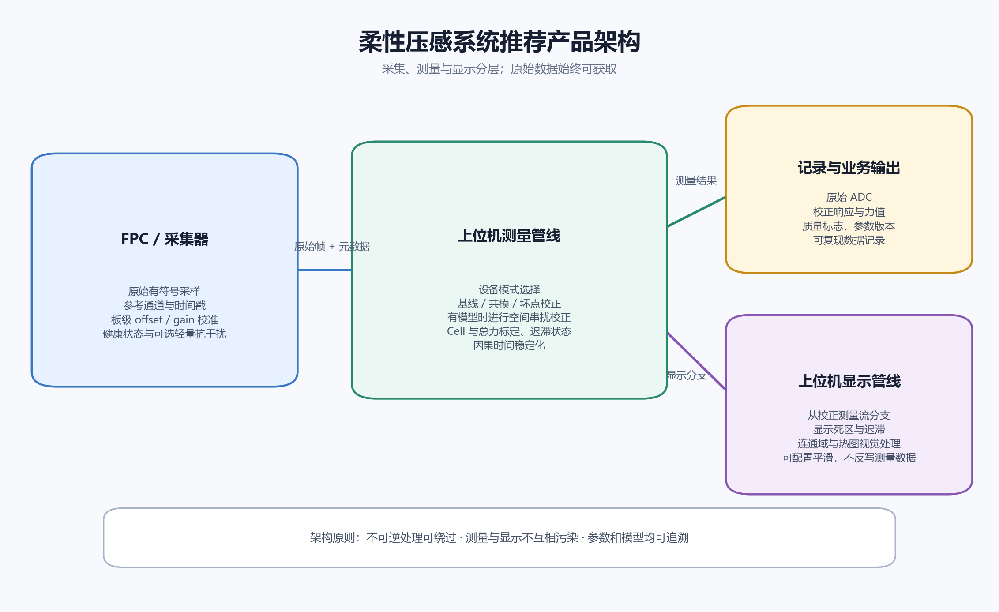

# 柔性压感传感器建模与算法路线图

> 日期：2026-07-16  
> 面向对象：负责数字信号处理、具备数学基础，但材料与器件背景有限的研发人员  
> 依据：`需求.md`、`Books/柔性电子技术_冯雪.pdf` 及 `research/` 中 beta2–beta5 的已有研究  
> 目标：建立“压力—材料/结构—电学量—采集值—力值/触觉特征”的可辨识模型，并明确嵌入式与上位机各自适合承担的算法工作。

## 1. 先给结论

这个项目不应被定义为单一的“降噪问题”，而应拆成五类彼此不同的问题：

1. **零点问题：** 空载时的固定偏置、共模变化、工频干扰和随机噪声。
2. **静态映射问题：** 压力或力如何非线性地映射到电阻、电压和 ADC。
3. **记忆效应问题：** 迟滞、蠕变、释放恢复、温漂、老化和上电预热。
4. **阵列问题：** 通道不一致、扫描串扰、行列寄生通路、空间扩散和坏点。
5. **显示与交互问题：** 输出跳动、响应延迟、接触区域抖动和视觉噪点。

这五类问题必须分别建模。低通滤波只能优化第 1 类中的高频随机项和第 5 类的视觉体验，不能校正迟滞、蠕变、串扰或错误标定。

对当前设备，最重要的工程决定是：

- **正负压模式与正压模式必须使用不同的观测模型和零点策略。** 不能只换一组滤波参数。
- **64×64 碳膜与织物/手套必须分路线。** 现有研究已证明统一降噪器不可靠。
- **先保留和记录原始量，再做校正和显示。** 任何不可逆门限、截零和强平滑都不应覆盖原始数据。
- **先辨识误差来源，再选算法。** 15% 的重复差异在柔性压阻器件中并非不可想象，但对测力产品通常不可接受；算法只能修复可观测、可重复的系统误差。
- **近期最值得做的不是更复杂的滤波，而是采集链路审计、重复性实验和灰盒模型辨识。**

## 2. 从书中应该读什么

《柔性电子技术》是器件与材料综述，不是传感器系统辨识或 DSP 教材。它适合建立物理概念，但不能单独提供本项目所需的完整数学模型。

### 2.1 必读顺序

| 优先级 | 书中位置 | 需要掌握的内容 | 与项目的关系 |
|---|---|---|---|
| 1 | 5.4.3 柔性应变/压力传感器，PDF 216–224 页附近 | 压阻、电容、压电等机理；微结构、导电网络、多孔材料 | 建立传感机理和非线性来源的直觉 |
| 2 | 3.4 柔性导电材料，PDF 124–133 页附近 | 金属、碳基、有机导电材料的差异 | 理解碳膜、炭黑、CNT、织物导电网络为什么会漂移和离散 |
| 3 | 2.3 柔性衬底结构设计，PDF 67–93 页附近 | 微结构、局部应变、结构几何对响应的影响 | 理解相同总力在不同接触面积、位置和边界条件下为何输出不同 |
| 4 | 4.3 柔性电子封装技术，PDF 173–179 页附近 | 封装、界面和环境隔离 | 理解预紧力、装夹、湿度和封装应力如何改变基线与灵敏度 |
| 5 | 第 7 章界面失效与可靠性，PDF 294–327 页附近 | 分层、界面失效、循环可靠性 | 理解老化、重复加载和批次差异 |

### 2.2 书中直接给出的关键认识

书中将柔性压力传感器分为压阻式、电容式和压电式等，并指出压阻式因采集容易、制备简单和灵敏度高而应用广泛。压阻路线主要依靠：

- 微结构受压后改变接触面积和接触电阻；
- 三维多孔导电材料受压后改变内部导电网络；
- 导电材料与弹性材料组成的非均匀网络在受压时形成或破坏导电通路。

这意味着“压力只影响面积”是不完整的。实际响应通常同时受以下变量影响：

- 接触面积与真实接触点数量；
- 敏感层厚度和体电阻率；
- 颗粒或纤维间隧穿距离；
- 多孔结构压缩和回弹；
- 电极—敏感层界面接触电阻；
- 横向拉伸、剪切、弯曲和预紧；
- 温度、湿度、装夹和历史载荷。

书中还明确提到，碳材料和纳米材料复合体系可能存在小应变能力弱、重复性差和信号延迟等问题。这与当前“同砝码重复 ADC 差异大”的现象在物理上是一致的。

### 2.3 仍需补充的知识

为了真正建模，还应按以下顺序补课：

1. **电路与采集：** 分压桥、恒流/恒压激励、仪表放大器、ADC、采样保持、输入阻抗、RC 建立时间、复用器电荷注入。
2. **概率统计：** 条件均值与方差、置信区间、方差分解、重复性/再现性、异常值和异方差。
3. **系统辨识：** 静态非线性、状态空间模型、参数辨识、训练/验证留出、可辨识性。
4. **黏弹性：** Maxwell/Kelvin–Voigt/标准线性固体模型、蠕变、应力松弛、迟滞。
5. **渗流与接触电阻：** 导电网络临界行为、隧穿导电、Holm 接触电阻的基本直觉。
6. **信号处理：** 功率谱密度、陷波、低通、鲁棒滤波、抗混叠和多速率处理。
7. **阵列反演：** 线性串扰矩阵、卷积核、非负最小二乘、正则化和空间标定。

不需要一开始深入量子力学或完整材料本构理论。对 DSP 研发而言，优先掌握能被数据辨识的灰盒模型即可。

## 3. 传感器从压力到 ADC 的数学模型

### 3.1 先区分力、压力与接触几何

力和压力不是同一变量：

$$
F(t) = \int_A p(x,y,t)\,\mathrm{d}A
$$

- $F$ 是总法向力，单位 N。
- $p(x,y,t)$ 是空间压力分布，单位 Pa。
- 同一个砝码给出近似相同的总力 $F=mg$，但压头面积、倾斜、放置位置和材料形变会改变 $p(x,y)$。

阵列 Cell 测到的也不是理想点压力，而是空间敏感函数的积分：

$$
s_i(t) = \iint w_i(x,y)p(x,y,t)\,\mathrm{d}x\,\mathrm{d}y
$$

其中 $w_i$ 包含 Cell 几何、封装、力传播和空间串扰。因此同一砝码在不同位置或面积下，逐 Cell ADC 不同是必然的；总 ADC 是否相同则取决于整个系统是否近似满足力守恒和位置无关标定，这不能先验假定。

### 3.2 压阻敏感层模型

基础电阻关系为：

$$
R = \rho\frac{L}{A}
$$

但柔性压阻材料中的 $\rho$、$L$ 和有效面积 $A$ 都会随压力及历史改变。更实用的灰盒静态模型是：

$$
G(P) = \frac{1}{R(P)} = G_0 + a(P+P_0)^n
$$

或分段幂律/对数模型：

$$
\log(G-G_0) = c+n\log(P+P_0)
$$

这里：

- $G_0$ 表示空载残余电导；
- $P_0$ 表示预紧或启动力；
- $n$ 描述接触网络的非线性；
- 参数可能随 Cell、温度、批次和装夹改变。

对电极接触主导的器件，可将总电阻拆成：

$$
R_{\mathrm{total}}
=R_{\mathrm{lead}}+R_{\mathrm{bulk}}
+R_{\mathrm{contact,top}}+R_{\mathrm{contact,bottom}}
$$

受压时不仅敏感层体电阻变化，界面接触电阻也会变化。两次放置导致界面微观接触点不同，便可能产生明显重复差异。

### 3.3 动态与记忆模型

柔性聚合物、织物和多孔碳材料具有记忆效应，静态函数 $\mathrm{ADC}=f(F)$ 通常不够。第一版可采用一个快状态和一个慢状态：

$$
\begin{aligned}
x_{\mathrm{fast}}[k+1]
&=a_{\mathrm{fast}}x_{\mathrm{fast}}[k]
+(1-a_{\mathrm{fast}})u[k],\\
x_{\mathrm{slow}}[k+1]
&=a_{\mathrm{slow}}x_{\mathrm{slow}}[k]
+(1-a_{\mathrm{slow}})u[k],\\
y[k]
&=f\!\left(x_{\mathrm{fast}}[k],x_{\mathrm{slow}}[k],d[k]\right)
+b[k]+e[k].
\end{aligned}
$$

- $u$ 为压力或力；
- $x_{\mathrm{fast}}$ 表示快速形变；
- $x_{\mathrm{slow}}$ 表示蠕变或恢复；
- $d$ 表示升载还是降载，用于表达迟滞；
- $b$ 为基线与慢漂移；
- $e$ 为随机测量噪声。

如果只研究长期稳定压力，可进一步写成加载后指数和：

$$
y(t)=y_{\infty}+c_1\exp\!\left(-\frac{t}{\tau_1}\right)
+c_2\exp\!\left(-\frac{t}{\tau_2}\right)
$$

释放过程应单独拟合，不要默认与加载参数相同。若同一力的升载和降载稳态均值不同，则应使用带迟滞状态的模型，而不是继续增加低通强度。

### 3.4 采集电路模型

若传感器作为分压电阻，典型关系为：

$$
\begin{aligned}
V_{\mathrm{out}}
&=V_{\mathrm{ref}}\frac{R_{\mathrm{sensor}}}
{R_{\mathrm{fixed}}+R_{\mathrm{sensor}}},\\
\mathrm{ADC}
&=\operatorname{round}\!\left[
(2^N-1)\frac{V_{\mathrm{out}}}{V_{\mathrm{ADC,ref}}}
\right].
\end{aligned}
$$

具体分子取 $R_{\mathrm{sensor}}$ 还是 $R_{\mathrm{fixed}}$ 取决于电路接法。即使 $R(P)$ 简单，分压本身也会引入非线性和饱和。

阵列扫描的更完整观测可写成：

$$
y[k]=Q\!\left(
g(Ax[k],\theta_{\mathrm{circuit}})
+b_{\mathrm{channel}}[k]+c_{\mathrm{common}}[k]
+h_{50/60}[k]+e[k]
\right)
$$

- $x$：理想 Cell 响应；
- $A$：空间或电气串扰矩阵；
- $g$：分压、放大、整流、限幅等非线性；
- $b_{\mathrm{channel}}$：通道固定偏置与慢漂移；
- $c_{\mathrm{common}}$：电源或参考引入的共模变化；
- $h_{50/60}$：工频及谐波；
- $e$：随机噪声；
- $Q$：ADC 量化和截断。

### 3.5 正负压与正压模式必须分开建模

根据需求中的描述，可先提出两个待硬件确认的观测模型。

**正负压模式（64×64 碳膜候选模型）：**

$$
y_{\mathrm{signed}}=g\,\Delta V+b+e
$$

信号围绕电学零点有正负摆动，若上游保留符号信息，空载均值可自然接近零。此时可以估计有符号噪声、共模和偏置。

**正压模式（织物/手套候选模型）：**

$$
y_{\mathrm{positive}}=\max\!\left(0,g\,\Delta V+b+e\right)
$$

或者硬件先施加正偏置：

$$
y_{\mathrm{positive}}=g\,\Delta V+b_{\mathrm{positive}}+e
$$

截零会把原本零均值的对称噪声变成正均值分布；正偏置则会产生可见的非零背景。这在热图和总和中表现为“白点很多”或总值持续为正，但它不一定意味着传感材料本身产生了更强的白噪声。

因此，下一步必须向硬件侧确认：

1. “正负压/正压”具体指差分极性、激励极性、ADC 编码、整流还是软件截零？
2. 截零发生在模拟电路、MCU 还是上位机？
3. 是否能导出截零/偏置前的有符号采样值？
4. 两类采集器的激励电压、参考电阻、增益、ADC 位宽、满量程和扫描时序分别是什么？

在这些问题未确认前，不应把两者差异笼统归因于“白噪声”。

## 4. 为什么相同砝码两次能差 15%

### 4.1 可能原因

| 层级 | 原因 | 典型表现 | 算法可修复性 |
|---|---|---|---|
| 载荷 | 砝码位置、倾斜、压头面积、放置冲击不同 | 空间图不同，总值也可能变化 | 有限；应先改工装和协议 |
| 机械 | 预紧、褶皱、边界夹持、层间滑移 | 重装后灵敏度改变 | 只能重新标定或加入工况变量 |
| 材料 | 迟滞、蠕变、回弹不完全、渗流网络重排 | 与加载历史、等待时间相关 | 可部分建模补偿 |
| 环境 | 温湿度、上电预热、老化 | 慢漂移、跨日差异 | 有温度/时间观测时可补偿 |
| 电路 | 激励/参考漂移、增益误差、复用器建立不足 | 多通道同向变化或扫描相关误差 | 可通过硬件和参考通道改善 |
| 阵列 | 行列串扰、寄生通路、相邻 Cell 扩散 | 接触外围或整行整列异常 | 有标定矩阵时可部分补偿 |
| 软件 | 不同基线、截零、门限、滤波初态 | 同原始数据也能得到不同结果 | 通常可完全修复 |

### 4.2 15% 是否合理

需要区分“常见”和“可接受”：

- 对低成本柔性压阻材料、织物、多孔碳网络和人工放置实验，15% 的跨次总值差异在现象上可以出现。
- 对只做触摸存在性、手势或粗粒度分档的产品，经过分类阈值设计后可能仍可用。
- 对定量测力、不同时间可比或设备间可比的产品，15% 通常意味着尚未完成可用标定，不能仅靠显示滤波掩盖。

现有 `research/` 结果也支持这一判断：64×64 膜片相同载荷重复录制的总 ADC 差异明显；织物垫旧、新批次同重量输出也不一致。已有 EMA 能降低帧间跳动，却不会让两次加载的均值自动一致。

### 4.3 先做方差分解

推荐把一次测量写成：

$$
\begin{aligned}
y={}&\mu+\alpha_{\mathrm{device}}+\alpha_{\mathrm{cell}}
+\alpha_{\mathrm{position}}+\alpha_{\mathrm{load\ cycle}}\\
&+\alpha_{\mathrm{temperature}}+\alpha_{\mathrm{time}}
+\varepsilon.
\end{aligned}
$$

使用重复实验估计各项方差贡献，而不是把所有差异都称为噪声。最低限度应区分：

- **同一次保持段内波动：** 随机噪声和短时漂移；
- **同位置重复放置差异：** 机械放置和材料历史；
- **位置间差异：** 空间灵敏度与边界效应；
- **上电/日期间差异：** 基线、温度和老化；
- **设备间差异：** 制造和采集器参数离散。

只有第一类主要适合用时间滤波。其余项需要标定、补偿、工装或硬件改进。

## 5. 建议的统一建模框架

### 5.1 分层模型


每一层只解决一类误差，并保留中间量用于回放和定位。

### 5.2 第一版可落地灰盒模型

不建议一开始建立高维材料有限元模型。第一版可按设备和 Cell 使用：

$$
\begin{aligned}
b_i[k+1] &= b_i[k]+d_i[k],\\
z_i[k+1] &= a_i z_i[k]+(1-a_i)u_i[k],\\
G_i[k] &= c_i+q_i\left(z_i[k]+p_{0,i}\right)^{n_i},\\
y[k] &= \mathcal{A}\!\left(AG[k]\right)+c[k]+e[k].
\end{aligned}
$$

再在总力层加入升/降载分支或残差校正：

$$
\widehat{F}
=\mathcal{C}\!\left(
\sum_i w_i r_i,\ d,\ t_{\mathrm{hold}},\ T
\right)
$$

该模型参数有明确物理或工程含义，能由砝码、长保持、升降载和点扫描数据辨识，也便于判断哪个环节不可辨识。

### 5.3 标定形式的选择

按数据量从简单到复杂：

1. **单调分段线性：** 最容易解释，适合少量砝码档位。
2. **幂律/对数回归：** 适合明显压阻非线性，参数少。
3. **单调样条或保序回归：** 不强加具体函数，但必须防止过拟合。
4. **含位置、面积、温度的多变量回归：** 只有这些变量可测时才使用。
5. **机器学习模型：** 需要多设备、多位置、多日期和独立测试集，当前不优先。

不要直接对每个 Cell 用高阶多项式；它容易在标定点外振荡，也不能解决历史依赖。

## 6. 全链路算法可以放在哪里

### 6.1 传感器、结构与工艺侧

这一层通常比后端算法更能改善重复性：

- 固定压头面积、垂直度和加载位置；
- 控制预紧力、层间贴合和装夹边界；
- 增加隔离层或合理微结构，减少横向力传播；
- 统一材料批次、厚度、固化和封装流程；
- 做老化/预循环，使初期导电网络重排趋于稳定；
- 增加温度传感器或参考无载 Cell，为补偿提供观测量。

如果机械状态不可重复，软件通常无法从 ADC 唯一反推出真实力。

### 6.2 模拟前端与 FPC 采集板

优先检查和优化：

- 使用稳定、低噪声的激励源和 ADC 参考；
- 合理选择参考电阻，使工作区避开分压饱和区；
- 差分/比率测量，降低电源变化影响；
- 增加模拟抗混叠低通；
- 改善屏蔽、接地、走线和数字/模拟隔离；
- 复用扫描后预留足够建立时间，必要时丢弃切换后的首个样本；
- 为 50 Hz 地区设计工频抑制，但先确认实际谱峰；
- 保留有符号原始量，避免不可逆整流或截零；
- 如果正压模式必须加偏置，提供偏置参考通道或内部零输入测量。

### 6.3 嵌入式

嵌入式适合承担确定性、低延迟和设备相关的处理：

1. **采样质量控制：** 时间戳、帧序号、丢帧/重复帧标记、实际采样率。
2. **工厂校准：** ADC offset/gain、通道映射、坏点表、板级参考值。
3. **同步去干扰：** 若采样率和电网频率稳定，可用轻量 IIR 陷波或同步平均；必须可配置 50/60 Hz。
4. **轻量去毛刺：** 仅对确认的通信/ADC 异常做限幅或 3 点鲁棒处理，并上报质量标志。
5. **可选低延迟平滑：** 用秒定义的 EMA/IIR，允许关闭，原始流仍应可获取。
6. **健康监测：** 饱和、断路、短路、长期卡死和参考漂移检测。

嵌入式不宜直接承担：未经验证的高维反卷积、使用未来帧的算法、不可回退的强门限以及频繁迭代的复杂标定模型。

### 6.4 上位机核心算法

上位机适合承担设备配置、模型选择和计算较重的部分：

```text
原始帧校验
→ 设备/采集模式识别
→ 基线与共模校正
→ 坏点处理
→ 串扰/空间响应校正
→ ADC→力/压力标定
→ 总力与接触特征计算
→ 时间稳定化
→ 显示专用处理
```

建议按设备建立独立配置：

- `sensor_type`：碳膜、织物、手套等；
- `acquisition_mode`：signed、positive_bias、rectified 等；
- `sample_rate` 和扫描布局；
- 基线策略、坏点表、标定版本；
- 空间补偿模型；
- 时间滤波参数；
- 原始/校正/显示输出开关。

### 6.5 显示层

显示体验可以比测量输出更积极地平滑，但必须分流：

- **测量流：** 尽量保真，用于记录、算法和总力输出。
- **显示流：** 可以使用颜色死区、迟滞、连通域清理、热图插值和较强 EMA。

显示层删除噪点不等于恢复真实压力。界面应能同时查看原始 ADC、校正 ADC、力值、接触掩膜和质量状态，避免把视觉效果误当成精度。

## 7. 各类具体算法的建议

### 7.1 基线与慢漂移

推荐状态机：

```text
确定空载 → 慢速更新 baseline
检测到接触 → 冻结受力 Cell 的 baseline
释放并稳定 → 延迟恢复 baseline 更新
```

基线更新可用鲁棒 EMA 或分位数估计，但不能在持续受压时无条件更新。beta4 已验证：织物垫上 10 秒滑动中位数会把持续压力学进基线，导致信号严重缩水。

若阵列存在大量空载 Cell，可由确定为空载的 Cell 估计每帧共模：

$$
c[k]=\operatorname{median}_{i\in\mathcal{I}_{\mathrm{inactive}}}
\left(y_i[k]-b_i\right)
$$

再从所有通道减去该共模。必须先排除受力 Cell 和坏点。

### 7.2 工频干扰

先对长时间空载数据做 PSD，确认 50 Hz、100 Hz 或混叠峰是否真实存在。

- 若采样率约 55–60 Hz，50 Hz 会混叠到低频附近，数字陷波未必能直接解决；应优先在模拟端抗混叠或提高采样率。
- 若采样率远高于 100 Hz 且谱峰稳定，可使用窄带二阶陷波。
- 若采样率只有 10–20 Hz，原始 50 Hz 已发生混叠，后端无法可靠区分混叠干扰与真实慢变化。
- 若多通道相位一致，可估计共模后去除，但需防止把大面积真实压力当成共模。

因此“加一个 50 Hz notch”不是通用答案。

### 7.3 随机噪声与显示震荡

现有研究对织物垫的首选基线是时间常数约 $\tau=0.8\,\mathrm{s}$ 的 EMA，二阶 $0.5\,\mathrm{Hz}$ IIR 可作对照。它们能明显降低相邻帧跳动且较好保持稳态均值。

EMA 参数应由采样率计算：

$$
\begin{aligned}
\alpha &= 1-\exp\!\left(-\frac{\Delta t}{\tau}\right),\\
\widehat{x}[k]
&=\widehat{x}[k-1]+\alpha\left(z[k]-\widehat{x}[k-1]\right).
\end{aligned}
$$

可进一步使用双速 EMA：变化显著时使用小时间常数，稳定时使用大时间常数，并加入进入/退出迟滞，兼顾响应与稳定。

卡尔曼不是默认更优。已有 beta3/beta4 结果表明，单状态卡尔曼在当前数据上本质接近 EMA；只有建立可辨识的“真实力 + 漂移”等状态模型，并在留出数据上优于 EMA，才值得增加复杂度。

### 7.4 64×64 空间串扰

现有 SpatioTemporal 整段空间掩膜使用未来数据，只适合作为离线 benchmark。若目标是力分布恢复，建议模型为：

$$
y=Ax+b+e,\qquad x\geq 0
$$

候选路线：

1. 单点扫描估计 3×3/5×5 局部泄漏系数；
2. 验证线性、平移不变、载荷无关和位置无关；
3. 条件成立时做轻量局部逆补偿或非负正则化反卷积；
4. 条件不成立时使用分区核或位置相关稀疏矩阵；
5. 以总响应、峰值、面积、质心和空间 IoU 联合验收。

硬门限和形态学可用于显示掩膜，但不应作为真实力恢复算法。

### 7.5 通道不一致与总力

逐 Cell 先完成：

- 基线 $b_i$；
- 增益或灵敏度 $g_i$；
- 非线性曲线 $f_i$；
- 坏点及饱和标志。

总力不能默认等于原始 ADC 直接求和。更合理形式为：

$$
\widehat{F}=\sum_i A_i\widehat{p}_i
$$

或用已知砝码对“校正后 Cell 特征”整体标定。如果接触位置显著影响总值，可加入位置相关权重，但必须用位置留出测试防止记住标定点。

## 8. 推荐的实验与辨识计划

### Phase 0：采集链路审计

输出一份每类采集器的链路表：

- 传感器等效电路；
- 激励方式与频率；
- 分压/恒流/电桥结构；
- 模拟增益、滤波和偏置；
- ADC 位宽、参考、编码和满量程；
- 复用扫描顺序与建立时间；
- MCU 是否整流、截零、平均或限幅；
- 上位机是否再次扣基线和截断。

没有这张表，任何“正压模式白噪声”的解释都不稳固。

### Phase 1：噪声分类

每类设备至少采集：

- 短接输入或等效固定电阻：分离采集板噪声；
- 连接传感器空载：增加传感器与界面噪声；
- 多次上电空载：估计零点可重复性；
- 长空载并记录温度：估计预热与漂移；
- 不同采样率：检查混叠与扫描建立问题。

分析项目：每 Cell 均值、标准差、MAD、PSD、Allan deviation、通道相关矩阵、共模比例、饱和/截零比例。

### Phase 2：静态标定、迟滞和蠕变

对 0/500/1000/1500 g 做升载与降载，每档至少重复 5 次；每条包含空载、加载、保持、释放和恢复。

输出：

- 静态标定曲线和单调性；
- 同次保持段随机波动；
- 跨次重复性 CV；
- 升/降载迟滞；
- 3–20 分钟蠕变；
- 释放后的零点恢复；
- 时间常数 $\tau_1$ 和 $\tau_2$。

### Phase 3：位置、面积和空间响应

- 中心、边、角和内部网格位置；
- 至少两种压头面积；
- 局部加载与大面积加载；
- 膜片增加单点扫描与双点叠加；
- 每种工况完整留出部分位置和载荷作为测试集。

目标是判断：总力是否位置相关、响应是否可线性叠加、空间串扰是否近似卷积核。

### Phase 4：算法 A/B 验收

固定比较：

1. 原始值；
2. 仅基线/共模校正；
3. 校正 + EMA；
4. 校正 + IIR；
5. 有物理依据的动态/空间模型。

训练与测试按完整录制、位置和设备划分。禁止用测试录制自身估计其最终参数。

## 9. 指标体系

### 9.1 传感器指标

| 指标 | 推荐定义/注意事项 |
|---|---|
| 灵敏度 | $\mathrm{d}(\mathrm{output})/\mathrm{d}P$ 或归一化输出变化；非线性器件需分区间报告 |
| 检测下限 | 在规定误报率下可可靠区分于空载的最小压力，不只看单点峰值 |
| 量程 | 满足精度、单调性且未饱和的压力范围 |
| 非线性 | 相对拟合曲线或满量程的最大偏差，明确采用哪条参考直线 |
| 迟滞 | 同一载荷升载/降载输出差异，相对满量程或该载荷输出报告 |
| 重复性 | 同工况多次加载稳态均值的标准差、CV 或满量程百分比 |
| 蠕变 | 固定载荷保持期内输出相对初值或稳定值的变化 |
| 恢复 | 卸载后回到空载容差带的时间及残余偏差 |
| 响应时间 | 加载后达到最终变化 90% 的时间；恢复时间单列 |
| 漂移 | 空载或固定载荷下单位时间的均值变化，并记录温度 |
| 串扰 | 未加载 Cell 响应相对加载 Cell 或总响应的比例 |

### 9.2 算法/产品指标

- 空载误触发率和总值 P95/P99；
- 稳态均值偏差、标准差、峰峰值和 CV；
- 加载稳定时间、释放恢复时间和超调；
- 峰值、积分和总力保持率；
- 升降载迟滞误差和长时漂移误差；
- 接触 IoU、质心偏移、面积误差；
- 跨位置、跨日期、跨设备的误差；
- 端到端延迟、单帧耗时、内存和丢帧恢复。

必须同时报告准确度和稳定性。曲线标准差降低 80%，但均值偏差增加 10%，不能视为改进。

## 10. 建议的近期任务优先级

### P0：立即做

1. 画清两类采集器电路与数据变换，确认正负压/正压的准确含义。
2. 让固件和上位机能保存偏置、整流、截零和滤波前的原始值。
3. 为每条录制保存设备、传感器、采样率、温度、上电时长、位置、压头和事件时间。
4. 用现有数据把“保持段内噪声”和“跨次均值差异”分开统计。
5. 产品默认先采用设备分流、静态基线校正和可关闭的 EMA 显示平滑。

### P1：随后做

1. 完成重复上电、升降载、长保持和释放恢复实验。
2. 拟合单调静态模型和双时间常数模型，检查残差是否仍与时间、位置相关。
3. 对正压模式实现空载状态机和共模校正，避免持续压力被自适应基线吞掉。
4. 对 64×64 完成点载荷扫描，决定是否能使用局部串扰核。
5. 建立统一离线回放和指标脚本，以完整录制留出做 A/B 验证。

### P2：证据充分后再做

1. 位置相关标定或分区串扰矩阵；
2. 力值 + 漂移状态空间模型；
3. 温度补偿和跨设备校准迁移；
4. 机器学习或端到端模型。

## 11. 对已有研究的继承与修正

应继续继承：

- 三类设备分路线；
- 织物垫以 EMA 0.8 s / 二阶 IIR 作为因果时间基线；
- 时间平滑不等于真实力恢复；
- 膜片整段空间掩膜不能在线使用；
- 膜片串扰应通过点载荷扫描后再补偿；
- 参数使用秒或 Hz 表示并按实际采样率换算。

应谨慎修正：

- “正压模式导致很大白噪声”应改写成待验证的“正偏置/截零/采集结构导致非零背景和随机波动”。先确认链路，再判断噪声类型。
- `beta4` 中用整段标准差评价含加载跳变的数据并不合适；应使用明确分段后的稳态指标，而 roughness 也只能表示帧间跳动，不能代表准确度。
- “织物垫没有串扰问题”不宜作为无实验支持的绝对结论。它可能没有与膜片相同的空间卷积串扰，但仍可能存在机械扩散、行列寄生通路或共模耦合。
- 任何仅相对原始 ADC 的保持率都不能证明输出更接近真实压力。

## 12. 最终建议的产品架构



这套架构的核心不是使用某个“高级算法”，而是让每种误差在正确层级被处理，并让所有不可逆处理都可以绕过、复现和验收。

## 13. 一句话研究主线

接下来最合理的研究主线是：

> 先审计正负压与正压采集器的真实观测模型，再用重复加载、升降载、长保持和位置扫描把随机噪声、偏置、迟滞、蠕变和串扰分开辨识，最后仅对可辨识误差做分层校正，并用简单因果滤波优化显示稳定性。
