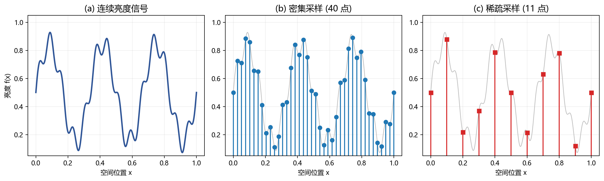
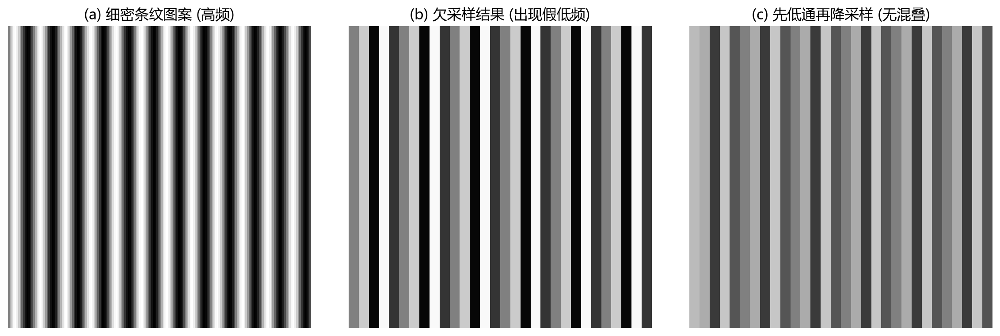
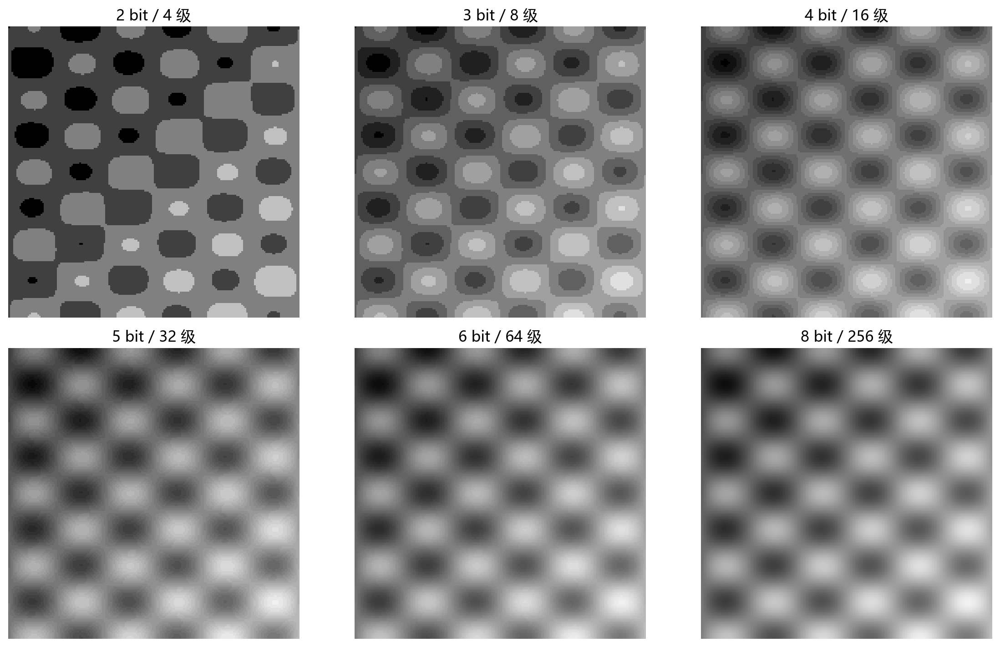

# 01 图像数字化：采样、量化与像素世界

> 把连续世界变成数组，是所有图像算法的第一步。

---

## 1. 从连续到离散：一张图像的诞生

真实世界的场景中，亮度在空间上是连续变化的——你可以想象站在窗前，每一寸视野里的明暗都在平滑地过渡。而计算机只能用**有限的数字**表示图像。于是我们做了两件事：

- **采样 (Sampling)**：在空间上按固定间隔取点，决定"在哪里取值"。
- **量化 (Quantization)**：把每个采样点的亮度值映射到有限个等级，决定"用多少级表示"。

图 1-1 展示了一维情况下连续亮度曲线被稀疏或密集采样后的结果。密集采样保留更多波形细节，稀疏采样可能遗漏高频起伏。在二维图像中也是同理：传感器越密，能分辨的细节越细。

如果你熟悉 DSP 中的模数转换，图像数字化就是"二维 ADC"——传感器阵列是空间采样器，ADC 位深是强度量化器。两者共同决定了你能"看见"多少细节。

---

## 2. 采样定理在二维图像中

采样定理告诉我们：**采样频率至少要覆盖信号最高频率的两倍**，才能从采样点无失真地恢复原信号。图像中的"频率"不是时间快慢，而是**空间上亮度变化的快慢**：

- **低频**：大面积的天空、墙面、皮肤——亮度变化平缓。
- **高频**：头发丝、文字边缘、织物纹理、金属划痕——亮度变化剧烈。

如果你要拍摄每毫米有 20 道黑白条纹的栅格，那么传感器像素间距至少要比 0.025 mm 更密。否则，高频信息会折叠回低频，产生**假象**。

图 1-2 直观展示了混叠现象。左边的细密条纹图案是真实高频场景；中间是采样率不足的结果——原本的细条纹消失了，出现了旋转方向不同、周期更长的**假条纹**。右边是先做低通滤波（模糊）再降采样的结果——虽然细节变少，但至少不会再出现不存在的结构。

  **经验法则：先低通，再降采样；不是先采样，再后悔。**

---

## 3. 量化：把无限个亮度压成有限级

采样搞定了"在哪里取值"，量化解决"取到的值怎么存"。真实世界的亮度是连续实数（理论上有无穷多种），但计算机存储是离散的。将连续值映射到有限个离散等级的过程叫作量化。

**均匀量化**把亮度范围 $[0, V_{\max}]$ 均匀切成 $L$ 级：

$$
Q(v) = \left\lfloor \frac{v}{\Delta} \right\rfloor \cdot \Delta,\qquad \Delta = \frac{V_{\max}}{L}
$$

常见位深对应的等级数：

| 位深 | 等级数 | 典型用途 |
|---|---|---|
| 1 bit | 2 | 二值图、文档扫描 |
| 4 bit | 16 | 低码率图像、游戏调色板 |
| 8 bit | 256 | 照片、视频、通用显示 |
| 12 bit | 4096 | 医学影像、工业检测、天文学 |
| 16 bit | 65536 | 科学成像、HDR 合成 |

图 1-3 展示了同一张图像在 2 bit 到 8 bit 量化下的效果。2 bit（4 级）时图像几乎辨认不出细节；4 bit（16 级）已经有明显色带；6 bit（64 级）色带开始减弱；8 bit（256 级）对人眼来说已经足够平滑。

**量化误差**：每个像素被量化时都会丢一点信息。均匀量化的误差大致在 $[-\Delta/2, +\Delta/2]$ 范围内分布。工程上通常用 PSNR 衡量量化质量——8 bit 均匀量化约为 48 dB，对大多数人眼视觉任务已经够用。

  **为什么常见是 8 位？**  
  人眼在理想条件下约能分辨 100~200 个灰度级，8 bit = 256 级刚好覆盖感知极限；而且 8 bit = 1 字节，天然对齐计算机字长。

---

## 4. 深入理解：采样、量化与噪声不是三件孤立的事

初学者容易把分辨率、位深、噪声分开看，但在真实成像链路中它们会互相影响。

- **高分辨率 ≠ 高画质**：像素做小了，空间采样密度提高，但单个像素接收的光子数减少，信噪比可能下降。结果是"像素更多，但每个像素更吵"。
- **高位深 ≠ 高有效信息**：如果模拟噪声已经大于 1 个量化级，增加 ADC 位数只会更精细地记录噪声。工程上常说的"有效位数 (ENOB)"就是提醒你：标称 12 bit 不等于真的 12 bit 有效。
- **采样与量化要匹配**：如果空间上已经混叠，再高的位深也救不回来；如果灰度过渡已经很平滑，位深不够就会出现色带，再多像素也白搭。

  **判断一套采集方案质量的三问：**
  1. 空间上够不够密？（目标最小结构是否跨越 ≥ 2~3 个像素）
  2. 灰度上够不够细？（目标与背景的灰度差是否明显大于噪声 + 量化台阶）
  3. 时间上够不够稳？（曝光、运动、光源频闪是否引入额外伪影）

---

## 5. 用例：显微成像的采样预算

假设你需要测量细胞边界，最细结构宽度约为 2 μm。

- 根据采样定理，像素间距应 ≤ 1 μm。
- 实际工程中为了稳定测量，通常让目标结构跨越 4~5 个像素，所以最好做到 0.5 μm/px。
- 如果视场需要覆盖 200 μm × 200 μm 的区域，则需要约 400 × 400 像素的传感器区域。

这就是"算法需求反推采集参数"——不是相机分辨率越高越好，而是让采样率刚好覆盖目标结构，同时留有余量。

---

## 6. 工作流程：一张图像如何进入计算机
**光学成像 → 空间采样 → 曝光积分 → 模拟增益 → 模数转换 → 格式封装**

1. 镜头把三维场景投影到传感器平面。
2. 传感器阵列在固定网格上记录光强（空间采样）。
3. 每个像素在曝光时间内累积光子。
4. 模拟信号被放大（增益/ISO），噪声也可能同时被放大。
5. ADC 将连续电压量化为有限位数字。
6. 数字矩阵被封装为 RAW、PNG、JPEG 等格式。

这条链路里的每一步，都可能影响后续算法。采样太稀 → 混叠；曝光不足 → 噪声大；量化位深不足 → 色带；压缩过强 → 块效应和细节丢失。

---

## 7. 常见坑

- 把像素理解成"小方块"。像素本质是采样点，方块只是显示渲染方式。
- 缩小图像时只取最近邻，不做低通，导致混叠。
- 认为高分辨率一定更好——如果镜头和噪声跟不上，只是采到更多噪声。
- 忽略位深：医学/遥感/工业检测中，8 bit 常常不够。
- 在 JPEG 中保存掩膜或深度图——有损压缩会破坏语义。

---

## 8. 练习题

### 练习 1：为什么缩小图片前要低通滤波？

一张高分辨率图像里有细密条纹，现在要缩小到原来的 1/3。如果直接"每隔 3 个像素取一个"会发生什么？

**参考答案：**

新图像的有效采样率降低到原来的 1/3。如果原图中的条纹频率超过新 Nyquist 限制，高频会折叠成低频——表现为摩尔纹、假纹理或条纹方向异常。缩小前用低通滤波（如高斯模糊）先移除新采样率无法表示的高频内容，可以避免混叠。

### 练习 2：8 bit 和 12 bit 的差别一定能被看出来吗？

同一场景分别用 8 bit 和 12 bit 存档，12 bit 一定肉眼更好看吗？

**参考答案：**

不一定。如果场景动态范围不大、显示设备只支持 8 bit、噪声水平已经高于 8 bit 的量化台阶，12 bit 的优势很难直接看出来。12 bit 的真正价值在于后期拉伸和高精度测量——比如在暗区放大 4 倍后，8 bit 会出现色带，12 bit 仍能保持平滑过渡。

### 练习 3：如何为一个测量任务估算像素分辨率？

目标裂缝宽度约 0.2 mm，视场宽度约 100 mm。你会如何估算相机水平分辨率？

**参考答案：**

裂缝最细处应至少跨越 2~3 个像素才能被可靠检测，工程上通常希望 4~5 像素。因此像素分辨率应 ≤ 0.05 mm/px。视场 100 mm 意味着水平方向至少需要 2000 px。可选用 5 MP 级别的传感器并配合合适镜头。

---

## 9. 小结

图像数字化就是"二维信号的采样与量化"。采样密度决定了你能看到多细的纹理；量化位深决定了灰度过渡多平滑；而两者在真实成像链路中还会和噪声、动态范围、压缩相互影响。理解这一层，后面学几何变换、滤波、压缩才会顺——因为所有算法都在和离散化带来的信息损失打交道。

下一章：[02 点运算与代数运算](02_点运算与代数运算.md)
