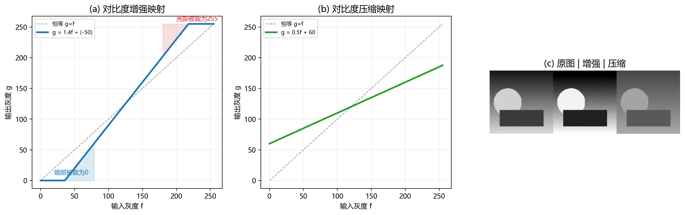
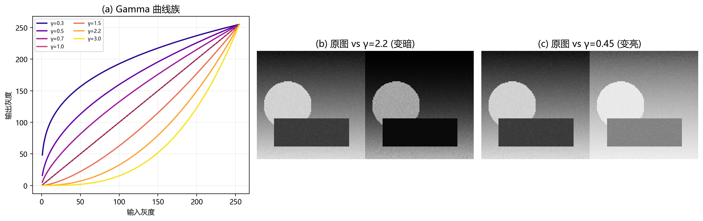
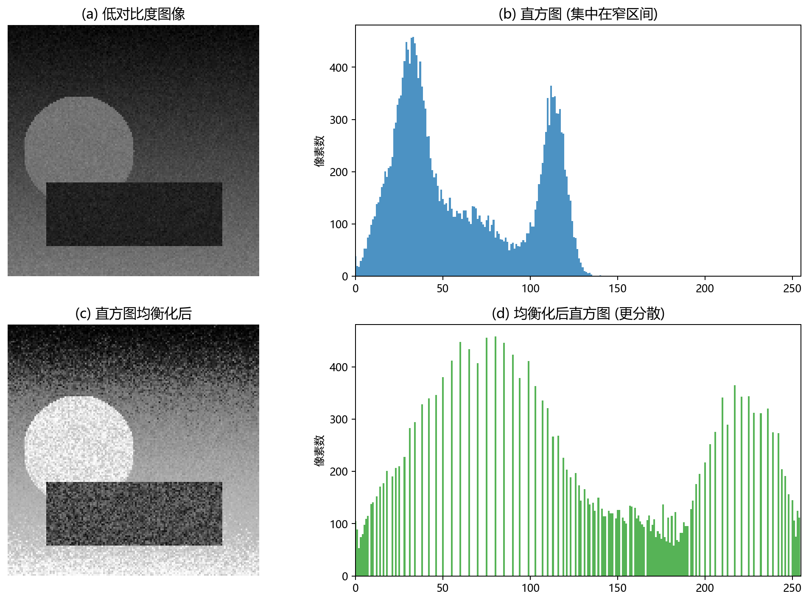
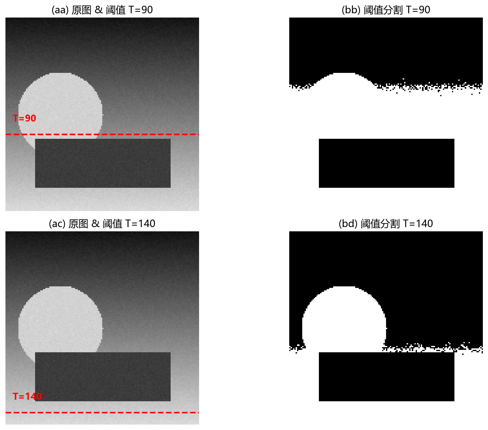
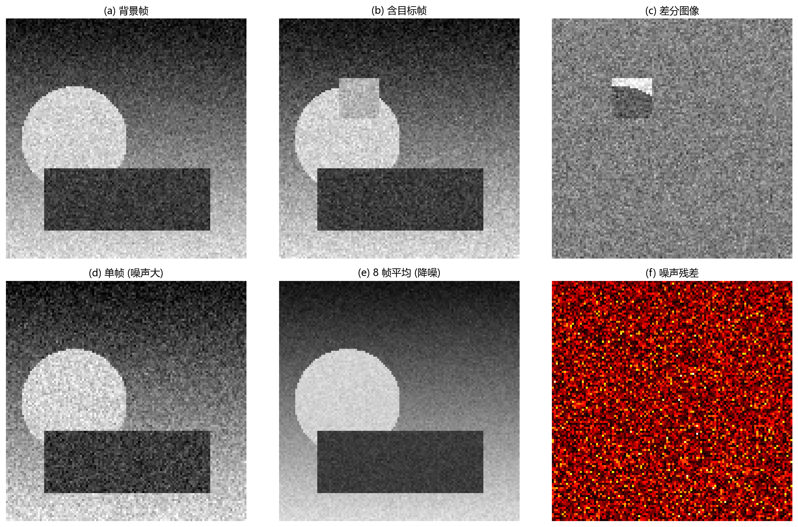

# 02 点运算与代数运算：先学会改像素值

> 像素位置不变，只改变像素的值——图像处理中最基础、也最常用的一类操作。

---

## 1. 点运算：每个像素独立做一次函数映射

点运算不依赖邻域，也不涉及坐标变换。它的数学形式极简：

$$
g(x, y) = T\bigl(f(x, y)\bigr)
$$

其中 $f(x,y)$ 是输入图像在 $(x,y)$ 处的灰度，$g(x,y)$ 是输出的灰度，$T(\cdot)$ 是一个标量映射函数。

你把它理解成**给灰度轴重新做标尺**就够了。线性变换是拉伸这根尺子；Gamma、对数、阈值则是在不同区域做不均匀压缩或展开。

> **与 DSP 的类比**：点运算相当于对标量信号逐点施加一个无记忆非线性系统——就像音频里的压缩器或扩展器。它们都不改变信号中的"事件位置"，只改变"事件的强弱"。

---

## 2. 线性灰度变换

最常见的线性点运算是：

$$
g = a \cdot f + b
$$

其中：
- $a$ 控制对比度（增益）。
- $b$ 控制亮度（偏置）。

### 2.1 什么时候 $a > 1$？增强对比度

当 $a = 1.4,\; b = -50$ 时，如果输入灰度 $f = 100$，则输出：

$$
g = 1.4 \times 100 - 50 = 90
$$

如果 $f = 200$，则 $g = 1.4 \times 200 - 50 = 230$。原图里 100 到 200 的灰度跨度是 100，输出跨度变成了 $230 - 90 = 140$——**对比度被放大**。

但注意两件事：
- $f < 50$ 的暗部会被裁到 0（因为 $1.4 \times 50 - 50 = 20$，再暗就全黑了）。
- $f > 217$ 的亮部会被裁到 255。

图 2-1(a) 展示了一条对比度增强的映射曲线——斜率大于 1，暗部被压黑、亮部被推白。图 2-1(b) 展示了一条 $a = 0.5,\; b = 60$ 的压缩曲线——斜率小于 1，灰度范围被压缩。图 2-1(c) 把这两条曲线实际作用在测试图像上的效果并排展示。

### 2.2 什么时候 $0 < a < 1$？压缩对比度

当 $a = 0.5,\; b = 60$ 时，输入范围 $[40, 220]$ 映射到 $[80, 170]$，范围从 180 压到 90。图像会变得"发灰"，因为所有灰度都向中间挤。

### 2.3 工程上必须裁剪

无论怎么算，输出灰度必须限在 $[0, 255]$（对于 8 bit 图像）：

$$
g = \mathrm{clip}(a \cdot f + b,\; 0,\; 255)
$$

裁剪意味着：线性映射的两端可能会**饱和**——暗部细节丢失（全部变黑），亮部细节丢失（全部变白）。所以在选择 $a$ 和 $b$ 时，需要权衡"对比度增强"和"细节保留"。

---

## 3. Gamma 校正——非线性点运算的经典例子

人眼对暗部的差异更敏感、对亮部差异不敏感（韦伯-费希纳定律）。同时，早期 CRT 显示器的电子枪响应也不是线性的。为了在有限的 8 bit 范围内高效利用灰度资源，引入了 Gamma 校正：

$$
g = 255 \cdot \left(\frac{f}{255}\right)^\gamma
$$

图 2-2(a) 画出了一族 Gamma 曲线：
- $\gamma < 1$（如 $\gamma = 0.45$）：曲线向上凸，暗部被大幅提亮、亮部变化不大。整体画面变亮，暗区细节浮现。
- $\gamma > 1$（如 $\gamma = 2.2$）：曲线向下凹，暗部被压暗、亮部被压缩。整体画面变暗。
- $\gamma = 1$：恒等映射，不做改变。

图 2-2(b) 和图 2-2(c) 展示了实际作用效果——$\gamma = 2.2$ 让整张图明显变暗，而 $\gamma = 0.45$ 让暗区的圆形和矩形都清晰了很多。

### 为什么 Gamma 很重要？

显示器、打印机、扫描仪都有自己的 Gamma 特性。如果你的图像在创作时假设 $\gamma = 2.2$，但显示设备用的是 $\gamma = 1.0$，画面就会偏亮偏灰。这就是色彩管理为什么需要 ICC Profile——其中的 Gamma 值确保了从拍摄到显示，灰阶关系保持一致。

在计算机视觉中，很多算法（如特征检测、图像匹配）对灰度分布敏感。未经 Gamma 校正的图像可能暗区一团黑、亮区一片白，导致算法失效。因此 Gamma 校正常常是**预处理的第一步**。

---

## 4. 直方图：点运算的仪表盘

直方图统计每个灰度值出现了多少次。它不告诉你像素在哪，但告诉你灰度分布的整体形状。

图 2-3 展示了一个非常经典的场景：
- (a) 是一张**低对比度**图像——亮部和暗部区分度不够，整体灰蒙蒙。
- (b) 是它的直方图——所有像素挤在 $[30, 130]$ 这个窄区间里，0 和 255 两侧几乎没有使用。
- (c) 是直方图均衡化后的结果——整张图的**灰度分布被拉伸到 $[0, 255]$ 全范围**，对比度明显提升。
- (d) 是均衡化后的直方图——灰度分布更均匀，没有原先那种"一堆像素挤在中间"的现象。

### 直方图均衡化的直觉

均衡化的核心思想是：**让出现的频率变成间距**。如果在某个灰度区间有很多像素，就把这个区间撑开，让每个灰度级上的像素数量尽量接近。这等价于让累积分布函数 (CDF) 接近一条斜线。

但直方图均衡化也有副作用：如果暗区既包含细节又包含随机噪声，拉伸暗区的同时，噪声差异也会被放大。这也是为什么低照图像往往先降噪，再做局部对比度增强。

---

## 5. 阈值变换：最简单也最重要的二值化

阈值变换把灰度图变成二值图：

$$
g = \begin{cases}
255, & f > T \\[2pt]
0, & f \leq T
\end{cases}
$$

图 2-4 在测试图像上展示了两种阈值的效果：
- 左侧两张图使用 $T = 90$：阈值较低，圆形目标和大部分矩形区域都被提出来。
- 右侧两张图使用 $T = 140$：阈值较高，只有最亮的部分（圆形）被保留，矩形的大部分消失了。

阈值的选择直接影响**哪些被当成目标、哪些被当成背景**。这看似简单，但一旦环境光照变化，同一个 $T$ 就可能失效。因此工程上常使用**自适应阈值**——每个局部区域根据自身灰度分布独立计算阈值。

---

## 6. 代数运算：多张图像之间的逐像素组合

代数运算不是单张图的内部变换，而是**两幅或多幅图像在相同坐标处逐像素组合**：

$$
g(x, y) = f_1(x, y) \;\circ\; f_2(x, y)
$$

其中 $\circ$ 可以是加、减、乘、除。

图 2-5 展示了代数运算的两类典型场景：

**上排 (a-c)：背景减除**。
- (a) 是背景帧——没有目标物体。
- (b) 是含目标帧——在中间位置多了一个亮区。
- (c) 是两帧做**减法**得到的差分图像——目标区域清晰可见，而静止的背景被消去。

**下排 (d-f)：多帧平均降噪**。
- (d) 是单帧——随机噪声明显。
- (e) 是 8 帧做**加法后平均**的结果——噪声被明显压制，画面平滑了许多。
- (f) 是噪声残差——也就是单帧和平均帧之间的差异部分，可以看出来被平均"吃掉"的噪声分布。

### 四种运算的典型用途

| 运算 | 公式 | 典型用途 |
|---|---|---|
| 加法 | $g = f_1 + f_2$ | 多帧平均降噪、图像叠加、曝光融合 |
| 减法 | $g = f_1 - f_2$ | 背景减除、变化检测、缺陷检测 |
| 乘法 | $g = a \cdot f$ 或 $g = f_1 \cdot f_2$ | 掩膜处理、区域加权、局部调光 |
| 除法 | $g = f_1 / f_2$ | 平场校正、归一化、反照率估计 |

> **工程经验**：除法运算最需要注意除零问题，通常会在分母加一个小常数 $\varepsilon$。减法结果容易出现负值，通常要偏移或取绝对值才能正常显示。

---

## 7. 深入理解：每个运算背后都有隐含模型

点运算和代数运算看起来简单，但每次使用时都在做隐含假设：

- **伽马校正**假设显示器响应是幂律曲线。
- **背景减除**假设背景在帧间基本不变、变化主要来自前景。
- **多帧平均**假设噪声是零均值随机变量、各帧信号相同。
- **平场校正**假设光照不均匀可以用乘性模型描述。

当这些假设成立时，结果很好；假设不成立时，结果会出错。所以每用一次运算，都应该问自己：**这个假设在我的场景里成立吗？**

---

## 8. 用例：工业相机平场校正

在工业检测中，即使拍一张纯白板，图像也可能中间亮、四角暗——这是镜头渐晕和光源不均造成的。如果直接用这张图做阈值分割，同样的目标在画面中间和边缘会被分出不同的结果。

平场校正的做法：
1. 先拍一张均匀白板，得到平场图 $F$。
2. 对待测样品拍得图像 $I$。
3. 校正后：$I_c = (I / F) \cdot \overline{F}$。

这就是**除法 + 乘法**的组合使用。校正后，光照不均被除掉，阈值可以在整张图上稳定工作。

---

## 9. 常见坑

- **数据类型溢出**：`uint8` 的 250 + 20 会绕回到 14，而不是 270。做运算前先转为 `float32`。
- **减法不处理负值**：差分会丢失"方向"信息——到底是变亮还是变暗。
- **盲目均衡化**：低照图像均衡化后噪声会被拉得非常明显。
- **彩色图逐通道增强**：RGB 各自拉伸容易导致**色偏**——建议先转 HSI/Lab，只处理亮度通道。
- **除法忘加 epsilon**：黑暗中一个像素值为 0 就崩溃。

---

## 10. 练习题

### 练习 1：为什么直方图均衡化可能让图像更"脏"？

一张低照度图像做直方图均衡化后，目标变清楚了，但背景噪声也更明显。为什么？

**参考答案：**

均衡化会拉开出现频繁的灰度区间。如果暗部既包含目标细节也包含随机噪声，暗部被拉伸时，噪声差异也同步放大——原来 ±3 的细微噪声可能被拉成 ±15 的明显噪点。低照图像建议先降噪，再做受限的局部对比度增强（如 CLAHE）。

### 练习 2：背景减除适合什么前提？

为什么固定监控摄像头的背景减除比手持摄像稳定得多？

**参考答案：**

背景减除假设背景在两帧之间基本不变，变化主要来自前景目标。固定摄像头满足这个前提——背景真的几乎不变。如果摄像头移动，整幅图像都在变，简单相减会把背景运动也当作目标。此时需要先做配准（对齐图像），再做差。

### 练习 3：Gamma 校正和直方图均衡化有什么本质区别？

两者都能改善图像视觉效果，但原理完全不同。请简要说明。

**参考答案：**

Gamma 校正是一个固定的非线性映射函数（通常是幂律），不依赖图像内容——同一套参数对任何图像结果一样。直方图均衡化是**数据驱动**的——映射函数由图像本身的直方图决定，每张图像可能不同。Gamma 主要解决显示设备的非线性响应问题；均衡化主要解决灰度分布不均匀的问题。

---

## 11. 小结

点运算处理"单像素映射"——改变的是灰度的坐标轴。代数运算处理"图像之间的组合"——利用多帧信息做减法、平均和校正。它们是最基础的积木块，但每个积木背后都隐含着一个对图像世界的假设。识别这些假设，比记住公式更重要。

下一章：[03 图像几何变换](03_图像几何变换.md)
