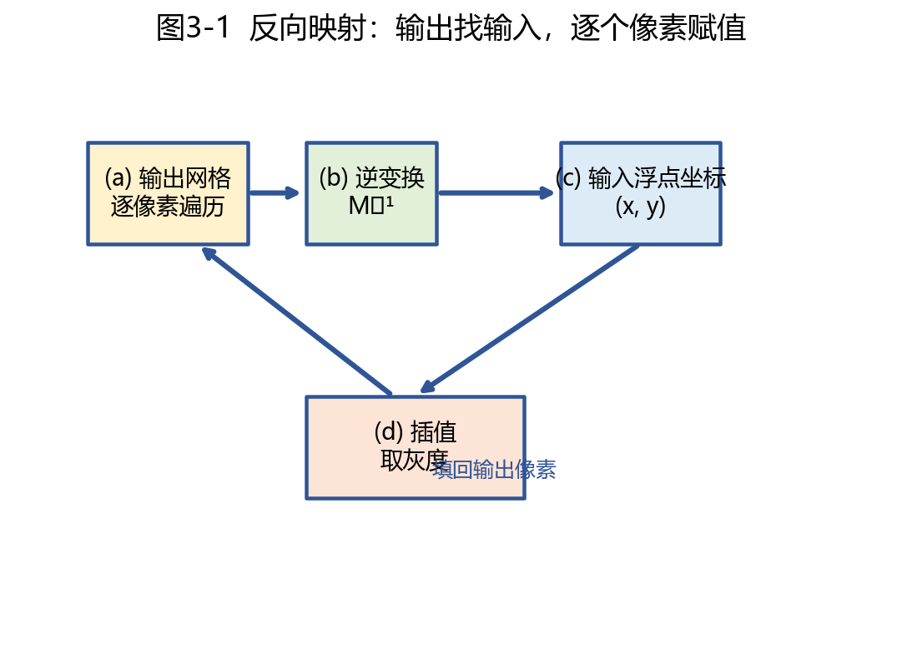
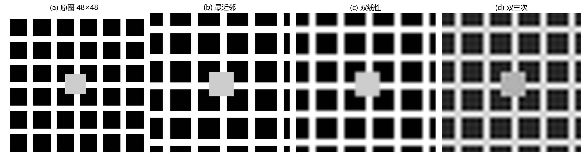
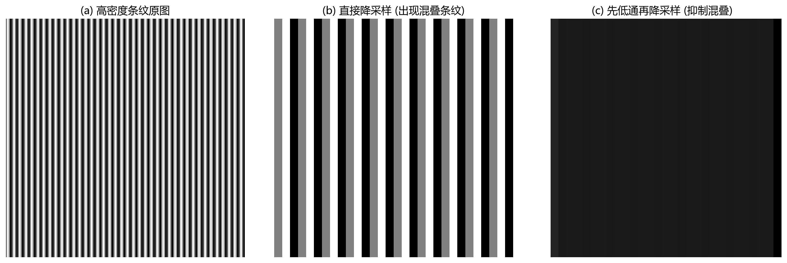
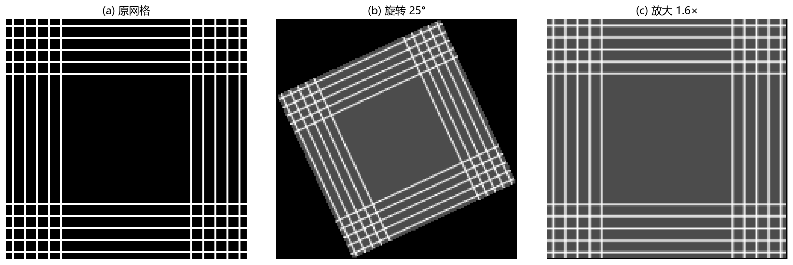

# 03 图像几何变换：坐标变了，像素从哪来

> 旋转、缩放、平移的本质不是"搬像素"，而是在新坐标网格上重新采样。

---

## 1. 几何变换解决什么问题

前两章的操作只改变像素值，不改变像素位置。但现实任务中你经常需要：旋转照片、矫正文档、拼接图像、放大缩略图、校正镜头畸变。这些都要求**改变像素空间位置**——这就是几何变换。

从 DSP 角度看，几何变换就是**二维重采样 (resampling)**。你把输出图像当成一张新采样网格，然后把每个输出点在输入图像中反查位置并插值——和变采样率转换中的重建 + 重新采样完全同源。

---

## 2. 齐次坐标：让平移也能写成矩阵

二维几何变换包括平移、旋转、缩放、错切。问题是：平移是加法，旋转和缩放是乘法。如果换成**齐次坐标**——把 2D 点 $(x, y)$ 扩展为 3D 向量 $(x, y, 1)^T$——所有变换都能统一成 $3 \times 3$ 矩阵乘法：

| 变换 | 齐次矩阵 | 说明 |
|---|---|---|
| 平移 $(t_x, t_y)$ | $\begin{bmatrix}1 & 0 & t_x \\ 0 & 1 & t_y \\ 0 & 0 & 1\end{bmatrix}$ | 移动位置 |
| 缩放 $(s_x, s_y)$ | $\begin{bmatrix}s_x & 0 & 0 \\ 0 & s_y & 0 \\ 0 & 0 & 1\end{bmatrix}$ | 沿坐标轴缩放 |
| 旋转 $\theta$ | $\begin{bmatrix}\cos\theta & -\sin\theta & 0 \\ \sin\theta & \cos\theta & 0 \\ 0 & 0 & 1\end{bmatrix}$ | 绕原点逆时针旋转 |

  **把矩阵从右往左乘，就是按顺序组合变换。**  
  先旋转再平移 → $T\; R\; p$

---

## 3. 反向映射：工程上唯一正确的做法

直觉上你会想：遍历原图的每个像素，算它在新图里的位置，把值填过去。这叫**前向映射**。它有致命缺陷：

- 多个原图像素可能映射到同一个新图像素（重叠）。
- 有些新图像素可能**没有任何原图像素落进来**（空洞）。

所以工程上几乎全用**反向映射**：对输出图的每个像素 $(x', y')$，用逆变换找回输入图上的浮点坐标 $(x, y)$，然后插值取灰度。

图 3-1 展示了反向映射的完整逻辑：遍历输出网格的每个像素 → 通过逆矩阵 $M^{-1}$ 找回输入坐标系中的位置 → 因为输入坐标通常是浮点数，所以需要插值 → 把插值得到的灰度填回输出像素。这样一来，输出图**每个像素都有值**，空洞和重叠问题自然消失。

---

## 4. 插值：从离散样本重建连续值的近似

反向映射拿到的是浮点坐标 $(x, y)$，而输入图只在整点位置有值。浮点位置上的值怎么取？这就靠**插值**。

图 3-2 把一张 48×48 的测试图案放大 6 倍，分别用三种插值方法展示了结果：
- **(b) 最近邻**：每个输出像素直接取最近输入像素的值。速度最快，但边缘锯齿严重，图像呈现明显的"马赛克"效果。
- **(c) 双线性**：用周围 4 个像素做线性加权平均。画面柔和，但细节略模糊——高频有所损失。
- **(d) 双三次**：用周围 16 个像素做三次多项式插值。边缘更锐利，但计算量更大，有时可能出现微小的过冲（ringing）。

| 方法 | 邻域点数 | 速度 | 特点 | 适用场景 |
|---|---|---|---|---|
| 最近邻 | 1 | 最快 | 保留原值，锯齿严重 | 标签图、二值图、像素艺术 |
| 双线性 | 4 | 快 | 平滑，略模糊 | 实时视频、通用缩放 |
| 双三次 | 16 | 中等 | 更锐利 | 照片缩放、离线处理 |
| Lanczos | 更多 | 慢 | 最接近理想重建 | 高质量离线重采样 |

> **关键区分：标签图不能用双线性。** 标签图像素值是类别编号（0=背景、1=目标、2=其他），不是连续亮度。双线性插出的 "1.5" 没有语义意义——它不是有效类别。标签图缩放应使用最近邻，或局部窗口中的**多数投票**。

---

## 5. 几何变换会改变频率，缩小必须防混叠

几何变换会改变局部采样间距。放大让单位输出像素对应更小的输入区域，不会出现新频率——只是插值质量决定画面平滑度。但**缩小**会让单位输出像素对应更大的输入区域，如果不先做低通，高频纹理会混叠。

图 3-4 用高密度条纹图案做降采样演示：
- (a) 是原始高密度条纹。
- (b) 是直接每隔 6 像素取一点——结果出现了完全不同的低频假条纹（混叠）。
- (c) 是先做高斯模糊（相当于低通滤波），再每 6 像素取一点——虽然细节变少了，但没有出现虚假结构。

  **口诀：放大看插值核，缩小看抗混叠。**

---

## 6. 仿射变换在图像上的实际效果

旋转、缩放、平移、错切统称仿射变换——它们保持线段的平行性。图 3-3 用网格图案直观展示了旋转和缩放带来的几何形变。

图 3-3(a) 是规整的正方网格。图 3-3(b) 是旋转 25° 后的结果——注意旋转中心在图像中心，不在坐标原点。如果不做"平移—旋转—平移回来"的组合，旋转会以左上角为轴心。图 3-3(c) 是放大 1.6 倍后的结果——网格间距变大，采样点之间需要用插值来填充。

---

## 7. 用例：文档扫描矫正

手机拍摄的纸质文档常常是梯形而不是矩形。这是因为相机平面和纸面不平行，产生了透视变形。

矫正流程：
1. **检测四个角点**：找到纸张的四个顶点坐标 $(x_i, y_i)$。
2. **构造透视变换矩阵**：已知四个源角点和四个目标矩形角点（如 A4 比例），解透视变换的 8 个自由度。
3. **反向映射 + 双三次插值**：遍历输出图像的每个像素，用矩阵找回输入图对应位置并插值。
4. **得到平整扫描图**：矫正后的图像是规整矩形，文字端正、可以直接做 OCR。

---

## 8. 常见坑

- **行列坐标 vs $(x, y)$ 坐标混用**。编程时访问像素常常是 `image[row, col]`（先列后行），而数学坐标是 $(x, y)$（先行后列）——映射时很容易搞反。
- **缩小时不做低通**，导致混叠。
- **对标签图用双线性或双三次插值**，产生不存在的类别编号。
- **旋转中心默认在原点**，图片会"绕左上角转"——记得先平移到图像中心，旋转，再平移回来。
- **输出画布不扩大**，旋转后四个角会被裁掉。

---

## 9. 练习题

### 练习 1：为什么旋转图像后可能出现黑边？

同一张矩形图片旋转 30° 后，四角出现三角形黑区。原因是什么？有哪些处理方法？

**参考答案：**

输出画布沿用原图尺寸时，旋转后部分输出像素对应到原始图像以外，没有数据可取值，默认填充为黑色。处理方法：扩大输出画布以容纳旋转后的内容；或计算有效区域并裁剪；或用边界复制/镜像填充替代黑色。

### 练习 2：为什么缩小标签图也要谨慎？

把语义分割标签缩小一半时，能否用普通图像缩放的双线性插值？如果不能，应该怎么做？

**参考答案：**

不能。标签图数值是离散类别（如 0=背景, 1=人, 2=车）。双线性插值产生 1.3 这样的中间值，语义无意义。应采用最近邻（保留原始类别），或在局部窗口中做多数投票，用出现最多的类别作为新像素值。

### 练习 3：反向映射为什么比前向映射更常用？

请从输出图像完整性的角度解释。

**参考答案：**

前向映射把输入像素推到输出位置——可能出现多个输入像素重叠到同一输出位置，也可能某些输出位置没收到任何像素而产生空洞。反向映射先规定输出网格，再逐个查找每个输出像素的来源输入位置——天然保证输出图**每个位置都有值、不存在空洞**。因此反向映射是工程标准做法。

---

## 10. 小结

几何变换的核心不是"把像素搬到新位置"，而是**在新坐标网格上重新采样原信号**。反向映射保证了输出图像的完整性，插值方法决定了重建精度，而缩小时的抗混叠滤波决定了是否会引入虚假结构。把这三者搞懂，就掌握了图像配准、矫正、拼接和缩放的全部基础。

下一章：[04 图像时频变换](04_图像时频变换.md)
