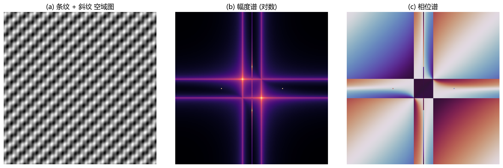
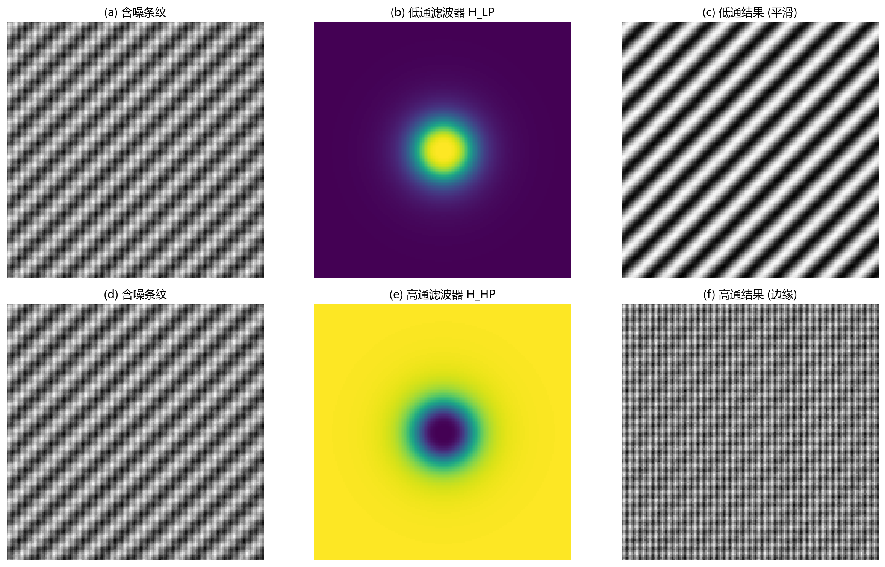
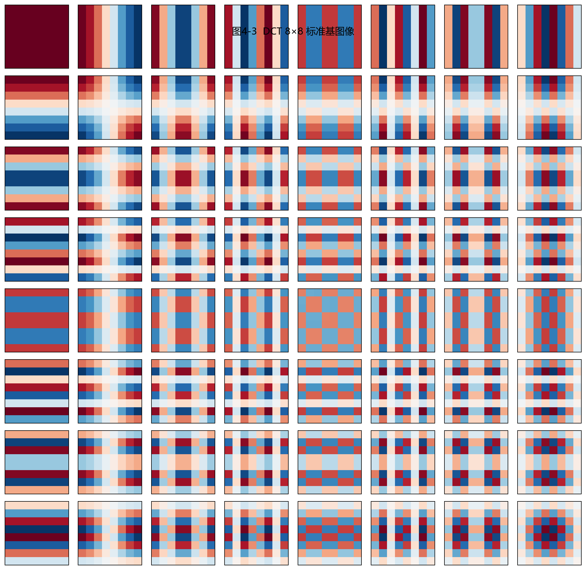

# 04 图像时频变换：换一个坐标系看图像

> 空域里问"哪里亮"，频域里问"变化有多快"。两者回答的是同一张图像的不同面向。

---

## 1. 为什么要把图像变到频域

在空域里，图像是一个二维数组，每个位置存亮度。在频域里，图像被分解成不同方向、不同频率的正弦波的叠加。低频对应大面积明暗（天空、皮肤），高频对应快速变化（边缘、纹理、噪声）。

频域的价值在于：**有些操作在空域里是复杂的卷积，在频域里只是简单的乘法**。模糊一张图 = 压低它的高频；锐化 = 提升高频；消除周期噪声 = 在频谱中找到那几个尖峰并剔除。

> **DSP 类比**：一维信号的傅里叶变换让你看到"这个声音有几个频率成分"。图像的二维傅里叶变换告诉你"这张图在什么方向、什么频率上有多少能量"。

---

## 2. 二维傅里叶变换：从图像到频谱

离散二维傅里叶变换的公式：

$$
F(u,v) = \sum_{x=0}^{M-1} \sum_{y=0}^{N-1} f(x,y) \; e^{-j2\pi(ux/M + vy/N)}
$$

其中 $(u,v)$ 是频率坐标（单位是"每个图像宽度的周期数"）。$|F(u,v)|$ 叫**幅度谱**，$\angle F(u,v)$ 叫**相位谱**。

图 4-1 展示了条纹 + 斜纹组合图像的频谱分解：
- (a) 空域原图：有水平条纹（垂直方向变化快）、竖直条纹（水平方向变化快）和斜向条纹。
- (b) 幅度谱（取对数后）：中心是低频，外圈是高频。你能看到几对亮点——每对亮点对应某种方向和频率的条纹。亮点到中心的距离等于条纹的空间频率，亮点连线方向垂直于条纹方向。
- (c) 相位谱：决定了这些频率成分的**相对位置**。同样的幅度谱加上不同的相位谱，会重建出完全不同的图像——比如把一个人的幅度谱和另一个人的相位谱混合，得到的图像更接近"提供相位谱的那个人"。

> **为什么幅度谱取对数？** 低频的能量通常远大于高频——比如一片天空（低频）贡献的能量比一绺头发（高频）大了几个数量级。直接显示会只看到中心一个大亮点，其他频率都看不见。取对数压缩了动态范围，让高频也能被看清。

---

## 3. 频域滤波：乘法就能做"选择"

空域卷积 → 频域相乘。这是卷积定理的核心。

图 4-2 用一张含噪条纹图演示了频域滤波的流程：

**上排 (a-c)：低通滤波。**
- (a) 是含噪原图。
- (b) 是低通滤波器——中心最亮（通过），越往外越暗（抑制）。使用平滑的巴特沃斯型过渡，避免硬边界。
- (c) 是滤波结果——噪声被平滑了，条纹的主体结构保留，但细节变"软"。

**下排 (d-f)：高通滤波。**
- (d) 是同一张含噪原图。
- (e) 是高通滤波器——中心暗（抑制低频），外圈亮（通过高频）。
- (f) 是滤波结果——大块明暗消失，只留下条纹边界、纹理边缘和噪声。

### 为什么不能直接用"硬"滤波器？

理想低通：频域里是一个圆圈，圈内系数 = 1，圈外 = 0。这在空域对应一个无限延伸的 sinc 函数，会产生**振铃 (ringing)**——边缘附近出现波纹。使用高斯或巴特沃斯等平滑过渡的滤波器可以大幅缓解振铃。

---

## 4. DCT：JPEG 选择的基础变换

离散余弦变换只用余弦基（不用正弦），而且是实数运算。JPEG 压缩的核心就是：把图像切成 8×8 小块 → 对每块做 DCT → 对系数按人眼敏感度量化 → 熵编码。

图 4-3 展示了 8×8 DCT 的全部 64 个基图像。每个小方块表示一个基：左侧的红色/蓝色块变化缓慢（低频），越往右下角变化越快（高频）。左上角那个全红的基就是 DC 分量——整个 8×8 块的平均亮度。

自然图像的 DCT 系数通常集中在左上角（低频区域）。右下角的高频系数往往接近 0 或很小——**量化就是把它们进一步归零，从而实现压缩**。归零越多，压缩率越高，但块效应和细节丢失也越重。

---

## 5. 小波变换：既看频率，也看位置

傅里叶变换回答"有哪些频率"，但不知道"这些频率出现在图像的哪里"。如果你只想知道某个局部有没有边缘，傅里叶不太擅长——它的基函数是无限延伸的正弦波，没有局部性。

小波变换用**可缩放、可平移的短波包**（小波）替代无限延伸的正弦波。图像被分解成多个尺度：最低频子带保留整体轮廓，高频子带保留水平、垂直、对角方向的细节。

如果你是 DSP 背景，可以把小波理解成**子带编码**在图像上的扩展——滤波器组对行和列交替作用，逐级分解。

---

## 6. 用例：用频谱图诊断图像质量

频谱图可以帮助你快速判断图像出了什么问题：
- **高频能量普遍很强** → 图像有很多细节/纹理/噪声。
- **高频区出现规则亮点** → 有周期性噪声（如电源纹波、网格干扰）。
- **高频能量明显偏弱** → 图像被过度模糊或失焦。
- **某个方向上的高频能量缺失** → 可能发生了运动模糊（沿运动方向的高频被拉低）。

---

## 7. 工作流程：频域滤波四步走

1. **正向变换**：从空域变到频域（FFT/DCT/DWT）。
2. **移动零频**：把低频移到中心（FFT 中常用 fftshift），方便观察和设计滤波器。
3. **设计滤波器**：构造频域掩膜——低通、高通、带通、陷波或自定义。
4. **反变换**：滤波后的频谱回到空域，得到处理结果。

---

## 8. 常见坑

- 频谱不取对数，只能看到中心一个亮点。
- 理想砖墙滤波器在频域边界太硬 → 空域出现振铃。
- 高通滤波增强边缘的同时，噪声也会被同步放大。
- DCT 块边界不连续 → JPEG 会出现块效应。
- 只分析幅度谱、忽略相位谱 → 相位包含结构信息（"东西放在哪里"）。

---

## 9. 练习题

### 练习 1：模糊图像的高频会怎样变化？

一张照片失焦后，边缘变软。频域中会发生什么？请用幅度谱来说明。

**参考答案：**

失焦模糊相当于用点扩散函数在空域做卷积，这个核通常是低通形状（如圆盘或高斯）。在频域，这等价于用一个低通滤波器乘以原始频谱。结果：远离中心的高频能量大幅衰减，频谱看起来更"紧凑"——能量更集中在中心低频区。

### 练习 2：周期条纹噪声为什么适合在频域处理？

如果图像中有一组斜向周期条纹（如扫描仪引入的纹波），频域如何帮助消除？

**参考答案：**

周期条纹在频域通常会聚集成一对或几对亮点（对应条纹的主频率和方向）。只要在频谱上找到这些亮点，用陷波滤波器（或直接置零）就可以消除条纹，同时对图像其他部分的影响远小于全局低通。这比在空域里设计滤波核更直观。

### 练习 3：幅度谱和相位谱哪个对图像"看起来像什么"更关键？

如果把图 A 的幅度谱和随机噪声的相位谱合成后反变换，是什么效果？如果把图 A 的相位谱和均匀幅度的噪声合成呢？

**参考答案：**

实验结果说明，**相位谱比幅度谱更决定图像的结构感**。保留相位谱、打乱幅度谱，重建出的图像仍能辨认轮廓和物体位置；反过来（保留幅度谱、打乱相位），图像会变成无法辨认的噪声——因为"什么东西放在哪里"的信息主要在相位中。

---

## 10. 小结

变换的核心目的是**换一个更适合操作的坐标系**。空域适合直观观察，频域适合按频率选择性操作——这是整个信号处理思维在二维图像中的自然延伸。增强、压缩、去噪、纹理分析都离不开这个框架。

下一章：[05 图像增强](05_图像增强.md)
