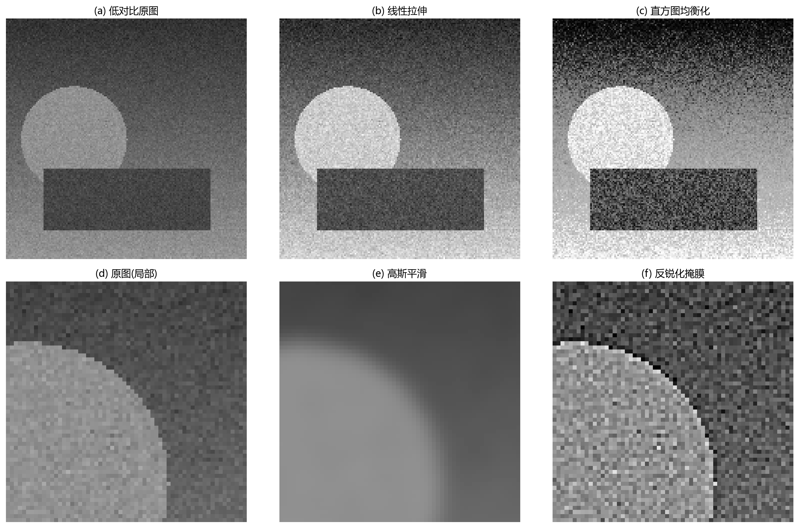
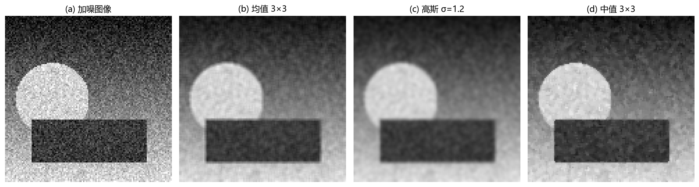

# 05 图像增强：让重要信息更容易被看见

> 增强的目标不是"看起来更真实"，而是"目标更容易被找到或测量"。它与图像恢复的区别在于：增强靠经验规则，恢复靠退化模型。

---

## 1. 什么时候需要增强

图像增强解决四类常见问题：
- **整体偏暗或偏灰**：灰度范围没有用满，目标埋没在窄区间里。
- **噪声干扰**：随机颗粒让细节无法分辨。
- **边缘不清晰**：目标和背景的边界模糊，影响分割和测量。
- **光照不均**：同一目标在画面不同位置亮度差异大。

图 5-1 在一张低对比度加噪图像上对比了三种增强方法：
- (a) 低对比原图：细节被压缩在很窄的灰度范围里。
- (b) 线性拉伸：把灰度范围扩展到 $[0, 255]$ 全区间，对比度立刻提升。但噪声也被同步拉伸——暗区原本 $[30, 50]$ 的噪声微起伏现在变成了 $[0, 100]$ 的大幅波动。
- (c) 直方图均衡化：按灰度分布密度重新分配灰度——出现最多的灰度区间被撑开，稀疏的区间被压缩。
- 下排展示了增强和锐化操作在局部区域的细节：高斯平滑压低了噪声但边缘变软，反锐化掩膜增强了边缘但噪声也略有增加。

---

## 2. 灰度变换增强

灰度变换是一对一的像素映射，不涉及邻域。它是最直接、最可控的增强方式。

**线性拉伸**把原图灰度范围从 $[f_{\min}, f_{\max}]$ 拉伸到 $[0, 255]$：

$$
g = 255 \cdot \frac{f - f_{\min}}{f_{\max} - f_{\min}}
$$

优点：简单、可逆（如果没裁剪）。缺点：如果 $f_{\min}$ 和 $f_{\max}$ 来自少数异常像素（如一个亮点噪声），拉伸后会浪费大量灰度范围。

**Gamma 增强** 偏向处理暗部或亮部。$\gamma < 1$ 拉开暗部、压缩亮部；$\gamma > 1$ 压缩暗部、拉开亮部。适合动态范围很大、需要局部调整的场景。

**对数变换** $g = c \cdot \log(1 + f)$ 能把 $[10^2, 10^5]$ 级的大动态范围压缩到可显示范围——频谱图显示就是典型的对数变换应用。

---

## 3. 直方图均衡化 vs 局部自适应均衡化

直方图均衡化是**全局**操作——它对整张图用同一条映射曲线。当光照不均时（左边暗右边亮），全局均衡会失效——亮区和暗区混在一起，映射曲线"两头够不着"。

**CLAHE (限制对比度的自适应直方图均衡化)** 是改进方案：把图像分成小格子，每个格子独立做均衡化，但限制最大对比度（裁剪直方图），再在格间做双线性插值消除边界。这能同时处理局部暗区和局部亮区。

  **经验规则：光照均匀用全局均衡，光照不均用 CLAHE，低照噪点大先降噪。**

---

## 4. 平滑降噪

降噪的本质是**利用邻域信息压制随机波动**。不同平滑方法对不同类型的噪声效果不同：

图 5-2 在加噪测试图像上对比了三种降噪方法：
- (a) 加噪原图：高斯噪声 $\sigma \approx 22$，细节被随机颗粒淹没。
- (b) 3×3 均值滤波：每个像素用周围 9 个像素的平均替代。噪声降低，但边缘也变模糊——因为均值滤波对边缘和噪声一视同仁。
- (c) 高斯滤波（$\sigma = 1.2$）：中心权重高、边缘权重低。比均值滤波更好地保留了边缘走向，但细节仍然会软化。
- (d) 3×3 中值滤波：每个像素用周围 9 个像素的**中位数**替代。对**椒盐噪声**（孤立的白点或黑点）效果特别好，因为中位数天然忽略极端值。

### 什么时候选哪种

| 噪声类型 | 推荐方法 |
|---|---|
| 高斯噪声 | 高斯滤波、双边滤波 |
| 椒盐噪声 | 中值滤波 |
| 混合噪声 | 先中值、后高斯 |
| 要保留边缘 | 双边滤波、非局部均值 (NLM) |

---

## 5. 锐化

锐化的目标不是创造新细节，而是让已有的亮度变化更明显。

**反锐化掩膜 (Unsharp Mask)** 是经典方法：
1. 对原图做高斯模糊得到"模糊版"。
2. 用原图减去模糊版得到"细节层"。
3. 把细节层加权加回原图。

公式可以写成：$g = f + \alpha \cdot (f - f_{\text{blur}})$

$\alpha$ 越大越锐，但也越容易出现**白边和黑边**（过冲）。真实边缘被轮廓线包围——这就是锐化过度的标志。

---

## 6. 深入理解：增强是在重新分配"注意力预算"

增强不恢复真实信号，而是把**有限的显示动态范围和算法敏感度**重新分配给重要信息。当你拉伸暗部时，暗部噪声也获得更多"预算"；当你锐化边缘时，压缩伪影也可能被当成边缘；当你局部均衡化时，全局亮度一致性可能被打破。

判断一个增强方法是否成功，不是看"好不好看"，而是看它是否让后续任务（检测、测量、识别）更准确。

---

## 7. 用例：低照度监控画面

低照监控画面常见：整体暗、噪声大、局部灯光过曝。

合理流程：
1. **轻度降噪**（中值或高斯，$\sigma$ 小一点）。
2. **Gamma 增强**（$\gamma \approx 0.5$~$0.7$ 提亮暗部）。
3. **适度锐化**（$\alpha \approx 0.5$~$1.0$）。

如果先锐化，噪声会被当成边缘放大，后面很难降下来。如果降噪太强，目标细节会永久丢失——**降噪和锐化的顺序不能颠倒**。

---

## 8. 常见坑

- 增强后更好看 ≠ 算法效果更好——算法可能依赖真实的灰度统计，增强可能破坏它们。
- 全局均衡化把背景噪声和信号一视同仁。
- 锐化过度→白边黑边→边界位置偏移→测量不准。
- 彩色图直接逐通道增强→色偏→应把亮度和色度分开处理（如用 HSI/Lab 空间）。

---

## 9. 练习题

### 练习 1：为什么先锐化后降噪通常不好？

**参考答案：**

锐化放大高频——而随机噪声大多在高频。先锐化相当于先放大噪声，再用降噪去修。降噪发现图像里满是"细节"（实际上是被放大的噪声），很难区分真假边缘。正确顺序是先降噪，再去增强残留的真实边缘。

### 练习 2：CLAHE 和全局均衡化的根本区别在哪？

**参考答案：**

全局均衡化对整张图用同一条灰度映射，光照不均时亮暗区混在一起，映射曲线哪个都照顾不好。CLAHE 把图像分成小块独立均衡化，每个块根据**自己的局部灰度分布**来拉伸——亮区的块和暗区的块各自独立调整。块间的插值保证了全局视觉平滑。

### 练习 3：增强后的图更"漂亮"，为什么算法可能更差？

**参考答案：**

算法（如特征检测、纹理分析、分类器）可能依赖稳定的灰度关系、真实的边缘强度或纹理统计。增强可能改变这些统计特性：阈值原本在某个灰度有效，增强后不适用了；纹理粗糙度被锐化改变了；特征向量的分布范围和分类器的训练分布对不上了。

---

## 10. 小结

增强是面向任务的预处理。它不追求客观保真，但追求让后续环节更稳定。选择增强方法时，比的不是谁"对比度高"，而是在相同的下游任务上谁的指标更好。

下一章：[06 图像恢复](06_图像恢复.md)
