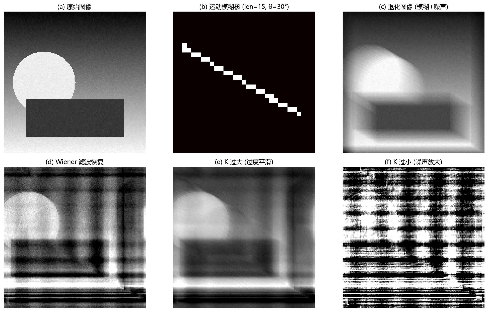

# 06 图像恢复：根据退化模型把图像救回来

> 增强靠经验规则，恢复靠退化模型。恢复的目标是"尽可能接近原始清晰图像"，而不是"看起来顺眼"。

---

## 1. 恢复和增强的根本区别

增强可以用任何让图像更可用的手段（不管它是否破坏了原图的物理一致性）。恢复必须从**退化模型**出发：图像是怎么坏的，就怎么反过来修。

标准退化模型：

$$
g = h * f + n
$$

- $f$：理想清晰图像。
- $h$：退化函数（点扩散函数/模糊核），描述一个理想点如何扩散成一片。
- $n$：加性噪声。
- $g$：我们实际拿到的退化图像。

> 恢复的任务就是：已知 $g$，尽可能精准地估计 $f$。

---

## 2. 模糊核：坏掉的"签名"

不同退化原因对应不同的模糊核形状：

| 退化原因 | 模糊核形状 | 特点 |
|---|---|---|
| 失焦 | 圆盘 | 各向大致均匀，半径决定模糊程度 |
| 运动模糊 | 线段 | 有明显方向性，长度 = 运动幅度 |
| 高斯模糊 | 钟形 | 平滑扩散，常见于大气散射和轻微失焦 |
| 压缩伪影 | 块状/振铃 | 8×8 块效应 + 高频丢失 |

如果你能从退化图像中估计出模糊核（或根据已知的采集参数确定），恢复工作就已经完成了一半。

图 6-1 完整展示了一次运动模糊恢复实验：
- (a) 是原始清晰图像。
- (b) 是运动模糊核——一条 15 像素长、30° 方向的线段。这就是"坏掉的签名"。
- (c) 是退化图像——模糊 + 少量高斯噪声。比原图糊了很多。
- (d) 是用 Wiener 滤波恢复的结果——大部分细节回来了，但仍有轻微模糊和一点噪声残留。
- (e) 是正则化参数 K 过大 → 恢复太保守 → 图像仍然模糊。
- (f) 是 K 过小 → 恢复太激进 → 噪声被严重放大，出现强烈的颗粒和振铃。

---

## 3. 逆滤波为什么脆弱

如果没有噪声 $n = 0$，恢复就是简单的频域除法：

$$
F(u,v) = \frac{G(u,v)}{H(u,v)}
$$

看起来很美好。但当 $H(u,v)$ 在某些频率上接近零时（大多数模糊核正是如此——会把某些高频彻底抹掉），除法会把残存的噪声无限放大。这就是逆滤波在真实图像上几乎不能裸用的原因。

---

## 4. Wiener 滤波：在去模糊和压噪声之间找平衡

Wiener 滤波可以被理解为"有噪声约束的最小均方误差解"：

$$
\hat{F}(u,v) = \left[ \frac{H^*(u,v)}{|H(u,v)|^2 + K} \right] \cdot G(u,v)
$$

- $K$ 是正则化参数，控制了"更信观测值"还是"更信先验平滑"。
- 当 $K \to 0$，退化为逆滤波——噪声放大。
- 当 $K \to \infty$，滤波趋近于输出零——图像被完全平滑。
- 合理 $K$ 的值通常在 0.001~0.05 范围，取决于图像噪声水平。

图 6-1(d-f) 清楚地展示了 $K$ 的影响——太小则噪声爆炸（f），太大则过度平滑（e）。Wiener 滤波不是魔法，但它提供了一个可控的"去模糊 vs 噪声放大"的旋钮。

---

## 5. 几何畸变校正

恢复不限于去模糊。镜头畸变也会让图像"变形"——直线变成弧线（径向畸变）。

校正流程：
1. 拍摄标准棋盘格标定板。
2. 检测角点，建立理想角点与观测角点的对应关系。
3. 用模型估计径向畸变参数 $k_1, k_2, k_3$。
4. 对每个输出像素做反向映射 + 插值，校正回标准坐标。

这也是一种"恢复"——用已知的模型参数把图像从畸变状态拉回正常状态。

---

## 6. 深入理解：恢复难在"坏掉的过程几乎不可逆"

模糊把像素能量扩散到邻域——很多高频信息被削弱甚至归零。噪声又在观测中加入不确定成分。恢复不能完全"反转"这个过程，因为有些信息已经永久丢失。

正则化就是在信息不完整的情况下，引入先验假设来约束解：图像不应到处振荡、噪声不应被无限放大、边缘可以存在但不能到处都是尖锐跳变。Wiener 滤波用的是"信号和噪声的功率谱比"作为先验；总变差恢复用的是"图像总梯度应较小"作为先验；盲去卷积则连模糊核都是未知的。

恢复的核心权衡是：**越忠实于观测数据（$g$），噪声越大；越忠实于先验（平滑），失真越大。**

---

## 7. 用例：拍摄时手抖了

日常最常见的运动模糊场景：手持拍摄，快门太慢，一抖就把点拉成了短线。

恢复流程：
1. 人工判断模糊方向（沿哪个轴拉的）和长度（拉了多少像素）。
2. 生成对应的运动模糊核。
3. 用 Wiener 或约束最小二乘解卷积恢复。
4. 评估恢复结果：边缘是否变锐、噪声是否可控、是否有明显振铃。

如果模糊核估计不准（方向错或长度错），恢复结果会**越修越坏**——出现方向错误的"假边缘"或条纹状振铃。

---

## 8. 常见坑

- 逆滤波裸用在真实图像上 → 噪声爆炸。
- 模糊核估计不准确 → 出现方向错误的结构假象。
- 恢复过程产生振铃 → 看起来像"边界被描了一圈白线/黑线"。
- PSNR 高不代表视觉好——平滑到没细节也有高 PSNR。
- 把压缩伪影当成模糊——压缩不满足 $g = h * f + n$ 模型，盲目去卷积会增加块效应。

---

## 9. 练习题

### 练习 1：逆滤波为什么容易放大噪声？

**参考答案：**

逆滤波需要对观测值 $G(u,v)$ 除以退化函数 $H(u,v)$。当某些频率上 $H(u,v)$ 接近 0（大多数模糊核正会这样压低高频），除法会极大放大这些频率上的噪声分量。原本肉眼看不见的微小噪声波动，经过除零附近的除法后被放大数百倍。

### 练习 2：失焦模糊和运动模糊的核有什么不同？

**参考答案：**

失焦模糊近似为圆盘形扩散——各方向均匀，没有方向性。运动模糊沿运动方向形成线段——有明显方向性和长度。因此恢复前者需要估计扩散半径，恢复后者需要估计运动方向和幅度。

### 练习 3：恢复结果为什么不能只看 PSNR？

**参考答案：**

PSNR 衡量像素级均方误差。一个"过度平滑"的结果可能 PSNR 很高（因为像素值没乱跳），但边缘不清、细节丢失，完全不适合后续识别或测量。一个"适度锐利"的结果可能 PSNR 略低，但保留了关键结构。此外人眼对边缘和纹理的主观感受与 PSNR 不完全一致。应结合 SSIM、视觉检查和下游任务指标。

---

## 10. 小结

图像恢复不是单纯的"反卷积"，而是在**不完整的观测和噪声污染的约束下，用退化模型 + 先验假设**去估计最可能的原图。模型准确 → 恢复可靠；模型偏差 → 越修越坏。这是信号与系统思维在图像处理中最高频的应用场景之一。

下一章：[07 图像分割](07_图像分割.md)
