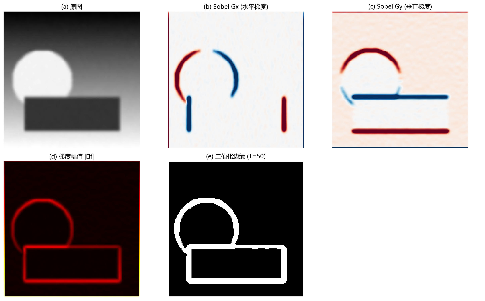
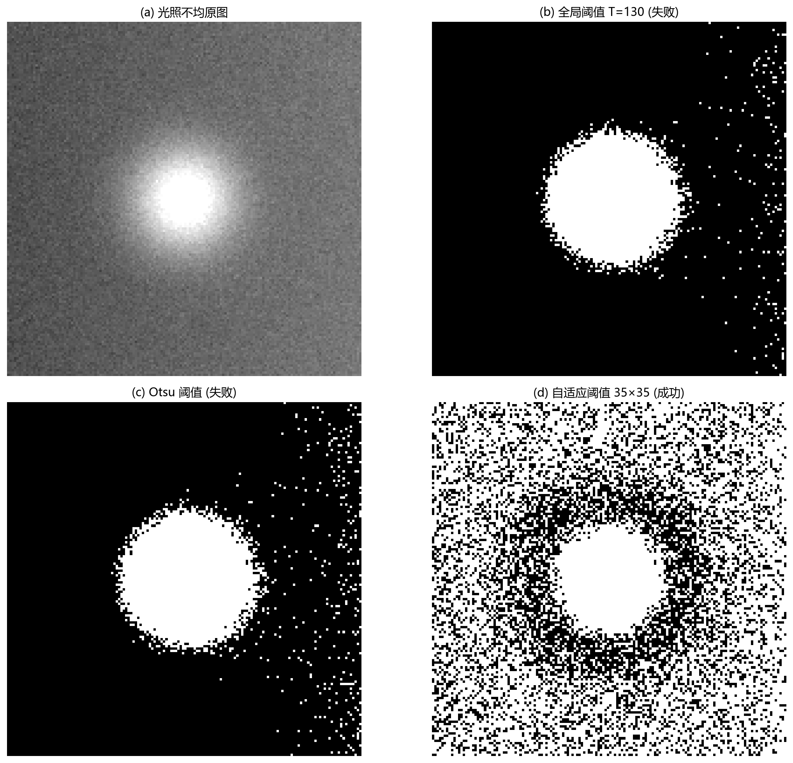

# 07 图像分割：把目标从背景中分出来

> 分割回答"每个像素属于谁"。它是从"看图"走向"理解图中对象"的桥梁。

---

## 1. 分割为什么是视觉系统的核心

有了采样你可以存储图像，有了增强你可以看清图像，但只有**分割**才能告诉你"目标在哪里"、"有几个"、"每个多大"。测量、计数、定位、识别、缺陷检测——全部依赖分割。

分割方法主要分三类思路：
- **阈值法**：目标和背景灰度不同，在某个值两侧。
- **边缘法**：目标和背景的边界处灰度变化最快。
- **区域法**：目标内部具有一致性（灰度、纹理、颜色）。

---

## 2. 边缘检测：找灰度变化最快的地方

边缘是灰度突变的区域。梯度 $\nabla f$ 描述每点灰度变化的**方向和幅度**：

$$
|\nabla f| = \sqrt{(\partial f / \partial x)^2 + (\partial f / \partial y)^2}
$$

梯度大 → 可能是边缘；梯度小 → 可能是平坦区域。

图 7-1 用 Sobel 算子演示了边缘检测的完整流程：
- (a) 原图。
- (b) **Sobel 水平梯度** $G_x$：红色 = 从左到右变亮（正梯度），蓝色 = 从左到右变暗（负梯度）。可以清晰看到竖直边缘。
- (c) **Sobel 垂直梯度** $G_y$：红色 = 从上到下变亮，蓝色 = 从上到下变暗。水平边缘清晰可见。
- (d) **梯度幅值** $|\nabla f| = \sqrt{G_x^2 + G_y^2}$：水平和垂直两个方向的梯度合成在一起。越亮的地方边缘越强。
- (e) **二值化边缘**：对幅值做阈值 $T = 50$。梯度强于 T 的地方判为边缘、弱于 T 的地方判为背景。

**Canny 检测器** 在 Sobel 的基础上加了三个关键步骤：
1. 先用高斯平滑抑制噪声（否则噪声点也被当成边缘）。
2. 做**非极大值抑制**：只保留梯度方向上最强的那个点，把边缘变细到一像素宽。
3. 做**双阈值连接**：用高低两个阈值——高于高阈值的肯定是边缘，高于低阈值且和强边缘连通的也保留。这解决了单阈值"要么断、要么噪"的两难。

---

## 3. 阈值分割：简单与困难的博弈

阈值法的基本形式：

$$
g(x,y) = \begin{cases} 255, & f(x,y) > T \\ 0, & f(x,y) \leq T \end{cases}
$$

**Otsu 方法** 自动寻找 $T$，最大化背景和目标两类之间的灰度差异。如果直方图呈现两个峰（背景峰 + 目标峰），Otsu 通常能找到一个合理的分界线。

但在真实场景中，全局阈值经常会失败——原因很简单：**真实图像极少有均匀光照**。

图 7-2 展示了光照不均场景下的阈值困境：
- (a) 光照不均原图：左边亮、右边暗，目标在画面中央相对亮。
- (b) 全局阈值 $T=130$：右边暗区大面积被误判为目标，左边亮区目标没分出来。
- (c) Otsu 自动阈值：同样无法应对光照渐变的挑战——因为 $T$ 是一个**全局固定值**。
- (d) 自适应阈值：把图像分成 35×35 小块，每块根据自己局部灰度分布独立算阈值——亮区的块阈值高，暗区的块阈值低。目标在整张图上都被稳定提取出来。

---

## 4. 区域生长：从种子蔓延到整个目标

区域生长的思想很直观：

1. 在目标内部放一个**种子点**。
2. 检查其邻域像素。如果邻域像素和种子"相似"（灰度差小于阈值），就把它们吸收进来。
3. 新吸收的像素继续生长，直到碰到边界。

区域生长**不依赖全局阈值**，特别适合目标内部灰度一致、但和背景灰度重叠的场景（如医学图像中的器官、材料中的相区）。它的弱点是对种子点和相似性准则的**选择非常敏感**——种子放错位置，什么都长不出来；阈值太松，"长"到背景里。

---

## 5. Hough 变换：找直线和圆的投票机制

Hough 变换不直接看像素，而是把"图像空间中的点"映射到"参数空间的投票"。一条直线 $y = kx + b$ 可以用参数 $(k, b)$ 描述。图像中每一个点都为"可能经过我"的直线投一票。很多点投同一条直线 → 参数空间中出现峰值 → 检测到直线。

更稳定的做法是用极坐标参数化 $\rho = x\cos\theta + y\sin\theta$，避免 $k$ 趋于无穷的问题。Hough 变换适合检测边界为**直线、圆、或已知参数形状**的目标——比如车牌边框、工件轮廓、瞳孔边界。

---

## 6. 用例：金属表面划痕检测

划痕通常是细长、高对比的结构。

流程：**光照校正** → **边缘增强** → **自适应阈值分割** → **形态学连接断缝** → **按长度筛选**（太短的去掉）→ **输出划痕掩膜**。

如果光源角度变了，划痕和背景的对比度可能反转——所以工业检测中光源设计比算法选择更关键。

---

## 7. 工作流程：怎样选择分割方法

- **是否有稳定光照？** ——否 → 先做光照校正或自适应阈值。
  - 是 → **目标与背景灰度差异大？** ——是 → 优先阈值（Otsu / 手动）。
    - 否 → **目标有清晰边缘？** ——是 → 边缘检测（Sobel / Canny）。
      - 否 → **目标内部一致？** ——是 → 区域生长或分裂合并。
        - 否 → **目标是直线 / 圆？** ——是 → Hough 变换。

---

## 8. 常见坑

- 不做光照校正就想用全局阈值——注定在光照不均场景失败。
- 边缘检测后不做闭合，区域无法填充。
- 只看 mIoU，不看小目标漏检。
- 把分割结果当完美真值，不做人工抽检——分割误差会传播给所有后续测量。

---

## 9. 练习题

### 练习 1：Otsu 阈值为什么适合双峰直方图？

**参考答案：**

Otsu 试图找到一个阈值最大化类间方差。如果直方图有明显双峰（分别对应背景和目标），类间方差会在这两个峰之间的谷底处达到最大——也就是最好的分界点。如果直方图只有单峰或多类重度重叠，Otsu 的"两类假设"就站不住脚。

### 练习 2：Canny 为什么要先平滑？

**参考答案：**

梯度算子对局部变化极其敏感——一个孤立噪声点在邻域中也会产生很大的梯度值。不先平滑的话，噪声点会产生大量虚假弱边缘，后续非极大值抑制和双阈值也很难区分真伪。高斯平滑的 $\sigma$ 越大，噪声抑制越强，但真实边缘也可能变模糊。

### 练习 3：区域生长最怕什么？

**参考答案：**

最怕三件事：
1. 光照不均导致同一目标内部的灰度漂移超过相似性阈值——生长中途断裂。
2. 目标与背景边界处的灰度过渡太缓——生长泄漏到背景。
3. 种子点的初始位置和目标内部纹理有关——放到纹理突变处可能刚开始就长不出来。

---

## 10. 小结

分割是图像理解中承上启下的一环。阈值、边缘、区域、投票——每种方法都有它最适配的图像结构。工程中的难点通常不是算法复杂度，而是光照、噪声、对比度这些采集端的问题传到分割时已经放大了。

下一章：[08 图像特征提取与分析](08_图像特征提取与分析.md)
