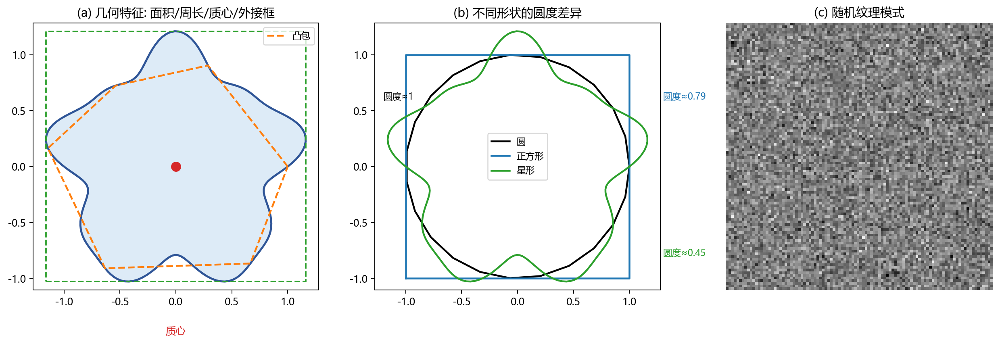
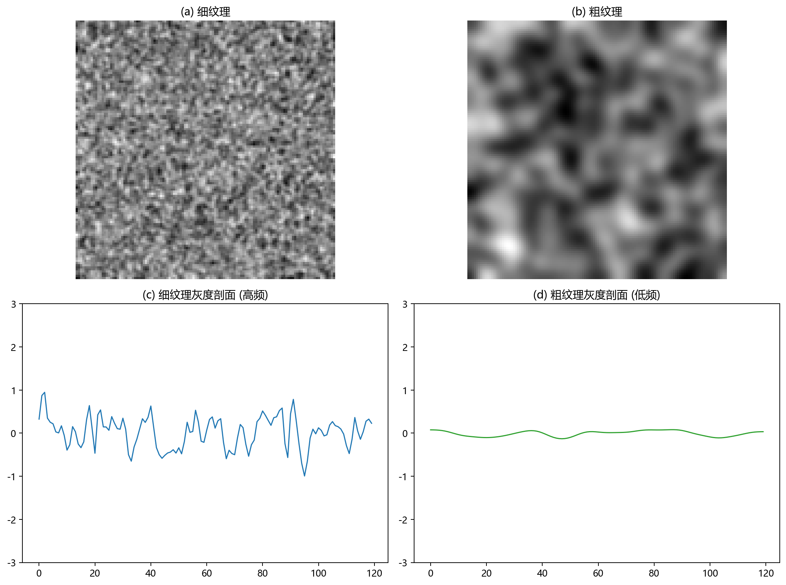

# 08 图像特征提取与分析：把区域变成可比较的数字

> 分割告诉你"目标和背景"，特征告诉你"目标长什么样"。特征是将图像的视觉信息转化为结构化数据的桥梁。

---

## 1. 什么是好特征

一个区域可能有成千上万个像素，但人类和算法需要的是可比较、可解释的**少量数字**。好的特征满足：

- **稳定性**：对噪声、光照、轻微形变不敏感。
- **区分度**：不同类别的目标应该有显著不同的特征值。
- **可解释性**：你知道它在描述什么（面积、圆度、方向...），而不是一个黑箱数字。
- **与任务相关**：计数任务可能只需要面积，缺陷检测可能需要圆度和纹理。

---

## 2. 几何特征：从形状形状中提取数字

图 8-1(a) 用一张不规则形状展示了常见的几何特征：
- **面积 (A)**：连通域的总像素数。
- **周长 (P)**：轮廓的长度（链码或边界像素计数）。
- **质心**：区域的几何中心 $(\bar{x}, \bar{y})$。
- **外接矩形**：能框住区域的最小平行于坐标轴的矩形。
- **凸包**：能包裹区域的最小凸多边形，用于判断形状是否有凹陷。

**圆度** 是一个简洁的形态指标：

$$
C = \frac{4\pi A}{P^2}
$$

- 圆：$C \approx 1$（面积相对周长最"经济"）。
- 正方形：$C \approx 0.79$。
- 不规则锯齿边界：$C$ 远小于 1（因为锯齿让周长变大但面积不变）。

图 8-1(b) 直观对比了圆、正方形和星形的圆度差异——圆形最饱满，正方形次之，星形因为有凹陷、周长相对面积大很多 → 圆度最低。

---

## 3. 边界特征与傅里叶描述子

边界特征不关注内部，只关注轮廓。

**链码**：把轮廓表示为一串方向编号（0=右、1=右上、2=上...），存储紧凑且可以直接计算周长和弯曲程度。

**傅里叶描述子**：把轮廓坐标视为复数序列 $z(t) = x(t) + j\,y(t)$，对这个序列做傅里叶变换，取前几个低频系数作为形状特征。低频系数描述整体轮廓的大形状（近似圆形、三角、长条...），高频系数描述细小的凹凸起伏。保留少数低频系数就能还原大致轮廓——这是形状压缩和形状匹配的基础。

---

## 4. 纹理特征：描述"重复模式"和"粗糙程度"

纹理不是单个目标的属性，而是区域内部**空间变化的统计模式**。

图 8-2 展示了细纹理和粗纹理的区别：
- (a) 细纹理：灰度变化频繁、幅度小。剖面(c)呈现高频率、小振幅的波动，相邻像素间高度不相似。
- (b) 粗纹理：灰度变化缓慢、区域更大。剖面(d)呈现低频率、大振幅的波动——相邻像素间更相似。

分析纹理的常用思路：
- **灰度共生矩阵 (GLCM)**：统计"距离 d、方向 θ 的一对像素分别取某两个灰度值"的概率。从 GLCM 可提取对比度、相关性、能量、同质性等特征。
- **频谱法**：把纹理区域做傅里叶变换。粗纹理 → 能量集中在低频环；细纹理 → 能量散布在高频区；规则纹理 → 频谱中出现明显峰。
- **自相关**：衡量像素和它邻居的相似性。粗纹理自相关下降慢，细纹理下降快。

---

## 5. 细化 (骨架化)：把区域压缩成一像素宽的线

细化把粗目标（如文字笔画、血管、裂纹）压缩成一像素宽的骨架，同时保留原形状的拓扑结构——不会断裂、不会多出分叉。

细化是特征提取的一种特殊形式：它把二维区域转成一维曲线，从而更容易测量长度、曲率、分支数和端点位置。

---

## 6. 用例：颗粒质量检测

工业金属粉末的颗粒需检测粒径分布和形貌。流程：
1. 显微镜采集 → 阈值分割得到每个颗粒的二值掩膜。
2. 对每个颗粒计算：
   - **等效直径**：$\sqrt{4A / \pi}$ → 粒径分布。
   - **圆度** $4\pi A / P^2$ → 判断是否有破碎或异形颗粒。
   - **纹理对比度** → 判断是否有污染或腐蚀。
3. 输出颗粒特征表格，用统计分布做质量判定。

面积过大 → 可能是粘连颗粒（需进一步分割）；圆度过低 → 可能是破碎或细长颗粒；纹理异常 → 可能是污染物。

---

## 7. 工作流程：从分割到决策表
**分割掩膜 → 连通域编号 → 逐个区域测几何特征 → 计算纹理/边界特征 → 特征归一化 → 分类/阈值/聚类 → 输出判定结果 → 检查误判样本**

关键提醒：特征归一化必不可少。面积量级可能是 $10^3$，圆度量级可能是 $[0, 1]$。不归一化的话，面积会主导距离计算，让其他特征形同虚设。

---

## 8. 常见坑

- 分割错误 → 特征计算的对象就是错的，后续全部白搭。
- 特征越多不一定越好——冗余特征增加噪声、降低分类器泛化能力。
- 只在一个光照/焦距条件下设计纹理特征 → 换条件就崩。
- 忽略尺度归一化 → 远近变化被误判为大小差异。
- 圆度对边界锯齿非常敏感——一个小锯齿让周长暴涨，圆度暴跌，但实际形状没变。

---

## 9. 练习题

### 练习 1：为什么圆度对边界噪声特别敏感？

**参考答案：**

圆度的分母是周长的平方。边界上出现锯齿或小噪声时，面积变化可能微乎其微（几个像素），但周长会因为"走锯齿"而大幅增加。比如一个光滑圆 $P=100$，加了少量锯齿后 $P$ 可能变成 $140$——$P^2$ 变化 $96\%$，圆度直接骤降。所以计算圆度前通常做了边界平滑。

### 练习 2：傅里叶描述子的低频和高频各表示什么？

**参考答案：**

低频傅里叶描述子描述轮廓的大尺度形状——比如整体是圆还是椭圆、有几个主要凸起。高频描述子描述细小的边界起伏——如锯齿、毛刺、局部不规则。保留前几个低频系数可以重建粗略廓形，丢弃高频则平滑了细节。

### 练习 3：为什么不归一化特征会导致分类器偏向？

**参考答案：**

不同特征量纲不同。面积可能是 $10^2\sim10^4$，圆度是 $0.1\sim1.0$。在计算欧氏距离或训练分类器时，数值范围大的特征会主导结果——一个面积差 500 可能遮盖了圆度差 0.9 的关键信息。归一化（如 z-score 或 min-max）让所有特征在同一尺度下公平参与。

---

## 10. 小结

特征提取是把图像转成结构化数据的关键步骤。它的核心不是"算得快"，而是"算得稳"——在噪声、光照、尺度变化下仍然能稳定描述目标。理解特征的物理意义，比背公式重要得多。

下一章：[09 图像形态学](09_图像形态学.md)
