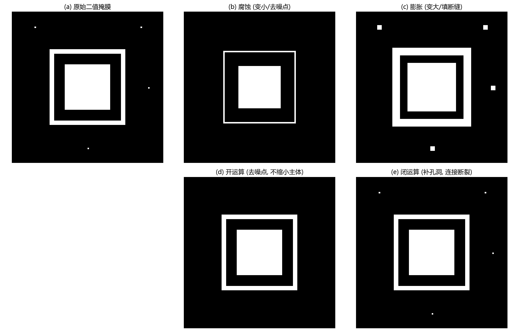

# 09 图像形态学：用结构元素改造形状

> 形态学不关心灰度值具体是多少，它关心的是"目标形状和邻域关系的几何特性"。

---

## 1. 结构元素：一把会滑动的小尺子

形态学所有操作都依赖**结构元素 (Structuring Element, SE)**——一个小形状（通常是 3×3 或 5×5 的矩形/圆形/十字），在图像上逐位置滑动，检查局部区域是否符合某种几何条件。

结构元素的选择直接决定了操作的语义：
- **圆形 SE**：均匀处理各方向，适合颗粒、孔洞、斑点。
- **水平线 SE**：偏向连接水平断裂，适合检测横向划痕或文字行。
- **小 SE (3×3)**：只影响单像素噪点和窄缝。
- **大 SE (7×7+)**：会影响主体结构——面积偏移、连接或断裂。

---

## 2. 腐蚀与膨胀：形态学的两个基本动作

图 9-1 用一张带噪点和孔洞的二值掩膜演示了全部基本操作：

- (a) 原始二值掩膜：中心有一个方框（目标），周围散布着几个孤立噪点，框内还有一个孔洞。
- (b) **腐蚀**：每个像素检查它邻域是否**全是**前景。如果某个像素的邻域里出现了背景，这个像素就变成背景。结果：目标变小，孤立噪点消失。
- (c) **膨胀**：每个像素检查它邻域**是否有**前景。如果有，这个像素就变成前景。结果：目标变大，孔洞被填上，断裂区域连接起来。
- (d) **开运算** = 先腐蚀，再膨胀：去除细小噪点，但主体大小不变。最常用的去噪后处理。
- (e) **闭运算** = 先膨胀，再腐蚀：填充小孔洞、连接窄裂缝，主体大小基本不变。

  **直觉规则：腐蚀收缩，膨胀扩张。开去噪，闭补洞。**

---

## 3. 开闭运算为什么不是简单的"反操作"？

腐蚀后再膨胀，看起来应该恢复原状——但实际上不会。腐蚀时删掉的像素是被"判定为太薄/太细小"的；膨胀时补充的像素只能"紧贴已有前景生长"。因此：

- 开运算删掉**细小突起和孤立点**后膨胀，不会再凭空长出那些突起。
- 闭运算填上**小孔和窄缝**后腐蚀——孔太小时膨胀会封住它，后续腐蚀不会重新挖开。

这就是为什么形态学能**选择性处理特定尺度的结构**，而不影响主体。

---

## 4. 击中-击不中变换

这个操作同时用两个结构元素：一个描述"前景应该长什么样"，另一个描述"背景应该长什么样"。只有当局部区域同时匹配两者时，才输出前景。

它特别适合检测**特定局部形状**：比如 L 形拐角、T 形分叉、线的端点、孤立点。在文字骨架分析和线网拓扑检测中常用。

---

## 5. 灰度形态学：把 max/min 引入局部窗口

灰度形态学把二值操作的 "and/or" 替换为 "max/min"：

- **灰度腐蚀** = 局部最小滤波：输出每个邻域的最小灰度值。效果：暗区域扩张，亮目标被"侵蚀"变细。
- **灰度膨胀** = 局部最大滤波：输出邻域的最大灰度值。效果：亮区域扩张，暗目标被"挤压"。
- **顶帽变换** = 原图 − 开运算结果：提取"比局部背景更亮的小目标"，如亮点、细小划痕。
- **黑帽变换** = 闭运算结果 − 原图：提取"比局部背景更暗的小目标"，如暗斑、微小孔洞。

---

## 6. 用例：清理分割掩膜

分割后最常见的问题是噪点和孔洞，直接用形态学清理：
**二值掩膜 → 开运算(去孤立噪点) → 闭运算(补孔洞) → 连通域筛选(去太小区域)**

但这套操作会改变目标的**面积和边界**。如果后续要做精确面积测量，必须评估 SE 带来的系统偏差——腐蚀 1 像素会让面积系统性偏小，膨胀 1 像素会让面积系统性偏大。

  **经验：后处理只改你不准备测量的东西。**  
  如果目标面积是测量指标，就只用连通域筛选，不做腐蚀膨胀。

---

## 7. 工作流程：如何选择结构元素

1. **看目标形状**：圆目标用圆形/方形 SE；线目标用线形 SE。
2. **看噪声尺度**：SE 要比要消除的噪声**稍大**，但不能比要保留的细节更大。
3. **小 SE 保守、大 SE 激进**：先用 3×3 尝试，不够再加大。
4. **多用图像判例验证**：抽几张边界案例看 SE 对目标的影响。

---

## 8. 常见坑

- SE 太大 → 把真实微小目标也当噪声删了。
- 连续多次腐蚀 → 目标可能断成几截。
- 对二值图开闭后面积偏了却不知道。
- 灰度形态学和二值形态学的直觉不能直接互搬。

---

## 9. 练习题

### 练习 1：开运算和闭运算分别适合处理什么问题？

**参考答案：**

开运算（先腐蚀后膨胀）适合去除小的白色噪点和细小突起——它用腐蚀拔掉这些结构，膨胀时它们不会再长出来。闭运算（先膨胀后腐蚀）适合填补小黑洞、连接窄裂缝——膨胀把缝隙封住，腐蚀不会再打开。两者都尽量保持了主体结构的大小不变。

### 练习 2：为什么结构元素太大会造成测量误差？

**参考答案：**

结构元素决定被保留或删除的尺度阈值。太大的 SE 会把真实小细节也当成噪声删除（如小缺陷、细裂纹）；同时，腐蚀/膨胀操作的像素级偏移也会累积，改变面积、周长和边界位置。这些变化会传播给后续测量和分类。

### 练习 3：顶帽变换适合找什么类型的目标？

**参考答案：**

顶帽变换 = 原图 − 开运算结果。开运算相当于估计了"局部背景"，顶帽提取的是"比背景更亮、且尺度小于 SE 的亮目标"。典型应用：显微图像中的小白点、金属表面的细小亮点、眼底照片中的微动脉瘤。

---

## 10. 小结

形态学是一组简单但极其实用的形状操作。它在图像处理中的角色更偏向**后处理**——分割之后、测量之前，用形状规则清理噪声、连接断裂、分离粘连。关键是：SE 是你对目标和噪声尺度的先验假设，选得好事半功倍，选不好越改越歪。

下一章：[10 模式识别](10_模式识别.md)
