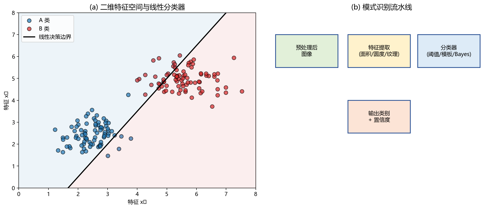

# 10 模式识别：从特征到类别

> 图像处理整理信息，模式识别做判断。把特征点云变成"这是 A"或"那是 B"的决策。

---

## 1. 模式识别是图像处理的最后一公里

前面九章讲的一切——采样、增强、分割、特征——都是为这一步服务的。你从图像中提取了面积、圆度、纹理对比度等特征，现在要回答：**"这个东西是合格品还是缺陷？是字母 A 还是 B？是人脸还是背景？"**

图 10-1(a) 展示了二维特征空间中的分类问题。每个点代表一个样本，横纵坐标是两个特征值。A 类（蓝色）和 B 类（红色）在特征空间中各聚一团。一条**线性决策边界**（黑色斜线）将空间分成两个区域——线左上的点判为 A 类，线右下的点判为 B 类。

图 10-1(b) 展示了完整的模式识别流水线：预处理后的图像 → 特征提取（面积、圆度、纹理等）→ 分类器做出决策 → 输出类别标签和置信度。

---

## 2. 模板匹配：最简单也最受限

模板匹配把待识别对象和一个标准模板做像素级比对：计算两者之间的**相似度**（如归一化互相关），相似度最高的类别就是识别结果。

优点：直观、不需要训练。缺点：对姿态、尺度、旋转、光照变化极其敏感。目标稍一倾斜、放大或阴影变化，相似度就剧降。

模板匹配适合**高度规整、变化极小**的场景——比如印刷体字符、固定工位上的零件定位、对齐后的指纹比对。

---

## 3. Bayes 分类：概率视角下的最优决策

Bayes 分类把识别看作概率推断：给定特征观测值 $x$，它属于类别 $C_k$ 的概率是：

$$
P(C_k \mid x) = \frac{P(x \mid C_k) \cdot P(C_k)}{P(x)}
$$

三个关键量：
- **先验概率 $P(C_k)$**：不看任何数据，某类本来出现的概率。比如正常件 99%、缺陷件 1%。
- **似然 $P(x \mid C_k)$**：如果这个样本真是 $C_k$ 类，它的特征大概是 $x$ 的概率有多大。
- **后验概率 $P(C_k \mid x)$**：知道了特征 $x$ 之后，它真正是 $C_k$ 的把握。

Bayes 决策规则：**选后验概率最大的那个类。**

Bayes 框架的意义不仅是给一个公式，它告诉工程师一个现实的警示：如果缺陷件本身极罕见（先验小），即使特征很像缺陷，后验概率也可能不高。换句话说：**分类不仅取决于样本"像不像"，也取决于某类"常不常见"。**

---

## 4. 线性分类器：在特征空间里画一条线

感知器和最小均方误差方法都试图在特征空间中找到一个**超平面**来分开两类。二维特征空间中是一条线，三维是平面，高维是超平面。

核心思想是寻找权重向量 $w$ 和偏置 $b$，使得：

$$
g(x) = w^T x + b
$$

- $g(x) > 0$ → 判为 A 类。
- $g(x) < 0$ → 判为 B 类。

如果数据**线性可分**——两类在特征空间中能被一条线干净分开——感知器算法可以逐步调整权值直到找到那条线。但很多现实问题的特征分布高度重叠，线性分类器会有较大误差。这时候需要非线性方法：核 SVM、决策树、神经网络。

---

## 5. 深入理解：分类器的边界由特征决定

无论分类器多高级，它看到的不是原始图像，而是特征空间中的点云。如果同类样本在特征空间中聚得紧、不同类样本分得开，简单分类器也能很好工作。如果特征混在一起，再复杂的分类器也会频繁判错。

因此，**特征设计比分类器选择更关键**。好特征 + 简单分类器 > 烂特征 + 复杂分类器。

---

## 6. 评价不只是准确率

混淆矩阵比单一准确率更有用：

|  | 预测 A | 预测 B |
|---|---|---|
| 实际 A | TP（正确 A） | FN（漏了 A） |
| 实际 B | FP（误报 B） | TN（正确 B） |

从中可算：
- **准确率** = (TP+TN) / 全部
- **召回率** = TP / (TP+FN)（真实 A 中找回了多少）
- **精确率** = TP / (TP+FP)（判为 A 的中有多少真是 A）
- **F1** = 精确率和召回率的调和平均

如果 99% 样本是正常，模型全判正常——准确率 99%，但缺陷全部漏检。这时候必须看召回率和 F1。

---

## 7. 用例：手写数字识别（传统流程 vs 深度学习）

传统流程：
1. 把数字图像归一化到固定大小（如 28×28）。
2. 提取特征：笔画方向直方图、投影轮廓、孔洞数量、交叉点位置。
3. 用模板匹配 / KNN / SVM 分类器输出 0-9。

深度学习把特征提取和分类器训练合二为一——卷积神经网络自动学习"什么特征有用"。但在 2010 年以前，上面这套传统流程支撑了无数 OCR 和邮件分拣系统。理解这套流程，能帮你建立"数据→特征→决策"的工程直觉。

---

## 8. 常见坑

- 只用准确率评价 → 类别不平衡时完全误导。
- 训练集太干净 → 真实场景一来就崩（过拟合干净数据）。
- 特征不归一化 → 大尺度特征主导距离计算。
- 只看整体指标、不看具体混淆 → "A 和 B 总被互相判错"这种模式被掩盖。

---

## 9. 练习题

### 练习 1：为什么类别不平衡会误导准确率？

**参考答案：**

如果 99% 的样本是正常，模型全部判为正常，准确率 99%——但异常全漏检。准确率只看总体正确比例，不区分类别。不平衡场景下必须关注各列的召回率、精确率和 F1。

### 练习 2：模板匹配为什么怕旋转和尺度变化？

**参考答案：**

模板匹配在固定位置做像素级比对。目标一旦旋转或缩放，像素对应关系就被打乱——原本匹配的位置上，模板的"边缘像素"可能对着目标的"内部像素"，相似度骤降。要处理变化，需要先做归一化（矫正到统一姿态和尺度），或使用对变化不变的特征（如傅里叶描述子）。

### 练习 3：特征空间中两类混在一起，该怎么办？

**参考答案：**

首先检查现有特征空间——是否用对了特征？是否归一化了？如果现有特征确实无法区分两类，应回到特征设计阶段：增加新特征（如纹理统计、形状参数），或使用更丰富的特征表示（如特征变换、核方法将数据映射到高维空间），或迁移到端到端学习方法让模型自己学特征。

---

## 10. 小结

模式识别是图像处理的决策终点。传统方法从"特征设计 + 分类器"两个阶段出发，每个阶段都是可理解、可调试的。深入理解这个双阶段框架，对学习深度学习和把关 AI 系统都有直接帮助。

下一章：[11 图像压缩](11_图像压缩.md)
