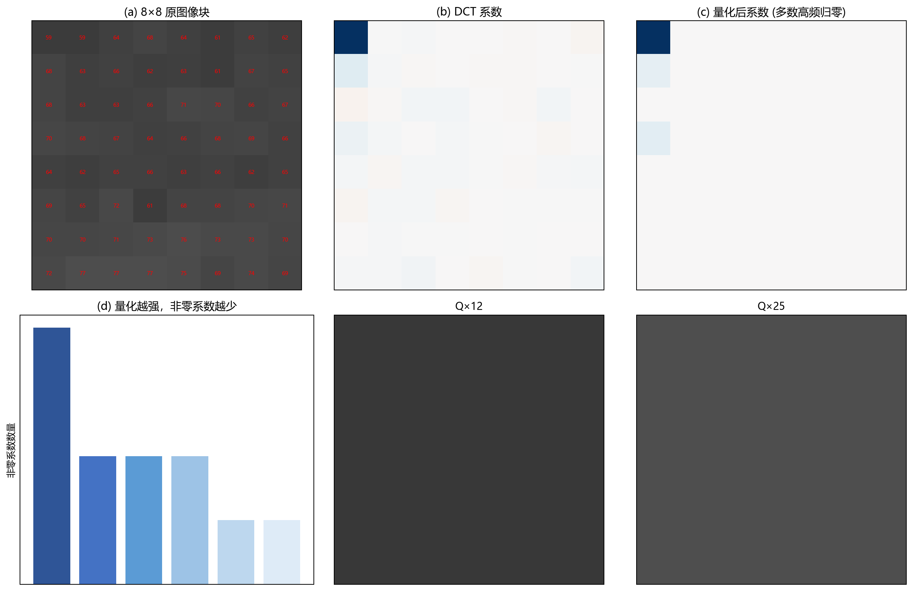

# 11 图像压缩：少存一点，但尽量看不出来

> 压缩利用三类冗余：空间冗余（相邻像素相似）、统计冗余（某些值更常见）、视觉冗余（人眼对某些误差不敏感）。

---

## 1. 图像为什么可以压缩

一张 1920×1080 的彩色照片未压缩约 6 MB。但如果相邻像素两两都差不多、大面积天空像素值几乎相同、人眼对色度细节不敏感——这些都是在浪费存储。压缩就是识别并消除这些冗余。

压缩分为两类：
- **无损压缩**：解码后逐像素完全一致。适合文档、掩膜、医学原始数据。
- **有损压缩**：允许丢一些信息换取更高压缩率。适合照片、视频、网页图片。

---

## 2. JPEG 压缩流水线

JPEG 是世界上使用最广泛的图像压缩标准。它的核心流程：
**RGB → YCbCr → 分块 8×8 → DCT → 量化 → Zigzag 扫描 → 熵编码 → 码流**

### 2.1 颜色空间转换与色度子采样

人眼对亮度变化远比色度变化敏感。所以 JPEG 先把 RGB 转成 YCbCr（Y=亮度，Cb/Cr=色度），然后可以对色度通道做 4:2:0 采样——水平和垂直方向各取一半分辨率。仅这一步就减少了约 50% 数据量，而肉眼几乎察觉不到差异。

### 2.2 DCT 与量化：真正"有损"的地方

图像被切成 8×8 小块，每块做 DCT 得到 64 个系数。左上角是 DC（平均亮度），往右下角频率递增。**量化是唯一不可逆的步骤**——每种 JPEG 质量都对应一个量化表，对高频系数用更大的步长，让大量高频系数变成 0。

图 11-1 用真实数据演示了量化过程：
- (a) 是一个 8×8 图像块的实际像素值。
- (b) 是该块的 DCT 系数——左上角数值大（低频），右下角逐渐变小。
- (c) 是量化后的结果：用一个标准量化表乘上倍数后，大量高频系数被归零——只剩下左上角少数几个非零值。
- (d) 展示量化强度与非零系数数量的关系——量化越强，非零系数越少，数据量越小。
- (e-f) 展示不同量化级别下重建块的质量——轻量化和重量化在视觉上的差异。

### 2.3 熵编码

量化后的系数通过 Zigzag 扫描变成一维序列（低频到高频），用游程编码压缩连续出现的零，再用 Huffman 编码对非零值按概率分配短码。

---

## 3. 无损压缩方法

| 方法 | 原理 |
|---|---|
| 游程编码 (RLE) | 连续的相同值用 (值, 次数) 替代 |
| Huffman 编码 | 出现频率高的符号分配更短的编码 |
| LZW | 动态维护字符串到编码的映射表 |
| PNG (预测 + DEFLATE) | 先用邻域像素预测当前像素，再用 DEFLATE 压缩残差 |

---

## 4. 压缩质量 vs 文件大小 vs 算法可用性

JPEG 的量化强度是你手中最重要的旋钮：量得细 → 文件大、质量高；量得粗 → 文件小、块效应和细节损失。

但压缩的影响不仅看视觉——还要看算法。缺陷检测系统如果保存 JPEG 而非无损图，细小裂纹可能被量化抹掉。人眼看不出，不代表算法看不出。

---

## 5. 用例：产线检测的存图策略

场景：每条产线一小时产生数百张检测图像，既要长期存档又要控制存储成本。

合理策略：
- **缺陷区域**：无损 PNG 保存（需要后续分析）。
- **全图**：高质量 JPEG（Q≈90，供浏览和回顾）。
- **缩略图**：低质量 JPEG（Q≈50，供快速检索）。

---

## 6. 常见坑

- 对标签图/深度图用 JPEG → 有损压缩污染类别值和深度值。
- 多次保存 JPEG → 每次解码重编码都会累积误差（generation loss）。
- 色度子采样破坏细小彩色细节（如红色文字）。
- 只关注文件大小，不验证压缩后算法性能。

---

## 7. 练习题

### 练习 1：JPEG 的块效应从何而来？

**参考答案：**

JPEG 以 8×8 块为单位独立做 DCT 和量化。量化较强时，相邻块边界的系数差异变得不连续，反变换后块与块之间的灰度无法平滑衔接——于是出现了肉眼可见的方块状边界，即块效应。

### 练习 2：为什么标签图绝对不能用 JPEG？

**参考答案：**

标签图的像素值是类别编号（如 0=背景, 1=目标），语义要求精确保存。JPEG 的有损压缩会产生浮动的中间值（如原始 1 变成 0.8 或 1.3）和块边缘伪影，破坏标签语义。应用 PNG 或 TIFF 等无损格式保存。

### 练习 3：压缩质量如何和最终任务挂钩验收？

**参考答案：**

不仅看文件大小和视觉效果，还要把压缩后的图像通过完整的检测/识别流程，检查：召回率是否下降？误检是否增加？测量误差是否超出允许范围？只有下游任务指标满足要求，才算合格的压缩级别。

---

## 8. 小结

压缩是"存储/传输成本"与"失真代价"之间的权衡。理解 JPEG 的 DCT + 量化 + 熵编码流程，不仅能帮你选择正确的格式和质量参数，还能帮你解释很多常见伪影的来源。

下一章：[12 分形图像压缩](12_分形图像压缩.md)
