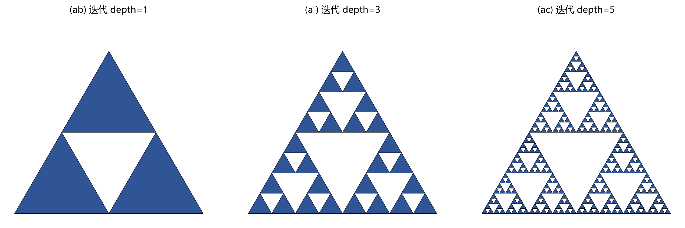

# 12 分形图像压缩：用自相似描述图像

> 分形方法不直接存像素，而是寻找"图像中哪块缩小后像哪块"，用变换关系替代数据。

---

## 1. 什么是分形

分形结构具有**自相似性**：整体和部分在某种尺度下相似。蕨类叶子、海岸线、云、山脉都有这种特性——放大后，局部看起来和整体结构很像。

图 12-1 用 Sierpinski 三角形展示了分形自相似的迭代生成过程。depth=1 时只有一个大三角；depth=3 时已经能看清"大三角套小三角"的模式；depth=5 时细节已经非常丰富——但所有细节都由同一个简单的变换规则反复应用产生。

---

## 2. 迭代函数系统 (IFS)

IFS 的核心思想是：**复杂的图形可以由一组收缩变换反复迭代产生。**

取一组压缩变换 $W = \{w_1, w_2, ..., w_N\}$，每个 $w_i$ 包含旋转、缩放、平移。从任意初始图像开始，反复对所有点施加这组变换，图像会逐渐**收敛**到一个唯一的不动点——这就是 IFS 吸引子，也就是最终生成的分形图形。

这个过程的逆向就是分形压缩：给定一张图像，去找到一组变换，使得反复应用这组变换能"生成"这张图像。

---

## 3. 分形压缩的基本流程

编码阶段：
1. 把图像切成**值域块**（小块，如 8×8）。
2. 在更大范围（通常是缩小两倍后的图像）构造**定义域块**（大块，如 16×16）。
3. 对每个值域块，在定义域块集合中搜索最相似的块。相似块经过缩放、旋转、灰度平移和对比度调整后可以和值域块尽可能匹配。
4. 记录每个值域块的**最佳匹配参数**：哪个定义域块 → 什么几何变换 → 什么灰度变换。

解码阶段：
1. 从一个全黑或全灰的初始图像开始。
2. 反复应用编码阶段记录的变换参数（把每个值域块用对应的变换后的定义域块替代）。
3. 图像会逐渐收敛，通常经过 8~15 次迭代后稳定。

---

## 4. 优点与限制

**优点：**
- 解码过程具有**分辨率无关性**——可以在解码时生成任意分辨率的图像。如果你放大来解码，它看起来仍有一定纹理感。
- 对纹理丰富、自相似性强的图像压缩效果好。

**限制：**
- 编码搜索过程极其耗时——为每个小块找最佳匹配需要遍历大量候选。
- 不适合规则文字、图标等缺少自相似结构的图像。
- 解码迭代需要时间，不适合实时场景。
- 压缩效率总体不如现代方法（JPEG2000、HEIF、AVIF）。

---

## 5. 用例：自然纹理图像

岩石表面、云层、树叶堆、树皮——这类图像中充满了近似自相似的纹理结构，比较适合分形编码。在卫星遥感、地质摄影等场景中，分形压缩曾被实际尝试。

---

## 6. 常见坑

- 以为分形压缩适合所有图像——它只适合那些"看起来像缩放和复制"的内容。
- 放大后看起来自然 ≠ 恢复了真实细节——分形放大生成的是模型推断，不一定是真实场景中存在的。
- 忽略编码搜索的计算成本。

---

## 7. 练习题

### 练习 1：分形压缩为什么编码慢、解码相对快？

**参考答案：**

编码时，需要为每个值域块在大量定义域块和可能的变换（旋转 8 种 × 灰度缩放 × 平移 × 亮度偏移）中搜索最佳匹配——这是组合爆炸级的搜索。解码时只需反复应用已经确定的变换参数——流程固定、计算量确定。

### 练习 2：分形放大等于恢复真实细节吗？

**参考答案：**

不等于。分形放大生成的是"符合自相似模型"的细节——它们看起来可能自然、连贯，但不一定是真实场景中客观存在的纹理。它是模型推断，不是信息恢复。一张 100×100 的低分辨率图放大到 400×400，分形解码的"细节"来自模型填补，不是真实还原。

### 练习 3：什么类型的图像最不适合分形压缩？

**参考答案：**

缺少自相似结构的图像不适合——如规则文字、机器图标、工程线条、二维码、硬边界图表。这些图像的自相似假设不成立，编码时找不到好匹配，压缩率和重建质量都会很差。

---

## 8. 小结

分形图像压缩今天已不是主流技术，但它提供了一种独特的思维视角：**图像可以通过局部自相似和变换关系来描述，而不仅仅是像素值的排列**。这个思想在纹理合成、超分辨率、以及 VQ-VAE 等现代生成模型中以不同形式延续至今。

下一章：[13 图像加密](13_图像加密.md)
