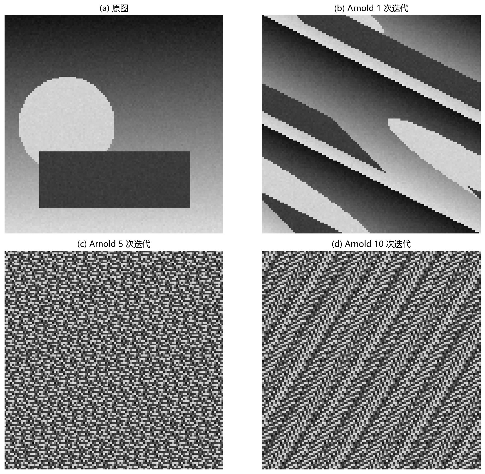

# 13 图像加密：让图像内容不可读

> 图像加密关注的是安全性——让未授权的人即使拿到图像数据，也无法恢复可辨识的视觉内容。

---

## 1. 图像加密和普通数据加密

图像本质也是二进制数据，当然可以用 AES 等标准密码加密。但图像有一些特点：
- 数据量大（一帧可能几十 MB）。
- 相邻像素高度相关。
- 有时需要保留某些格式特征（如 JPEG 头）以便传输。

因此除了标准加密，也有人研究**图像特有的加密方法**——置乱像素位置、改变像素值分布、在变换域中操作。

  **核心原则：真实安全场景应优先使用成熟标准加密。**  
  图像专用方法的价值主要在研究和理解"置乱 + 扩散"的直觉。

---

## 2. Arnold 变换：经典的像素置乱

Arnold 变换（猫脸变换）是一个周期性的全图置乱算法：

$$
\begin{bmatrix} x' \\ y' \end{bmatrix} = \begin{bmatrix} 1 & 1 \\ 1 & 2 \end{bmatrix} \begin{bmatrix} x \\ y \end{bmatrix} \pmod{N}
$$

其中 $N$ 是图像的边长。每次迭代把每个像素映射到新位置。变换具有**周期性**——迭代一定次数后图像会完全恢复原样。

图 13-1 展示了 Arnold 变换对测试图像逐次置乱的效果：
- (a) 是原图。
- (b) 是 1 次迭代后的结果——图像已经被打散，但还有模糊的结构感。
- (c) 是 5 次迭代——已经完全看不清原始内容。
- (d) 是 10 次迭代——完全随机化的像素排列。

### Arnold 的局限

只改变像素位置、不改变像素值 → 直方图完全保留。如果你加密的是纯色块图，直方图会泄露"图像有几种颜色、各占多少比例"的信息。因此 Arnold 置乱**不是强加密**——它只是一层视觉混淆。

---

## 3. 扩散：让一个像素影响很多像素

置乱改变了位置但不改变值，那如果攻击者知道"你的图可能包含什么"，就可以用统计分析破解。**扩散**解决这个问题：让每个像素值的变化影响密文中的许多像素值和位置。

Logistic 混沌映射是一种常用的伪随机数发生器：

$$
x_{n+1} = r \cdot x_n \cdot (1 - x_n)
$$

当 $r \approx 4$ 时，序列呈现**类随机**行为，且对初始值 $x_0$ 极其敏感。用这个序列对图像像素做 XOR 操作，就把"确定性随机"融入了图像——攻击者看不到密钥就难以反推。

---

## 4. 频域加密

也可以先对图像做 DCT、Walsh-Hadamard 或小波变换，再对系数做置乱和扩散。频域方法有时能和压缩流水线融合（如在 JPEG 的 DCT 系数阶段嵌入加密）。但设计不当可能留下统计规律——某些频率的能量分布仍可被利用。

---

## 5. 安全性的四个检验维度

评估一个图像加密方案，至少要看：
1. **密钥空间**：是否足够大以抵抗穷举攻击？
2. **统计随机性**：密文图的直方图是否均匀？相邻像素相关系数是否接近 0？
3. **信息熵**：是否接近 8（8 bit 图像的最大理论熵）？
4. **抗攻击性**：对裁剪、噪声、已知明文攻击是否有防御？

---

## 6. 用例：隐私图像的传输与存储

医院传输患者影像、工厂传输缺陷谍照、军事通信——这些场景中，图像加密是数据保护的基础。更稳妥的方案：
1. 使用 TLS/SSH 加密传输链路。
2. 对敏感图像文件使用 AES-256 加密后再存储。
3. 如需"部分可用"的权限控制，可结合选择性加密 + 水印。

---

## 7. 常见坑

- 把置乱当加密。
- 密钥空间太小——如果密钥是 4 位数，攻击者举手就能穷举。
- 混沌参数用浮点实现，跨平台（不同语言/编译器）复现困难。
- 没有统计随机性分析就说"安全"。

---

## 8. 练习题

### 练习 1：为什么单纯 Arnold 置乱不是强加密？

**参考答案：**

Arnold 置乱只改变像素位置，不改变像素值。密文图直方图与原图一模一样——如果原图是纯色块图，攻击者可以直接用颜色分布推测内容。此外 Arnold 具有周期性，参数和迭代次数可能被穷举或分析恢复。它缺少扩散步骤，不能满足现代密码学对混淆与扩散的要求。

### 练习 2：扩散的作用是什么？

**参考答案：**

扩散让明文中一个微小的变化在密文中产生广泛的影响——多个位置、多个像素值都会被扰动。这使得攻击者无法通过分析局部统计规律（如相邻像素相关性）反推明文结构。扩散通常与置乱配合：置乱打散空间结构，扩散打散灰度统计。

### 练习 3：真实隐私传输应该优先用什么？

**参考答案：**

应优先使用经过广泛分析的标准密码学方案：TLS 加密传输链路、AES 加密存储文件。图像专用置乱/混沌方法可以作为研究或附加保护层，但不应单独承担安全责任。密钥管理同样关键——即使算法再强，密钥写死在代码里或明文传输，安全等于零。

---

## 9. 小结

图像加密的核心是**混淆 + 扩散**：混淆让密文和密钥的关系变得复杂，扩散让局部明文变化影响密文全局。理解这两个基本原则，加上对安全性的四个检验维度，就能判断一个加密方案是否"看起来安全"还是"真的安全"。

下一章：[14 图像数字水印](14_图像数字水印.md)
