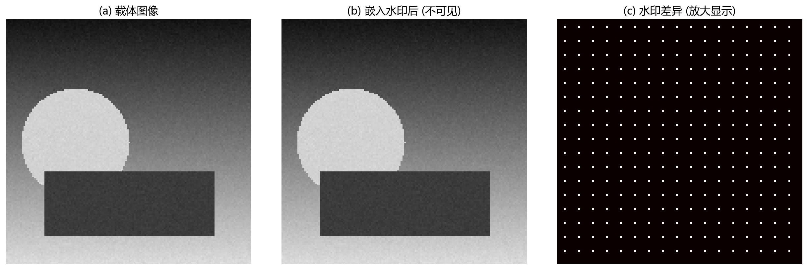

# 14 图像数字水印：把信息藏进图像里

> 水印不是加密。加密让人"看不懂"，水印让人"知道你在看的是谁的"。

---

## 1. 水印解决什么问题

数字水印在图像中嵌入一段可验证的信息，用于：
- **版权声明**：证明"这张图是我的"。
- **来源追踪**：给不同分发对象嵌入不同水印，泄露后追踪源头。
- **内容认证**：检测图像是否被篡改过。
- **隐蔽通信**：在不引起怀疑的情况下传递信息。

---

## 2. 水印的三元悖论

水印系统永远在三个维度间做权衡：

| 维度 | 含义 |
|---|---|
| **不可见性** | 水印不应该被肉眼察觉、不应影响图像观看体验 |
| **鲁棒性** | 水印在压缩、缩放、滤波、加噪后仍能被检测 |
| **容量** | 能嵌入多少比特的信息 |

这三个目标相互制约：
- 水印越强 → 越鲁棒，也越容易被看见。
- 容量越大 → 每个比特可分配的冗余越少 → 鲁棒性下降。
- 越不可见 → 越容易被压缩和滤波抹掉。

没有一种水印方案能同时在这三个维度上都做到极致——你只能根据任务需求"三选二"。

---

## 3. 空域水印：最低有效位 (LSB)

最简单的水印方法：把水印信息写入每个像素的**最低位 (bit 0)**。

原像素值 $195$（二进制 `11000011`），嵌入水印 bit = 1 后变成 `11000011` → 还是 $195$。嵌入 bit = 0 后变成 `11000010` → $194$。肉眼完全看不出 ±1 的灰度变化。

图 14-1 展示了水印嵌入的效果：
- (a) 是载体图像。
- (b) 是嵌入水印后的图像——肉眼完全无法区分。
- (c) 是水印差异图（放大 40 倍显示）——每 8×8 块的特定位置被微调了几个灰度级。这就是 LSB 注入留下的"指纹"。

LSB 水印优点：容量高、视觉影响极小、实现简单。致命弱点：**极度脆弱**——哪怕做一次轻度 JPEG 压缩，低位被量化时基本全丢；裁切、滤波后也无法检测。

---

## 4. 频域水印：把信息藏在更稳定的系数里

频域水印不修改像素值，而是修改频域系数。
- **DCT 域**：在 8×8 DCT 的中频系数中嵌入（太低频影响视觉，太高频容易被压缩）。
- **小波域**：在特定子带的系数中嵌入，可以利用小波的多分辨率特性。
- **扩频**：把一个 bit 的信息"扩散"到很多个系数中，每个系数的修改量极小。检测时把分散的微弱信号通过**相关性累加**恢复出来。

扩频水印的优势：个别系数被压缩或滤波破坏后，通过相关检测仍然能恢复水印。代价：容量低（每个 bit 占用大量系数）。

---

## 5. 盲检测 vs 非盲检测

- **盲检测**：不需要原图，只用密钥和水印信息就能检测。适合追踪和版权验证。
- **非盲检测**：需要原图参与比对。检测更容易、更准确，但实际场景中原图不一定在手边。

---

## 6. 用例：内部文件泄露追踪

公司给每个员工的培训文档 PDF 中嵌入不同的水印序列。如果有人把文档截图发到网上，检测截图中的水印序列 → 定位到具体员工 → 追责。

这个场景需要水印对**截图、缩放、压缩、轻微裁剪**有鲁棒性（这些是常见的"反水印"攻击）。

---

## 7. 常见坑

- 只测无攻击检测，不测压缩/缩放 → 鲁棒性被高估。
- 水印强度太大 → 肉眼可见。
- 没有密钥管理 → 任何人拿到水印算法就都能伪造。
- 混淆水印、加密、隐写的目标——三者的威胁模型和设计目标完全不同。

---

## 8. 练习题

### 练习 1：为什么 LSB 水印容易被破坏？

**参考答案：**

LSB 水印把信息放在像素的最低有效位。但最低位对视觉影响最小，也最容易被压缩、滤波、加噪和格式转换改变——JPEG 压缩的量化步骤会直接四舍五入抹掉低位；中值滤波会替换像素值；裁切会改变位置。因此 LSB 水印隐蔽性好但鲁棒性极弱。

### 练习 2：为什么频域水印常选在中频嵌入？

**参考答案：**

低频系数直接影响图像大面积明暗——修改它很容易被肉眼察觉。高频系数在压缩和滤波中首先被丢弃——修改它容易被抹掉。中频系数在不可见性和鲁棒性之间处于平衡位置：不太影响感知，也不太容易被常规处理破坏。

### 练习 3：误检率和漏检率在水印场景中各意味着什么？

**参考答案：**

- **误检率 (FPR)**：没有水印却被判断为有水印——相当于冤枉一个无辜的人。版权场景中这可能导致错误索赔。
- **漏检率 (FNR)**：有水印却没检测出来——相当于放过了真正的泄露源头。追踪场景中这意味着失去溯源能力。

两者需要根据场景权衡：版权保护可能更关注低误检（不能冤枉），来源追踪可能更关注低漏检（不能放过）。

---

## 9. 小结

数字水印的核心是在**不可见性、鲁棒性和容量**之间做取舍。这个三角框架比任何具体算法都重要——因为所有水印方案本质上都是在给三个角分配预算。理解了它，你就理解了水印设计的全部自由度。

下一章：[15 综合实践路线](15_综合实践路线.md)
