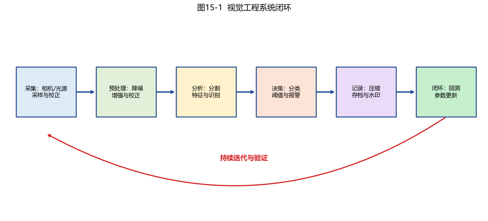

# 15 综合实践路线：把图像处理串成工程系统

> 单个算法只是零件。真实的视觉系统需要流程、指标和闭环——这才是一个能上线运行的东西。

---

## 1. 从 14 章到 1 个系统

前面 14 章讲了采样、增强、变换、分割、特征、识别、压缩和安全——它们像一个工具箱里的独立工具。但实际项目不是"找个算法跑一下"就完事的。你需要把采集、校正、分析、决策、存储和迭代串成一个闭环。

---

## 2. 典型视觉系统的六层架构

图 15-1 展示了视觉工程的完整闭环：

1. **采集层**：相机选型、镜头视场、光源角度与波长、曝光时间——这决定了图像质量的**天花板**。
2. **校正层**：畸变校正、平场校正、颜色校正——把原始数据变成可比较的物理量。
3. **增强层**：降噪、对比度增强、锐化——让目标和背景更容易区分。
4. **分析层**：分割、特征提取、分类识别——把像素变成结构化信息。
5. **决策层**：阈值规则、置信度过滤、报警逻辑——把分析结果变成可执行的行动。
6. **记录层**：压缩存储、水印溯源、加密保护——让结果可追溯、可审计。

>

  **最重要的闭环：决策层出了问题 → 回到分析层改特征/分类器 → 回到增强层调参数 → 回到采集层改光照/曝光。**  没有闭环的系统会停留在"跑通了"的状态，但永远到不了"跑稳了"的状态。

---

## 3. 从问题反推算法，而不是从算法反推问题

不要一开始就决定"我要用深度学习"或者"我要用 Hough 变换"。先问清楚：
- **要测量什么？** 面积？宽度？数量？位置？类别？
- **允许多大误差？** ±0.1 mm？±5%？不允许漏检？
- **速度要求？** 实时 30 fps？离线批处理？
- **光照稳定吗？** 室内可控？户外多变？
- **需要证据留存吗？** 是否需要保存原图和中间结果？

目标清晰后，算法的选择会自然很多。比如"测量螺丝内径" → 需要高精度边缘 → 亚像素边缘检测 + 形态学测量 → 不需要深度学习。

---

## 4. 指标比感觉可靠

图像处理很容易陷入"肉眼看起来不错"。工程上必须有量化指标：
- **分割**：IoU、Dice 系数。
- **检测**：召回率、精确率、F1。
- **测量**：平均绝对误差、标准差、最大偏差。
- **速度**：单张处理时间、吞吐量。
- **压缩影响**：压缩后检测/测量性能的降级比例。

---

## 5. 用例：金属表面缺陷检测系统

**需求**：检测轴承表面的划痕和凹坑，不允许漏检，允许少量误检（因为有人工复核）。

**流程设计**：
1. 采集：环形 LED 光源 + 工业相机，确保划痕有高对比度。
2. 校正：平场校正消除光源边缘衰减。
3. 增强：中值滤波去椒盐噪声 + CLAHE 局部对比度增强。
4. 分割：自适应阈值分割，得到候选区域。
5. 形态学：闭运算连接划痕断缝，开运算清理小噪点。
6. 特征筛选：按长度 > 2 mm、圆度 < 0.5 筛选划痕。
7. 决策：长度超的报警，面积超的报警。
8. 记录：缺陷区域无损 PNG 存档，全图 JPG Q90 存档。

**如果误检多，回看 1-2 步**——可能是光源导致不稳定纹理。**如果漏细划痕，回看 1-4 步**——可能是采样不够密或压缩抹掉高频。

---

## 6. 落地流程：从零到一

1. **明确任务和量化验收标准**——不是"检测缺陷"，而是"缺陷召回率 ≥ 99%、误检率 ≤ 5%"。
2. **采集代表性样本**——覆盖好品、边界品、典型缺陷、光照变化。
3. **建基线**——用最简单的流程（全局阈值 + 基本特征）先跑通，得到一个可衡量的起点。
4. **分析失败样本**——误检发生在哪种光照？漏检是哪种缺陷？定位到具体环节。
5. **分阶段改进**——一次只改一个环节（比如调光照、换阈值、加特征），看指标变化。
6. **固化和回归**——参数确定后保存样本集和指标，后续改动都要过回归集。

---

## 7. 常见工程坑

- 数据采集不稳定，却拼命在算法端硬补。
- 只看单张效果，不看批量统计——单张调参是最容易的幻觉。
- 前处理太强 → 把后续需要的细节也处理没了。
- 没保存中间结果 → 出错后问"到底是哪一步不对？"答不出来。

---

## 8. 练习题

### 练习 1：为什么视觉系统要保存中间结果？

**参考答案：**

中间结果（如校正后图、增强后图、分割掩膜、特征表）能帮助定位问题来源。如果最终判断错误，可以逐级向上追查：是分类器判错，还是特征值不对，还是分割把目标漏了，还是增强时把边缘抹掉了？没有中间结果只能猜测。

### 练习 2：为什么不直接从最复杂的方法开始？

**参考答案：**

复杂方法的参数多、调试难、出问题不好定位。先从简单基线开始：可解释、易调试、能快速暴露数据和流程问题。知道简单方法失败在哪里，改进才有明确方向，也更容易证明新增复杂度确实有价值。

### 练习 3：系统上线后为什么需要回归样本集？

**参考答案：**

算法升级、参数调整、光源更换或环境变化都可能影响性能。回归集是一组标注过的代表性样本——新版本在回归集上跑一遍，确认历史能力没有被破坏。没有回归集，系统会悄无声息地退化。

---

## 9. 小结

图像处理的核心能力不是记公式，而是**把真实问题拆解成可解释、可验证、可迭代的流程**。每一章的知识都是拼图的一块，而本章讲的闭环思维是把所有拼图拼在一起的框架。到此，你已经具备搭建一个传统视觉系统所需要的全部主干知识。

返回：[学习路线 README](README.md)
