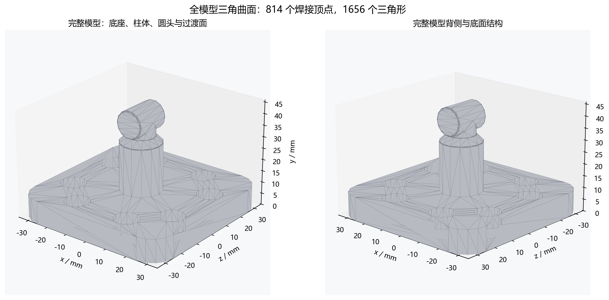
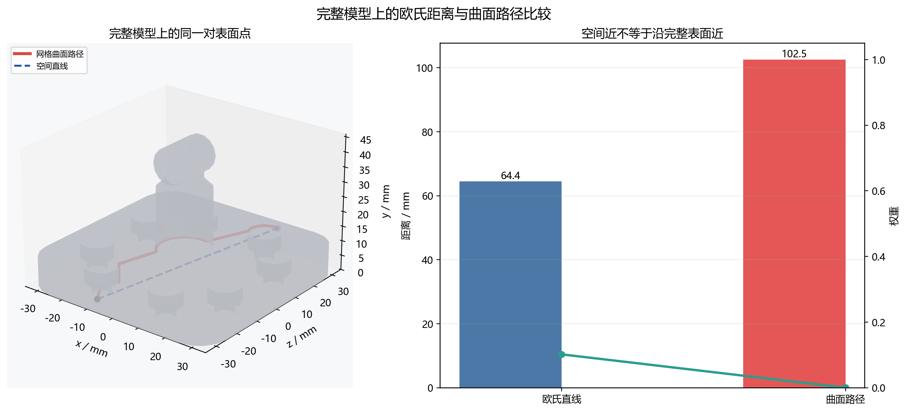
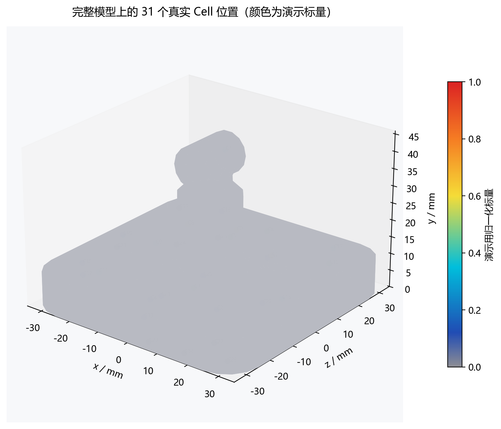
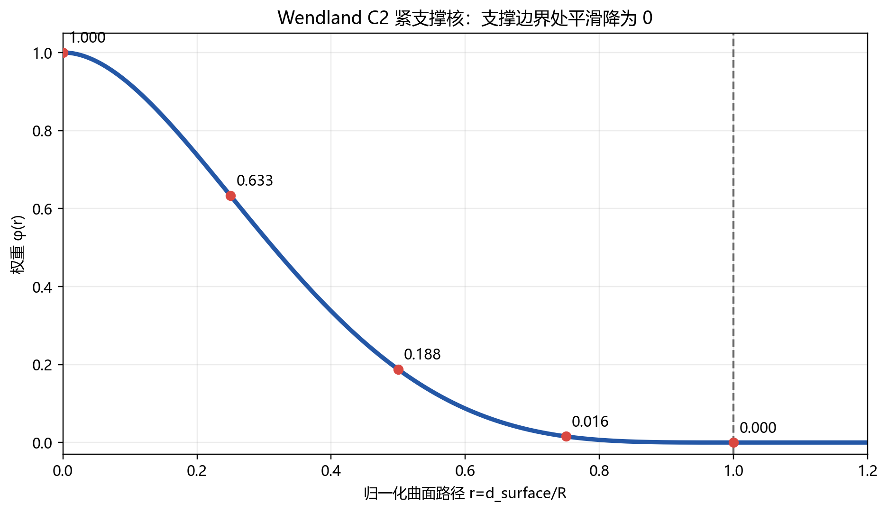
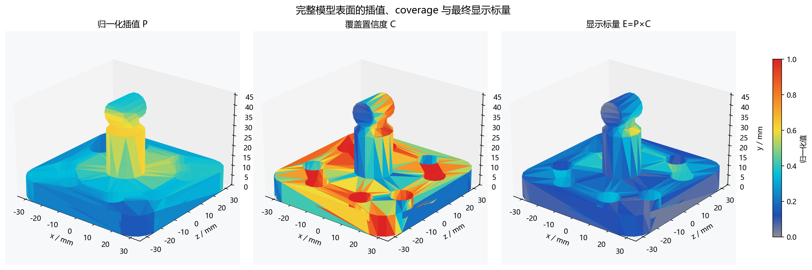
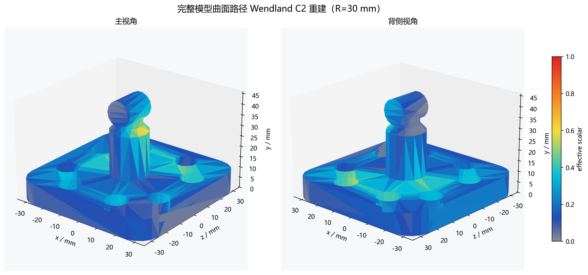
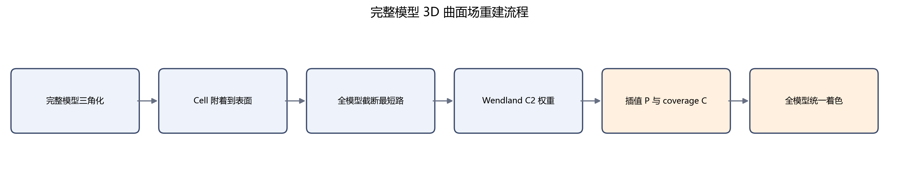

# Wendland 紧支撑核的 3D 曲面力场重建方法

二维散点场重建解决的是“平面上只有少量采样点，怎样恢复连续场”的问题。到了三维模型上，采样点仍然是离散的，但目标不再是一张平面图，而是一张有曲率、有折角、有正反面、甚至包含多个零件的三角曲面。

这时真正新增的困难不是把公式里的 `(x,y)` 换成 `(x,y,z)`，而是重新回答一个问题：**两个点在三维空间里看起来很近，是否意味着它们沿模型表面也很近？**

本文把 Cell 视为连续力场的离散采样，使用 Wendland C2 核进行归一化局部插值，并以曲面路径代替空间直线距离，使力场沿模型表面传播，而不是穿过实体或跨到相邻表面。

文中的示例 STEP 是一个由底座、柱状连接段、圆柱侧面、圆头和过渡圆角共同组成的完整实体，并不是一个独立的标准半圆柱。为了单独说明曲面距离和局部插值，配图从其中的 φ12 圆柱侧面取出一块规则圆柱带作为演示区域，并在该区域上有意布置 12 个采样点。这个规则圆柱带是对模型局部表面的分析性截取，不代表整个零件的外表面，也不能替代实际 Cell 所覆盖区域的识别。采样值是为了说明算法而设置的 `0~1` 归一化数据，不是实测压力，也不代表材料内部应力。

## 从平面散点到曲面采样

在平面问题里，一个采样点可以写成：

$$
(x_i,y_i,p_i)
$$

在三维曲面上，位置变成三维坐标，并且通常还要保留表面法线：

$$
(\mathbf x_i,\mathbf n_i,p_i),\qquad \mathbf x_i\in\mathbb R^3
$$

这里的 $p_i$ 是第 $i$ 个 Cell 的采样值。最重要的语义仍然与二维方法相同：**Cell 是对连续场的一次观测，不是向周围释放能量的独立力源。**

因此多个 Cell 的值不能直接相加。如果四个相邻 Cell 都是 `0.6`，中间位置也应接近 `0.6`，不能仅因为附近有四个点就变成 `2.4`。力场重建的目标，是估计没有传感器位置上的场值，而不是计算多个“光斑”的叠加亮度。

三维曲面还带来两个额外约束：

1. 传播必须尊重曲面拓扑。空间上相邻、拓扑上断开的零件不能互相串色。
2. 传播必须尊重表面形状。跨越尖锐折角的代价应高于在平滑面上走同样长度。

## 先从完整模型中确定目标表面

示例 STEP 中可以找到半径为 `6 mm`、轴线沿 $z$ 方向并经过 $(0,40)$ 的圆柱侧面。为了构造规则的演示区域，本文只取其中 $z\in[-8,8]$、圆周角 $\theta\in[-90^\circ,90^\circ]$ 的圆柱带，并将它参数化为：

$$
x=6\sin\theta
$$

$$
y=40-6\cos\theta
$$

$$
z\in[-8,8],\qquad \theta\in[-90^\circ,90^\circ]
$$

这里需要区分“底层几何”和“实际修剪面”。半径、轴线和局部圆柱形状来自 STEP 中的圆柱曲面实体，但完整零件还包含其他平面、圆柱面、圆头及圆角过渡，实际 CAD 面也可能被边界曲线修剪成不规则区域。因此，上述参数域只是为了讲解而选取的规则局部区域，不能据此把完整模型判断成半圆柱，也不能仅凭一个圆柱曲面实体就确定真实的力场传播区域。



真实应用中的目标曲面应结合 Cell 数据确定。若采样数据已经记录所属 CAD 面或三角形 ID，就直接以这些面及允许连通的相邻面组成目标区域；若只有 Cell 中心和法线，则先把每个 Cell 投影到距离和法线方向都合理的三角形上，再从这些附着三角形沿网格拓扑扩展。扩展过程中还要根据测量对象排除底座、背面、其他零件和不允许跨越的物理边界。最终参与重建的“二维曲面”是这一组三角面及其连接关系，而不是根据零件名称或外形自动套用一个半圆柱公式。

## 为什么三维欧氏距离不够

最直接的三维写法，是用空间欧氏距离：

$$
d_{E}(\mathbf x,\mathbf x_i)=\|\mathbf x-\mathbf x_i\|_2
$$

这个距离只看两点之间的直线。对圆柱面而言，它量到的是弦长；而真实的表面传播至少要沿圆弧走。若两点圆周角相差 $\Delta\theta$，则：

$$
d_E=2R_c\sin\frac{|\Delta\theta|}{2}
$$

$$
d_S=R_c|\Delta\theta|
$$

其中 $R_c$ 是圆柱半径，$d_S$ 是沿圆柱面的弧长。除两点重合外，总有：

$$
d_E\le d_S
$$

也就是说，空间直线会系统性低估表面传播距离。距离一旦被低估，Wendland 核得到的权重就会偏大，影响范围也会偏宽。对更一般的薄壁或折叠模型，这个问题会表现为正面 Cell 穿过实体影响背面，或者两个靠得很近的独立零件互相串色。



法线过滤能缓解部分问题，却不能替代曲面拓扑。两层平行薄壁的法线可能方向相近，但它们仍然是两张不同的表面。真正稳妥的做法，是先建立三角网格的连通图，再沿图上的表面路径计算距离。

## 在规则圆柱演示区域上怎样选点

为了同时观察轴向变化和圆周方向变化，我没有随机撒点，而是选择了一个规则但不贴边的布局：

$$
z\in\{-6,0,6\}\text{ mm}
$$

$$
\theta\in\{-70^\circ,-25^\circ,25^\circ,70^\circ\}
$$

两组坐标做笛卡尔积，共得到 12 个点。轴向位置距离端部各留 `2 mm`，避免所有核中心都压在边界上；圆周角覆盖左右侧面和中部，同时避开 `±90°` 的开口边界。



点位和演示压力如下：

| 点 | z / mm | θ / ° | x / mm | y / mm | 归一化压力 |
|---|---:|---:|---:|---:|---:|
| S1 | -6 | -70 | -5.638 | 37.948 | 0.18 |
| S2 | 0 | -70 | -5.638 | 37.948 | 0.32 |
| S3 | 6 | -70 | -5.638 | 37.948 | 0.46 |
| S4 | -6 | -25 | -2.536 | 34.562 | 0.42 |
| S5 | 0 | -25 | -2.536 | 34.562 | 0.82 |
| S6 | 6 | -25 | -2.536 | 34.562 | 0.68 |
| S7 | -6 | 25 | 2.536 | 34.562 | 0.55 |
| S8 | 0 | 25 | 2.536 | 34.562 | 1.00 |
| S9 | 6 | 25 | 2.536 | 34.562 | 0.76 |
| S10 | -6 | 70 | 5.638 | 37.948 | 0.28 |
| S11 | 0 | 70 | 5.638 | 37.948 | 0.48 |
| S12 | 6 | 70 | 5.638 | 37.948 | 0.36 |

这里把最高值放在中部偏右的 S8，把较高值分布在 S5、S6、S7、S9 周围，是为了形成一个连续但不完全对称的主热点。四角附近保留较低值，用来观察 coverage 和边缘回落是否自然。

## 从曲面路径到 Wendland 权重

本文使用的 Wendland C2 核为：

$$
\phi(r)=
\begin{cases}
(1-r)^4(4r+1),&0\le r<1\\
0,&r\ge1
\end{cases}
$$

区别只在于归一化距离 $r$ 的定义。三维曲面算法使用：

$$
r_i(v)=\frac{d_S(v,i)}{R}
$$

其中 $d_S(v,i)$ 是采样点到曲面位置 $v$ 的表面路径代价，$R$ 是影响半径。本文配图取 `R=8 mm`。



这个核有几个适合实时曲面重建的性质：

- 采样点中心处权重为 `1`。
- 距离增大时权重平滑下降。
- 到支撑半径时权重和低阶导数连续回到 `0`。
- 支撑半径外严格为 `0`，所以只需要处理局部邻域。

对于选取的规则圆柱带，它是可展曲面。令圆弧坐标：

$$
s=R_c\theta
$$

把曲面展开后，每个位置可以写成 $(z,s)$，两个点之间的曲面最短距离就是：

$$
d_S=\sqrt{(z-z_i)^2+(s-s_i)^2}
$$

这个解析距离正是圆柱面上的测地距离。它适合生成本文的高分辨率示意图；对任意 STL 三角网格，则需要把同样的“沿表面走”语义离散成网格图上的最短路径。

## 归一化插值解决密度伪影

得到每个采样点的权重后，先做归一化加权平均：

$$
P(v)=\frac{\sum_i p_i\phi(r_i(v))}{\sum_i\phi(r_i(v))}
$$

这一步和点高斯叠加的本质区别，在分母上。

如果只计算：

$$
\sum_i p_i\phi_i
$$

采样点越密集，重叠区域就越亮。归一化以后，重建值表达附近采样值的加权平均。只要权重非负，$P(v)$ 就不会无依据跑出有效邻域的最小值和最大值之外。

常量场也会保持常量。若附近所有 Cell 都是 $p_0$：

$$
P(v)=\frac{p_0\sum_i\phi_i}{\sum_i\phi_i}=p_0
$$

因此增加等值 Cell 只会提高覆盖可信度，不会制造额外峰值。

## coverage 负责边缘自然淡出

归一化平均解决了采样密度问题，却会带来另一个现象：只要某处还有一个非常小的非零权重，$P(v)$ 仍然可能接近那个采样值。若直接着色，覆盖边缘会像被硬切断一样。

因此还需要定义覆盖置信度：

$$
C(v)=\min\left(1,\sum_i\phi(r_i(v))\right)
$$

再构造用于显示的有效值：

$$
E(v)=V_{min}+[P(v)-V_{min}]C(v)
$$

本文使用归一化范围 `0~1`，所以 $V_{min}=0$，公式简化为：

$$
E(v)=P(v)C(v)
$$

曲面展开以后，可以把三层含义分开看：左图是附近采样值的归一化插值，中图是采样覆盖强度，右图才是最终交给色表的显示标量。



这里有一个容易写错的细节：coverage 已经进入了标量 $E(v)$，颜色阶段就不应再做一次“灰色与热色的 RGB 混合”。否则同一个 coverage 会被重复使用，低值区域也只会改变颜色浓淡，而不会完整经过灰、蓝、青、黄、橙、红的连续色阶。

## 把重建结果重新贴回模型

规则圆柱带的展开只用于演示计算和检查。最终显示时，把每个 $(z,\theta)$ 位置重新映射到三维坐标，并用 $E(v)$ 查询统一的 256 项色表：

$$
t(v)=\operatorname{clamp}\left(\frac{E(v)-V_{min}}{V_{max}-V_{min}},0,1\right)
$$

色表从模型灰连续进入深蓝、青、黄、橙和红。无覆盖位置对应图例下限，模型与图例在同一个归一化值上必须使用同一种颜色。



从结果可以看到，S8 附近形成主热点，S5、S6、S7、S9 共同塑造连续高值区；两侧和端部因为采样值较低、coverage 较弱而自然回落。白色小点标出原始采样位置，颜色面则是对未采样区域的估计。

这张图表达的是“离散表面采样如何重建为连续显示场”，不是接触力学仿真。算法不会凭空恢复采样点之间未被观测到的尖峰，也不会给出材料内部应力。

## 一般三角网格上怎么计算曲面路径

规则圆柱可以解析展开，但一般模型由三角面组成，不能为每种形状单独推导公式。通用处理方式是把模型表面变成一张带代价的图。

第一步是顶点焊接。STL 常按三角面重复保存顶点，同一几何位置可能在文件中出现多次。如果不先焊接，相邻三角形在图结构里会彼此断开。焊接容差随模型包围盒对角线缩放，并限制在合理范围内，只合并真正重合的顶点，不跨越正常薄壁厚度。

第二步是建立共享边和连通分量。同一连通分量内允许传播，不同连通分量之间严格禁止传播。这样即使两个零件在空间上贴得很近，也不会因为欧氏距离小而互相染色。

第三步是把 Cell 附着到曲面。当采样数据只有 Cell 中心和法线、没有三角面 ID 时，算法先寻找中心到三角形的最近点；距离接近时，再用 Cell 法线和三角形法线的一致性消除歧义。投影点到附着三角形三个焊接顶点的距离，作为最短路的三个初始代价。

第四步是截断 Dijkstra。每个 Cell 只扩展累计路径代价不超过影响半径的顶点。超过半径的节点无需进入缓存，这正好利用了 Wendland 的紧支撑性质。

为了让力场不轻易翻过尖锐折角，共享边的代价还要乘上折角惩罚：

$$
\alpha=\arccos\left(\operatorname{clamp}(|\mathbf n_0\cdot\mathbf n_1|,0,1)\right)
$$

$$
c_{edge}=L_{edge}\left[1+\lambda\left(\frac{\alpha}{\pi}\right)^2\right]
$$

本文示例取折角系数 $\lambda=2$。平滑区域的路径代价接近真实边长；折角越大，跨边代价越高，远侧顶点得到的 Wendland 权重越小。使用法线点积绝对值，是为了避免 STL 面绕序不一致把平滑面误判成 180° 折角。



## 工程上怎么跑得动

如果每一帧都为每个 Cell 重新运行 Dijkstra，再遍历所有顶点，动态力场很难实时。实际实现应把“几何关系”和“实时数值”分开。

模型、Cell 位置、Cell 法线、支撑半径或折角参数变化时，重建几何缓存。缓存记录每个焊接顶点受哪些 Cell 影响，以及这些 Cell 的固定 Wendland 权重。可以使用 CSR 形式保存：

```text
offsets[weldedVertexCount + 1]
sampleIndices[influenceCount]
weights[influenceCount]
```

实时压力更新时，只需要：

1. 根据缓存读取每个顶点的相关 Cell。
2. 计算加权和与权重和。
3. 得到 $P(v)$、$C(v)$ 和 $E(v)$。
4. 查询 256 项色表。
5. 把焊接顶点颜色展开回渲染 VBO。

这样，最昂贵的顶点焊接、三角邻接和截断 Dijkstra 不会随压力值变化重复执行。只有模型拓扑、Cell 布局、影响半径或折角参数改变时，才需要使缓存失效。

## 为什么不再做无约束曲面高斯平滑

二维图像中，最后加一个很轻的 Gaussian 可以消除像素级噪声。但在三角曲面上，无约束邻接平滑可能重新跨越尖锐折角、薄壁接缝或错误焊接位置，还会削弱真实采样差异。

因此，不把网格高斯平滑或颜色邻接平均作为必需步骤。连续性由四件事共同保证：

- 曲面最短路径保证传播方向正确。
- Wendland C2 保证支撑区内和平滑边界处连续。
- coverage 保证覆盖边缘回落到图例下限。
- 三角形内部的顶点色插值完成最终渲染连续化。

如果结果仍然出现块状区域，应该优先检查三角网格是否过稀、Cell 是否过少、支撑半径是否过小，而不是先用后置平滑把几何问题盖住。

## 适用范围与使用前提

这套方法不局限于规则圆柱这一特定形状。对工程中常见的平面、圆柱面、球面、自由曲面、带圆角或折角的零件，以及由多个互不连通部件组成的模型，只要能够得到拓扑关系基本正确的三角网格，通常都可以使用同一套重建流程。规则曲面可以使用解析曲面距离，一般模型则使用三角网格上的表面最短路径；二者改变的是距离的计算方式，不改变归一化局部插值的基本原理。

方法适用的对象不是某一种特定的“力”，而是定义在模型表面上的连续或分段连续标量场。表面压力、温度、磨损量、厚度、位移幅值和振动幅值等，都可以作为采样值进行重建。判断一个量是否适合使用该方法，可以采用一个直接标准：**如果某个未采样位置的值，可以由它周围一小片曲面上的测量值合理估计，那么该量通常适合进行这种局部插值。**

为了使重建结果具有明确意义，需要满足以下条件：

1. **采样值定义在模型表面。** 本文计算的是二维曲面上的场，不是材料内部的三维体场。
2. **局部邻近代表数值相关。** 沿曲面距离较近的点，其真实值应当通常比较接近，或者至少能够通过局部加权平均合理估计。
3. **采样密度能够覆盖主要变化。** Cell 间距和支撑半径应足以覆盖目标区域；采样点之间未被观测到的窄峰、深谷或高频振荡无法由插值自动恢复。
4. **网格拓扑能够代表真实传播关系。** 应正确区分独立零件、薄壁两侧、孔洞和断开区域，避免错误焊接、缺失连接或自交使最短路径走到不应到达的位置。
5. **场的传播近似各向同性。** 本文默认相同曲面距离对应相同衰减。如果物理量只沿某个方向传播，或沿不同方向具有明显不同的相关长度，就需要使用方向相关的距离或各向异性核。
6. **明确真实的不连续边界。** 裂纹、材料分区、隔热带、密封边界或接触分区两侧的场值可能发生真实跳变。若这些区域在网格上仍然连通，应把相关边设置为不可跨越或分别重建，不能依靠增大折角惩罚自动识别所有物理边界。

因此，这套方法对常见模型具有较广泛的几何适用性，但“模型能够计算”不等于“结果一定符合物理事实”。模型形状通常不是主要限制，真正的限制是目标量能否被视为局部连续的表面标量场、采样是否足够，以及网格拓扑是否符合真实传播关系。对具有突变、强方向性或体积效应的场，仍可在分区、方向距离或体网格等方面扩展，但不能直接套用本文的默认假设。

## 参数怎样理解

最重要的参数仍然是影响半径 $R$。

- $R$ 太小：相邻采样之间可能出现低 coverage 空洞，场被切成多个孤立斑块。
- $R$ 太大：不同热点会被过度混合，薄壁和折角处的误传播风险也会增加。
- Cell 分布不均匀：即使归一化避免了亮度叠加，稀疏区域的可恢复细节仍然更少。

一个实用起点，是把 $R$ 设为平均相邻 Cell 曲面间距的 `1~2` 倍，再用统一压力检查覆盖是否连续。本文点位的轴向相邻间距为 `6 mm`，圆周相邻弧长约为 `4.7~4.9 mm`，所以使用 `8 mm` 作为演示支撑半径。

折角系数 $\lambda$ 控制力场翻越棱边的难度。它不是越大越好：过小会跨角传播，过大则可能把本应连续的圆角或粗糙网格切开。它应与模型网格质量和真实表面传播假设一起确定。

## 结果能说明什么，不能说明什么

这套方法能说明：在给定 Cell 布局、采样值、支撑半径和曲面传播规则以后，怎样得到一个连续、局部、可解释的表面标量场。

它不能说明：材料内部的应力应变、接触变形、结构安全裕量，或者采样点之间真实存在但未被测到的尖峰。若要回答这些问题，需要增加传感器密度、引入明确的物理模型，或执行有限元和接触力学计算。

因此更准确的名字是“曲面散点场重建”。压力只是示例数据；方法重建的是满足上述使用前提的表面标量场，而不是由插值结果反推出完整的物理过程。

## 最终流程

整个方法可以压缩为：

```text
STEP/STL 三角曲面
    ↓
顶点焊接、共享边与连通分量
    ↓
Cell 投影并附着到三角面
    ↓
带折角代价的截断表面最短路
    ↓
Wendland C2 紧支撑权重
    ↓
归一化采样插值 P
    ↓
coverage C 与有效值 E
    ↓
统一 3D 色表映射
    ↓
连续曲面力场显示
```

曲面散点场重建不仅要解决“散点怎样变成连续场”，还要解决一个关键问题：**这个连续场应该沿哪里传播。** 只有距离、拓扑和折角都服从真实曲面，Wendland 的局部平滑和归一化才不会被错误的三维捷径破坏；只有目标量同时满足局部连续表面场的假设，重建结果才具有合理的解释。
