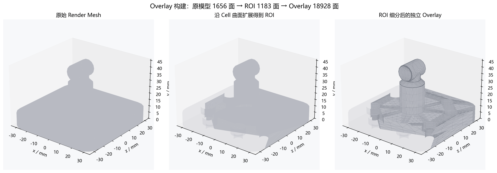
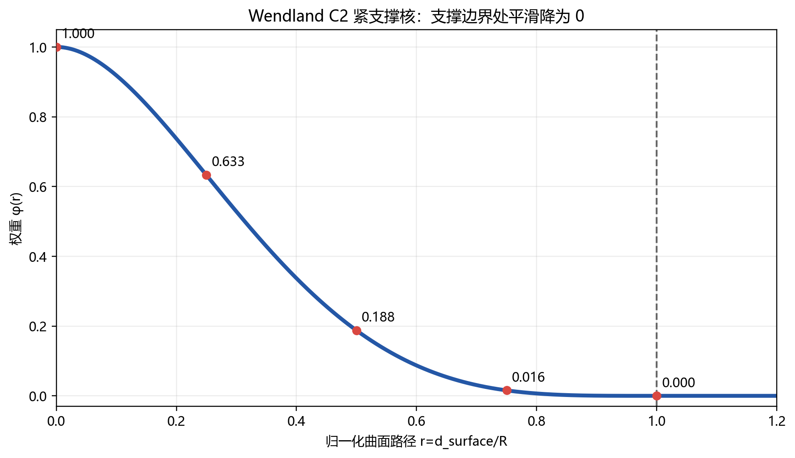
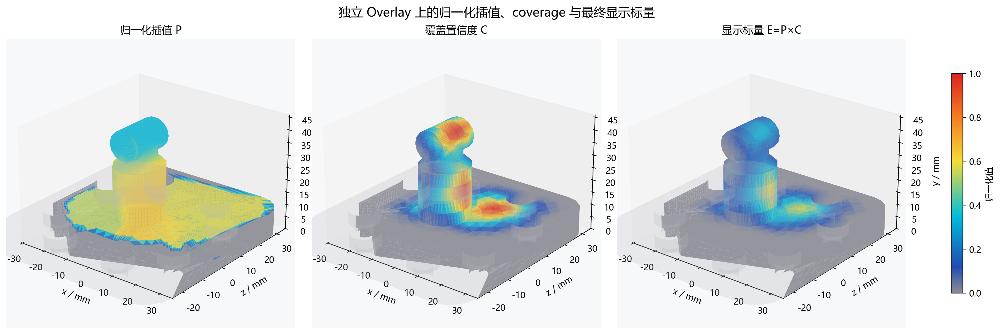
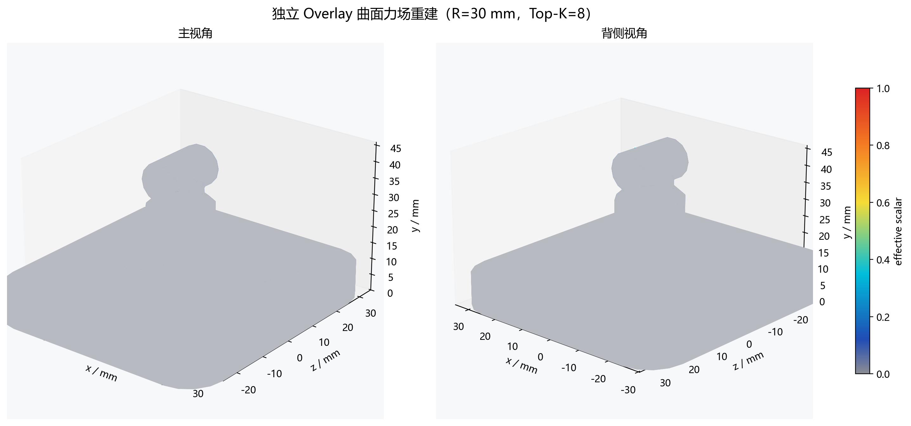
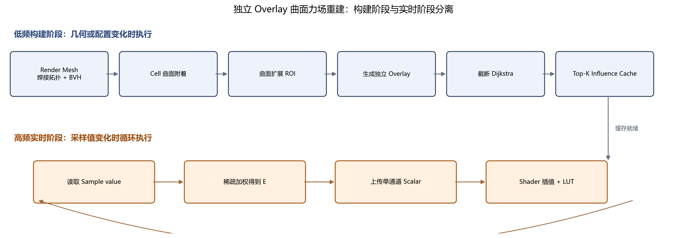

# 基于独立 Overlay 的 3D 曲面力场重建方法

二维散点场重建解决的是“平面上只有少量采样点，怎样恢复连续场”的问题。到了三维模型上，采样点仍然是离散的，但目标不再是一张平面图，而是一张有曲率、有折角、有正反面、甚至包含多个零件的三角曲面。

这时真正新增的困难，不是把公式里的 $(x,y)$ 换成 $(x,y,z)$，而是同时回答三个问题：

1. 两个点在三维空间里看起来很近，是否意味着它们沿模型表面也很近？
2. 原始模型三角形很粗或很密时，热力图怎样保持合适的显示分辨率？
3. Cell 数值连续变化时，怎样避免每帧重复执行曲面搜索和最短路？

本文把 Cell 视为连续表面场的离散采样，采用以下方法：

> **独立局部 Overlay Mesh + 曲面最短路径 + Wendland C2 归一化插值 + 预计算稀疏影响缓存 + Shader LUT 映射。**

其中，Overlay 是贴合原模型目标区域的一张独立细密网格。它只负责热力场的计算位置和显示分辨率，不修改原模型顶点、索引、材质或 UV。曲面距离、Wendland 权重和影响关系在构建阶段预计算；实时阶段只更新单通道标量。

文中的模型来自实际项目文件，包含底座、柱体、圆头和过渡曲面，三角化后有 `814` 个焊接顶点和 `1656` 个三角形。模型上记录了 `31` 个 Cell。为了清楚展示“局部 Overlay”的构建过程，本文保留全部 Cell 作为布局背景，只选择中央相邻的 `C0、C1、C7、C8` 四个 Cell 作为本次活动采样。图中的 `0~1` 数值是算法演示数据，不是实测压力，也不代表材料内部应力。

## 从平面散点到曲面采样

在平面问题中，一个采样点可以写成：

$$
(x_i,y_i,p_i)
$$

在三维曲面上，位置变成三维坐标，并且通常还要保留表面法线：

$$
S_i=(\mathbf x_i,\mathbf n_i,p_i),\qquad \mathbf x_i\in\mathbb R^3
$$

其中 $p_i$ 是第 $i$ 个 Cell 的采样值。最重要的语义仍然与二维方法相同：**Cell 是对连续场的一次观测，不是向周围释放能量的独立力源。**

因此多个 Cell 的值不能直接相加。如果四个相邻 Cell 都是 `0.6`，中间位置也应接近 `0.6`，不能仅因为附近有四个点就变成 `2.4`。力场重建的目标，是估计没有传感器位置上的场值，而不是计算多个光斑的叠加亮度。

三维曲面还带来两个几何约束：

1. 传播必须尊重曲面拓扑。空间上相邻、拓扑上断开的零件不能互相串色。
2. 传播必须尊重表面形状。跨越尖锐折角的代价应高于在平滑面上走同样长度。

## 先从完整模型中确定目标表面

真实模型通常不是一个规则圆柱或单一曲面。即使底层 CAD 几何中存在圆柱、平面和圆角，实际参与测量的区域仍可能被边界曲线修剪，并与底座、背面或其他零件相连。

因此不能根据零件名称或局部外形自动套用一个标准曲面公式。首先应加载完整模型，清理退化三角形，焊接几何重合顶点，建立共享边、连通分量和 BVH。之后再根据 Cell 的附着位置和业务边界确定目标区域。


这里需要区分两张网格：

- **Render Mesh**：原始渲染模型，负责几何外观、材质、遮挡和拾取。
- **Overlay Mesh**：从目标区域生成的独立热力覆盖网格，负责场值计算和显示。

Render Mesh 可以很粗，也可以达到数十万乃至上百万三角形；Overlay 的密度则由热力场变化尺度和屏幕效果决定。两者不应被强制绑定。

## 在模型上怎样选择和附着 Cell

本文加载到 `31` 个 Cell。图 2 中灰色小点表示完整布局，彩色点 `C0、C1、C7、C8` 是本次用于局部 Overlay 演示的活动 Cell，其归一化演示值约为：

| Cell | x / mm | y / mm | z / mm | 演示值 |
|---|---:|---:|---:|---:|
| C0 | 8.97 | 22.22 | -0.12 | 0.642 |
| C1 | 10.37 | 10.00 | 13.91 | 0.573 |
| C7 | 4.45 | 43.80 | 0.76 | 0.344 |
| C8 | -8.70 | 18.51 | 1.33 | 0.537 |


采样位置可能因标定和测量误差略微离开模型表面，所以每个 Cell 都需要先附着到三角形上。稳定附着信息应写成：

$$
A_i=(T_i,\boldsymbol\beta_i,\mathbf q_i,\mathbf m_i,e_i)
$$

其中 $T_i$ 是源三角形，$\boldsymbol\beta_i$ 是重心坐标，$\mathbf q_i$ 是曲面投影点，$\mathbf m_i$ 是表面法线，$e_i$ 是附着误差。

如果输入数据已经包含 `triangleId + barycentric`，应优先使用。若只有 Cell 中心和法线，则通过 BVH 查询若干最近三角形候选，再联合距离和法线一致性评分：

$$
Q=\frac{d}{d_{tol}}+w_n\left[1-\operatorname{clamp}(\hat{\mathbf n}_s\cdot\hat{\mathbf n}_t,-1,1)\right]
$$

薄壁两侧的空间距离可能相近，法线方向可以帮助判断 Cell 属于哪一侧。若最近距离超过业务允许的最大附着误差，应跳过该 Cell 并记录诊断信息，而不是强行吸附。

## 为什么要从原模型提取独立 Overlay

如果直接在原始模型顶点上保存热力值，会产生三个问题：

1. 原网格过粗时，热力图只能在少数顶点之间插值，三角形色块明显。
2. 原网格过密时，每帧更新大量与活动热区无关的顶点，成本过高。
3. UV 接缝和硬法线会复制渲染顶点，直接用于传播可能在几何连续处断色。

更合理的做法，是从活动 Cell 出发沿曲面扩展 ROI，再把 ROI 复制、细分并投影回原曲面，得到独立 Overlay。

ROI 扩展半径定义为：

$$
R_{ROI}=R+M_{ROI}
$$

其中 $R$ 是单个 Cell 的支撑半径，边缘余量可取：

$$
M_{ROI}=\max(0.25R,2h)
$$

$h$ 是目标 Overlay 边长。本文示例使用 `R=30 mm`、`M_ROI=8 mm`。从四个活动 Cell 沿曲面扩展后得到 `1183` 个原始 ROI 三角形，再经过两级细分得到 `9607` 个 Overlay 顶点和 `18928` 个 Overlay 三角形。



图 3 左图是完整 Render Mesh，中图是从活动 Cell 沿曲面可达范围提取的 ROI，右图是细分后的 Overlay。灰色原模型始终保留，Overlay 只是附加在其表面的独立显示层。

通用的 Overlay 构建步骤为：

1. 从焊接曲面提取 ROI 三角形；
2. 复制为独立网格；
3. 按目标边长递归细分过大的三角形；
4. 将新顶点投影回允许的源表面；
5. 为每个 Overlay 顶点保存源三角形和重心坐标；
6. 重建 Overlay 法线、共享边和邻接图；
7. 删除退化、翻转、投影失败或跨越 Barrier 的三角形。

建议初始目标边长满足：

$$
h\le\min\left(\frac{R}{6},\frac{d_{sample}}{3}\right)
$$

其中 $d_{sample}$ 是相邻 Cell 曲面距离的中位数。高曲率、采样附近和预计梯度高的区域可以进一步自适应细分。

## 为什么三维欧氏距离仍然不够

最直接的三维写法，是使用空间欧氏距离：

$$
d_E(\mathbf x,\mathbf x_i)=\|\mathbf x-\mathbf x_i\|_2
$$

这个距离只看两点间的直线，可能穿过实体、孔洞或薄壁，也可能连接两个断开的零件。对圆柱面而言，欧氏距离量到的是弦长，而真实的表面传播至少要沿圆弧走。若圆柱半径为 $R_c$，两点圆周角相差 $\Delta\theta$，则：

$$
d_E=2R_c\sin\frac{|\Delta\theta|}{2}
$$

$$
d_S=R_c|\Delta\theta|
$$

除两点重合外，总有：

$$
d_E<d_S
$$

也就是说，空间直线会系统性低估表面传播距离。距离被低估后，核权重会偏大，影响范围也会偏宽。对薄壁或折叠模型，这会表现为正面 Cell 穿过实体影响背面，或者两个靠得很近的独立零件互相串色。


法线过滤只能帮助 Cell 附着，不能代替曲面拓扑。两层平行薄壁的法线可能方向相近，但它们仍然是两张不同的表面。真正稳妥的做法，是在 Overlay 共享边图上计算曲面路径。

## 从曲面路径到 Wendland 权重

对 Cell $i$ 到 Overlay 顶点 $v$ 的曲面路径距离 $d_i(v)$，定义归一化距离：

$$
r_i(v)=\frac{d_i(v)}{R}
$$

本文使用 Wendland C2 紧支撑核：

$$
\phi(r)=
\begin{cases}
(1-r)^4(4r+1),&0\le r<1\\
0,&r\ge1
\end{cases}
$$



该核具有适合实时曲面重建的性质：

- Cell 中心处权重为 `1`；
- 距离增大时权重平滑下降；
- 到支撑半径时权重和低阶导数连续回到 `0`；
- 支撑半径外严格为 `0`，只需处理局部邻域；
- 权重非负，便于保持插值有界。

在规则圆柱等可展曲面上，可以展开后使用解析测地距离。对任意三角网格，则在 Overlay 共享边图上运行截断 Dijkstra。

Cell 通常位于三角形内部，不能只选择一个最近顶点作为唯一最短路起点。设附着三角形顶点为 $v_0,v_1,v_2$，曲面投影点为 $\mathbf q_i$，应同时初始化：

$$
d(v_k)=\|\mathbf q_i-\mathbf v_k\|_2,\qquad k\in\{0,1,2\}
$$

然后只扩展累计路径代价小于 $R$ 的节点。这样可以减弱网格密度和顶点位置对传播结果的方向偏差。

## 归一化插值解决采样密度伪影

得到每个 Cell 的权重后，先计算权重和：

$$
W(v)=\sum_i\phi_i(v)
$$

再做归一化加权平均：

$$
P(v)=\frac{\sum_i p_i\phi_i(v)}{W(v)}
$$

这一步与点光斑叠加的本质区别在分母上。如果只计算：

$$
\sum_i p_i\phi_i(v)
$$

采样点越密集，重叠区域就越亮。归一化以后，重建值表达的是附近采样值的加权平均。只要权重非负，$P(v)$ 就不会无依据跑出有效邻域的最小值和最大值之外。

常量场也会保持常量。若附近所有 Cell 都是 $p_0$：

$$
P(v)=\frac{p_0\sum_i\phi_i(v)}{\sum_i\phi_i(v)}=p_0
$$

因此增加等值 Cell 只会提高覆盖可信度，不会制造额外峰值。

## Coverage 负责边缘自然淡出

归一化平均解决了采样密度问题，却会带来另一个现象：只要某处还有一个很小的非零权重，$P(v)$ 仍然可能接近那个 Cell 的值。若直接着色，覆盖边缘会像被硬切断一样。

因此定义覆盖置信度：

$$
C(v)=\min(1,W(v))
$$

再构造用于显示的有效标量：

$$
E(v)=V_{min}+[P(v)-V_{min}]C(v)
$$

本文使用 `0~1` 归一化范围，所以 $V_{min}=0$，公式简化为：

$$
E(v)=P(v)C(v)
$$



图 6 左图是邻近采样值的归一化估计 $P$，中图是采样覆盖强度 $C$，右图才是交给色表的最终标量 $E$。灰色部分是未被 Overlay 替换的原始 Render Mesh。

这里有一个容易写错的细节：Coverage 已经进入标量 $E$，定量显示模式下就不应再用同一个 Coverage 把 LUT 颜色与固定灰色混合。否则 Coverage 被重复使用，模型颜色也无法与图例一一对应。

如果产品需要半透明展示模式，可以另用 Coverage 调节 Alpha，但必须明确该模式是视觉混合，不能继续声称屏幕颜色可直接按统一 LUT 定量读取。

## 把重建结果作为覆盖层贴回模型

Overlay 顶点只保存一个 `float` 或 `half` 标量，不保存最终 RGB。渲染时，对有效值做统一归一化：

$$
t(v)=\operatorname{clamp}\left(\frac{E(v)-V_{min}}{V_{max}-V_{min}},0,1\right)
$$

Fragment Shader 在三角形内部插值标量，并使用 $t$ 查询 256 项一维 LUT。模型和图例必须使用同一 LUT、同一 `minValue/maxValue` 和同一归一化函数。



图 7 中，灰色部分仍由原始 Render Mesh 显示；彩色部分来自独立 Overlay。四个活动 Cell 共同形成连续局部热区，支撑半径外回到图例下限。Overlay 的三角形密度明显高于原始 ROI，因此热力显示不会受原模型粗三角形直接限制。

Overlay 与原曲面几何重合，渲染时要避免 Z-fighting。优先使用 Rasterizer Depth Bias 或 Polygon Offset，也可在 Vertex Shader 中沿表面法线偏移包围盒对角线的 `1e-5~1e-4`，同时采用 `LessEqual` 深度测试并关闭 Overlay 深度写入。偏移不能过大，否则轮廓处会出现悬浮。

## 一般三角网格上怎样构建传播关系

### 顶点焊接

STL、CAD 三角化和硬法线模型经常在相同几何位置保存多个顶点。若不先焊接，本来连续的表面可能在 UV 或法线接缝处断开。

推荐令焊接容差随模型包围盒对角线 $D$ 缩放：

$$
\varepsilon_w=D\cdot\operatorname{clamp}(\rho_w,10^{-9},10^{-4})
$$

默认可从 $\rho_w=10^{-7}$ 开始。容差必须足以连接数值重复点，但不能大到把薄壁两侧焊在一起。

### 共享边、连通分量与 Barrier

对焊接三角形，以排序后的两个端点作为无向边键，记录边长、相邻三角形、两侧法线、边界状态和非流形状态。

以下位置默认不得传播：

- 不同连通分量之间；
- 非流形边；
- 用户或业务指定的物理边界；
- 裂纹、密封、隔热或接触分区边界；
- 配置为硬阻断的折角边。

对允许跨越、但希望抑制翻越尖角的边，可以使用软折角代价：

$$
\theta=\arccos\left(\operatorname{clamp}(|\mathbf n_0\cdot\mathbf n_1|,0,1)\right)
$$

$$
c_e=L_e\left[1+\lambda\left(\frac{\theta}{\pi}\right)^2\right]
$$

默认可从 $\lambda=2$ 开始。折角惩罚只能改变传播代价，不能替代明确的物理 Barrier。

## 预计算 Influence Cache

曲面距离和 Wendland 权重只依赖模型、Overlay、Cell 位置和配置，不依赖当前 Cell 数值。因此应在构建阶段一次性计算，并压缩为稀疏缓存：

```cpp
struct InfluenceCache {
    Array<uint32_t> offsets;        // overlayVertexCount + 1
    Array<uint32_t> sampleIndices;  // influenceCount
    Array<float> normalizedWeights; // influenceCount
    Array<float> coverage;          // overlayVertexCount
};
```

一个 Overlay 顶点可能受到很多 Cell 影响。为了保证实时性能，可以只保留权重最大的 $K$ 项，默认从 `K=8` 开始：

1. 先收集全部非零权重；
2. 用完整权重和计算 Coverage；
3. 选择最大的 $K$ 个权重；
4. 将保留权重重新归一化，使其和为 `1`；
5. 分别保存归一化权重和完整 Coverage。

这样每帧每个 Overlay 顶点只需最多 $K$ 次乘加，同时尽量保持原始 Coverage 语义。应使用实际数据比较 `K=4、8、16` 与完整结果的最大误差和 RMSE；若 `K=8` 的归一化 RMSE 超过约 `1%`，应提高 $K$。

## 工程上怎样达到实时更新

最昂贵的顶点焊接、BVH、ROI 提取、Overlay 生成和截断 Dijkstra 都不应每帧执行。算法应明确分为两个阶段。



### 低频构建阶段

只有模型、Cell 位置、支撑半径、Overlay 分辨率、折角参数或 Barrier 变化时，才执行：

```text
Render Mesh 焊接拓扑与 BVH
    ↓
Cell 附着到曲面
    ↓
沿曲面扩展 ROI
    ↓
生成独立 Overlay
    ↓
截断 Dijkstra 与 Wendland 权重
    ↓
Top-K Influence Cache
```

Overlay 构建和多次 Dijkstra 应放在后台线程，并使用 `generationId` 管理取消和过期结果。构建期间继续显示旧 Overlay 或隐藏热力层，不能阻塞相机、拾取和原模型渲染。

### 高频实时阶段

Cell 数值变化时，每帧只执行：

```pseudo
parallel_for each overlay vertex v:
    weightedValue = 0
    for item in cache[v]:
        weightedValue += sampleValue[item.sample] * item.normalizedWeight

    if cache[v] is empty:
        output[v] = minValue
    else:
        output[v] = minValue
                  + (weightedValue - minValue) * coverage[v]
```

随后只上传 `R16F` 或 `R32F` 单通道标量 Buffer，由 Fragment Shader 查询 LUT。不要每帧在 CPU 生成 RGB/RGBA 顶点颜色，也不要每帧重建 Overlay 或重新运行 Dijkstra。

在常规桌面 CPU 上，单个活动 Overlay 可优先控制在 `10k~50k` 顶点。若目标为 `60 Hz`，建议热力子系统的 P95 预算为：标量 CPU 更新 `≤2~4 ms`、GPU 上传 `≤1 ms`、Overlay Draw `≤1~1.5 ms`。

## 缓存何时失效

| 变化 | Overlay | 传播图 | Influence Cache | 仅更新标量 |
|---|---:|---:|---:|---:|
| Cell value | 不重建 | 不重建 | 不重建 | 是 |
| LUT 或图例范围 | 不重建 | 不重建 | 不重建 | Shader 参数即可 |
| 模型世界变换 | 不重建 | 不重建 | 不重建 | 否 |
| Cell 位置或法线 | 视 ROI 而定 | 视情况 | 重建 | 否 |
| 支撑半径 | 可能重建 | 不一定 | 重建 | 否 |
| 折角系数 | 不重建 | 更新代价 | 重建 | 否 |
| Barrier | 可能重建 | 重建 | 重建 | 否 |
| Overlay 分辨率 | 重建 | 重建 | 重建 | 否 |
| 原模型拓扑 | 重建 | 重建 | 重建 | 否 |

如果原模型发生骨骼、节点或有限元形变，可以利用 Overlay 顶点保存的源三角形和重心坐标恢复其位置与法线。只有形变近似刚性或局部等距、曲面路径长度变化可以忽略时，才能继续使用旧影响缓存；若形变显著改变边长、折角或可达关系，就必须重建传播图和 Influence Cache。

## 参数怎样理解

### 支撑半径 $R$

- 太小：相邻 Cell 之间出现低 Coverage 空洞，场被切成孤立斑块；
- 太大：不同热点被过度混合，跨折角误传播风险增大；
- 实用起点：平均或中位相邻 Cell 曲面距离的 `1~2` 倍。

### Overlay 目标边长 $h$

- 太大：顶点插值不足，显示出粗三角形结构；
- 太小：缓存、上传和 Draw 成本增加；
- 增加 Overlay 密度只能降低显示离散误差，不能恢复采样间未观测到的尖峰。

### 折角系数与 Barrier

折角系数控制跨越棱边的额外代价，不是越大越好。真实不连续边界必须明确设为 Barrier，不能仅靠提高折角系数猜测裂纹、材料分区或接触边界。

### Top-K

$K$ 越小，每帧更新越快、缓存越小，但近似误差越大。必须以实际 Cell 数量和布局做误差验证。

## 适用范围与使用前提

这套方法不局限于某一种模型形状。对平面、圆柱面、球面、自由曲面、带圆角或折角的零件，以及由多个互不连通部件组成的模型，只要能够得到拓扑关系基本正确的三角网格，通常都可以使用同一套流程。

方法适用的对象不是某一种特定的“力”，而是定义在模型表面上的连续或分段连续标量场，例如：

- 表面压力；
- 温度；
- 磨损量；
- 厚度；
- 位移幅值；
- 振动幅值；
- 置信度或质量评分。

为了使结果具有明确意义，需要满足：

1. **采样值定义在模型表面。** 本文计算二维曲面场，不是材料内部三维体场。
2. **局部邻近代表数值相关。** 沿允许曲面路径较近的位置，其真实值通常较接近。
3. **采样密度能够覆盖主要变化。** 未被观测到的窄峰、深谷和高频振荡无法由插值自动恢复。
4. **网格拓扑代表真实传播关系。** 应正确区分独立零件、薄壁两侧、孔洞和断开区域。
5. **默认传播近似各向同性。** 如果不同方向具有明显不同的相关长度，需要使用各向异性距离或方向核。
6. **真实不连续边界可以明确表达。** 裂纹、材料分区和接触分区应设置 Barrier 或分别重建。

## 怎样验证结果

### 数值验证

1. **常量保持**：所有有效 Cell 设为 $p_0$，充分覆盖区内应满足 $P(v)\approx p_0$。
2. **有界性**：$P(v)$ 不应超出影响 Cell 的最小值和最大值。
3. **支撑边界**：$d=R$ 时权重平滑归零，$d>R$ 时不存在该 Cell 的影响项。
4. **Coverage**：Cell 中心和密集区接近 `1`，支撑边缘连续下降，不出现负值、NaN 或 Inf。
5. **Top-K 误差**：比较完整影响与不同 $K$ 的最大误差、平均误差和 RMSE。

### 几何验证

| 场景 | 应验证的行为 |
|---|---|
| 平面 | 曲面距离接近平面欧氏距离，基础插值连续 |
| 圆柱面 | 沿圆弧传播，不以弦长代替曲面距离 |
| U 形薄壁 | 一侧 Cell 不直接穿透到另一侧 |
| 两个断开零件 | 连通分量不同，不发生串色 |
| 90° 折角 | 软惩罚增加路径代价，Barrier 完全阻断 |
| UV/硬法线接缝 | 焊接拓扑后传播连续 |
| 非流形模型 | 检测并默认阻断可疑边，不崩溃 |

### 视觉验证

所有方法比较应固定 Cell、量程、LUT、相机、光照和输出分辨率。合格结果应满足：

- 热区沿曲面连续，无明显逐面常色块；
- 不穿过薄壁，不跨断开零件或 Barrier；
- UV 和硬法线接缝不造成断色；
- Overlay 无明显 Z-fighting 或悬浮；
- 模型与图例颜色一致；
- 改变相机不改变标量场分布。

## 结果能说明什么，不能说明什么

这套方法能说明：在给定 Cell 布局、采样值、支撑半径和曲面传播规则以后，怎样得到一个连续、局部、可解释的表面标量场。

它不能说明：材料内部的应力应变、接触变形、结构安全裕量，或者采样点之间真实存在但未被测到的尖峰。若要回答这些问题，需要增加传感器密度、引入明确的物理模型，或执行有限元和接触力学计算。

因此更准确的名字是“曲面散点场重建”。压力只是示例数据；方法重建的是满足局部连续假设的表面标量场，而不是由插值结果反推出完整物理过程。

## 最终流程

整个方法可以压缩为：

```text
完整 Render Mesh
    ↓
焊接拓扑、共享边、连通分量与 BVH
    ↓
Cell 投影并附着到三角面
    ↓
沿曲面扩展局部 ROI
    ↓
生成分辨率独立的 Overlay Mesh
    ↓
带折角代价和 Barrier 的截断 Dijkstra
    ↓
Wendland C2 权重与 Top-K Influence Cache
    ↓
归一化插值 P、Coverage C 和有效标量 E
    ↓
每帧只上传单通道 Scalar
    ↓
Fragment Shader 插值并查询统一 LUT
    ↓
连续局部曲面力场显示
```

曲面散点场重建不仅要解决“散点怎样变成连续场”，还要解决“这个连续场沿哪里传播、由哪张网格承载、怎样实时更新”。独立 Overlay 使热力分辨率不再受原始高模限制；曲面最短路径、连通分量和 Barrier 保证传播关系正确；Wendland 归一化与 Coverage 保证数值含义清晰；预计算 Influence Cache 则把昂贵几何计算从逐帧更新中分离出来。
