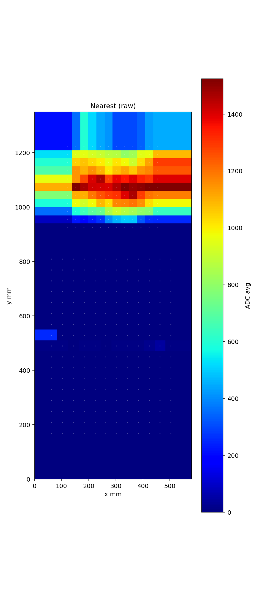
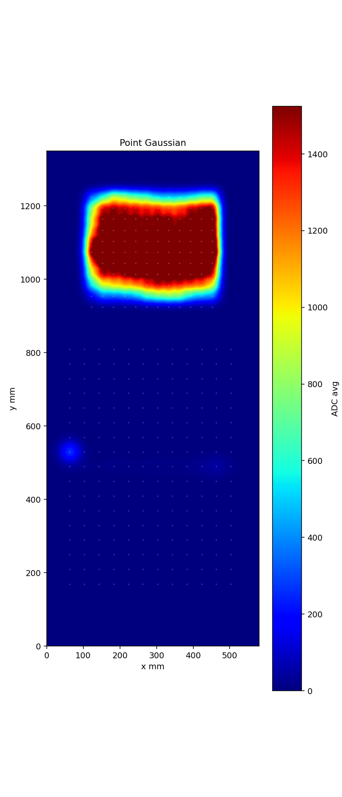
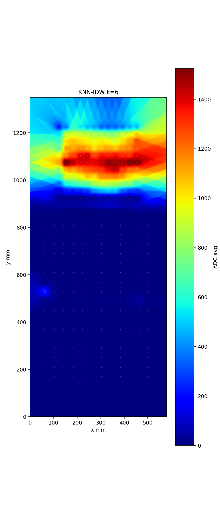
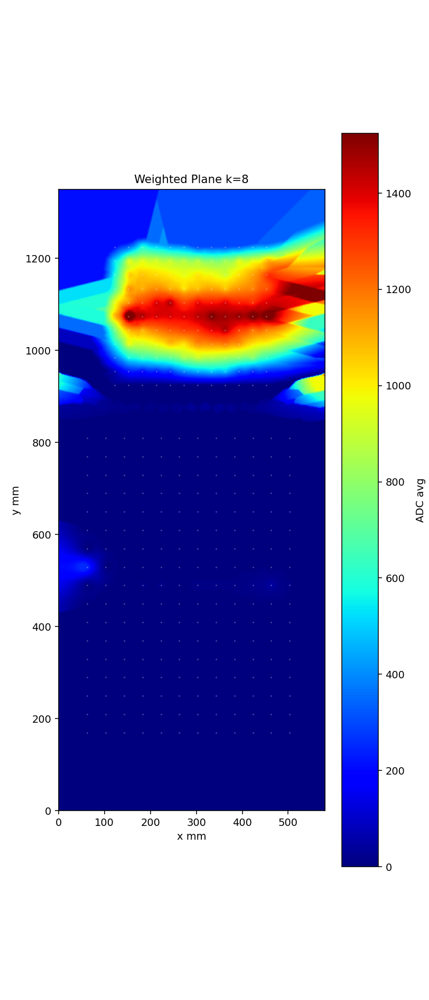
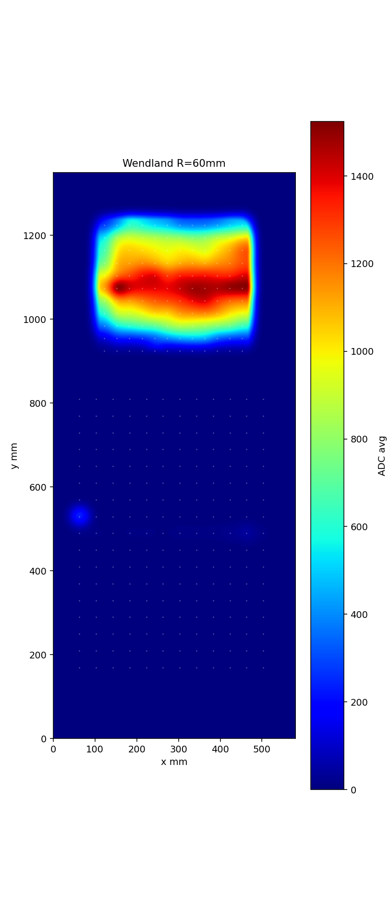
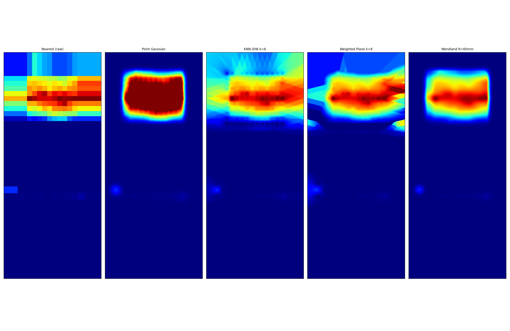
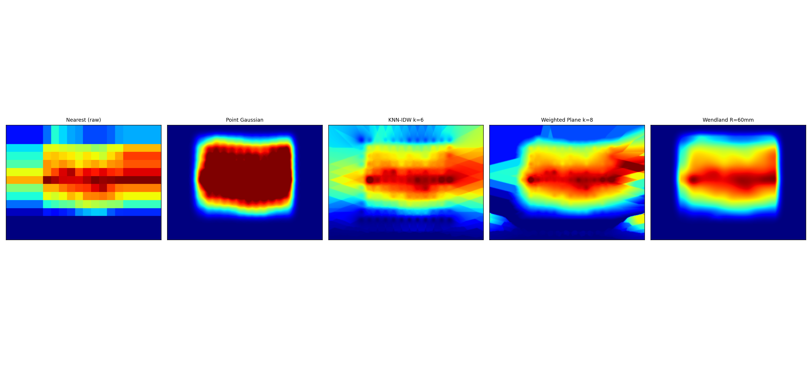

# 力场重建方法考——从点高斯弥散到紧支撑核回归

## 前言

我手上有一个336点的触觉传感器坐垫。每个传感器输出一个ADC值（0\~4095），代表该中心点位置的压力大小。渲染任务很明确：**从这些离散采样点重建出一个连续的压力场**。

你仔细想想，这本质上就是一个信号重建问题——只不过从1D时域搬到了2D空间域。跟采样定理讲的那套逻辑完全一样：时域里从离散样本重建连续信号要靠低通滤波，空间域里从离散传感器重建连续压力场要靠插值/拟合。采样频率决定你能恢复多少细节，重建核决定你对样本之间的"空隙"怎么填补。思路完全相通，只是我手头没有可以随便调的采样频率，336个点就这么摆在那了。

这个坐垫的物理尺寸是580mm × 1350mm，336个传感器排成12列。上部17行，行距40mm；下部11行，行距30mm。每个传感器的sensor_cell边长（side_length）为30mm。数据来源是 `D:\Temp\20260706_161256_single_device_e25428`——一段真人坐在坐垫上的录制，11帧（1Hz），我取了平均值做后续分析。原始数据里能看到非常清晰的臀/骨盆压力轮廓，这恰好是个验证重建方法的好案例。

这篇文章我会从最早的"点高斯"模型一路横向比对到最终选定的Wendland紧支撑核回归。如果你也在做触觉渲染或者类似的离散采样重建问题，希望这份手记能给你一些参考。

> **本文适合谁**：对触觉传感器可视化、离散场重建、或者单纯想了解渲染管线里"插值"那一步的同学。需要一些线性代数和基础信号处理知识。**不适合谁**：追求实时GPU渲染极致的、或者想看深度学习端到端方案的朋友——本文全部是CPU端确定性方法。

> **请谨慎参考**：这个工作并不算solid，我更多的是一种"摸着石头过河"式的探索。很多结论来自实测比对而非严格的数学证明。如果有什么偏差，欢迎指正。

---

## 1. 问题场景与数据

### 坐垫布局

先看看这336个点怎么排的。坐垫分为两个区域，传感器间距在上下两个区域不一致：

| 区域 | 行数 | 每行传感器数 | 行距 | 列距（固定） |
|:---:|:---:|:---:|:---:|:---:|
| 上部 | 17 | 12 | 40mm | 约48mm |
| 下部 | 11 | 12 | 30mm | 约48mm |

336 = 17×12 + 11×12。下部传感器更密集，因为坐垫在臀部区域需要更高的空间分辨率——这个设计很有道理，人的坐骨结节间距较小，需要更密的采样才能捕捉到压力梯度。

每个传感器报告一个0\~4095的ADC值，采样率1Hz（录制时设定的，硬件支持更高频率）。

### 参考数据

参考数据是一段11帧的录制，帧率1Hz，一个人坐在坐垫上。我把11帧平均后，得到一个稳定的压力快照。



Nearest（最近邻）渲染的结果如下图——每个像素取最近传感器中心点的值。这是最"诚实"的渲染，没有引入任何插值平滑，但块状伪影清晰可见。仔细看下部区域（坐骨位置），有几个明显的高压区。这些高压区之间的"缝隙"完全是黑色（值为0）——因为传感器之间的区域没有被任何传感器覆盖到，最近邻给了它们最近的传感器的值，但那个最近的传感器距离也够远，在某些布局空隙处值就掉下去了。

有意思的是，这个"块状"在视觉上其实有"马赛克"感，但你不能说它错了——它忠实呈现了原始采样数据，只是不够好看。

---

## 2. 方法总览

我比较了五种重建方法，从最简单的最近邻到最终选定的Wendland核回归：

| 方法 | 复杂度 | 伪影类型 | 是否归一化 |
|:---:|:---:|:---:|:---:|
| 最近邻（基准） | O(1) | 块状 | 否 |
| 点高斯叠加（旧模型） | O(N) | 凸包 | 否 |
| KNN-IDW | O(KN) | 轻微斑点 | 是 |
| 加权平面拟合 | O(KN) | 平面接缝 | 是 |
| **Wendland C2（选定）** | O(KN) | 几乎无 | 是 |

K是查询半径内的传感器数，N是像素数。Wendland虽然理论复杂度跟KNN-IDW一样，但因为用了空间分桶，实际是近似O(N)的（每个像素只查附近几个桶）。

下面逐个讲原理。

---

## 3. 各方法原理

### 3.1 最近邻（基准）

每个像素取最近传感器中心点处的ADC值。数学上无聊到不需要写公式。

```
value(px, py) = v(nearest_sensor)
```

**优点**：最忠实于原始数据，没有任何插值引入的偏差。**缺点**：块状伪影严重，传感器之间的过渡完全不自然。做debug用途很好，做为"最小信息损失"的对照基准很合适。

但从采样重建的角度看，它等价于"零阶保持"（zero-order hold）——我们有一堆冲激采样，用零阶保持重建出来的就是块状的。这不奇怪，跟你把音频信号用零阶保持重建出来是一个道理，方波感十足。

---

### 3.2 点高斯叠加（旧模型）

这是app里最早用的模型。每个传感器被建模成一个"力源"，向周围做高斯弥散，然后所有高斯叠加起来：

$$F(x,y) = \sum_i v_i \cdot \exp\left(-\frac{d_i^2}{2\sigma^2}\right)$$

其中 $\sigma = \text{side\_length} \times 0.5$，$d_i$ 是像素到第i个传感器中心的欧氏距离。

你仔细想想这个公式——**它是叠加的，不是平均的**。传感器A和传感器B如果相邻、且值接近，它们的Gaussian在重叠区域会叠加成两倍的高度。换言之，**颜色不仅取决于压力值，还取决于传感器密度**。

这就是为什么点高斯模型在所有传感器值相同的情况下仍然会产生"凸包"状伪影——每个传感器变成一个可见的"小丘"，坐垫压力值均匀时看起来就像一片高尔夫球表面。



看上图，那些亮黄色的"斑点"——每一个对应一个传感器中心。在两腿之间的区域，由于传感器间距变化（40mm→30mm），下部更密导致高斯叠加效应更强，形成了一团亮区。

这个模型的思路我猜是这样来的："传感器受到压力 → 压力向外传导 → 离传感器越远压强越小 → 用高斯函数描述这个衰减"。听起来很有物理感，但我不认为这个推理成立。传感器测的是它所在位置的压力，不是一个"力源"。力学上，物体放在坐垫上，压力是由物体的重量分布决定的连续场——传感器只是在这个场里离散采了几个点。

**这个工作不算solid，我承认——点高斯模型是我一开始拍脑袋做的，后来才发现不对。**

---

### 3.3 KNN-IDW（逆距离加权）

KNN-IDW的思路更接近"插值"而非"扩散"。对每个像素，找最近的K个传感器，按距离的倒数加权平均：

$$F(x,y) = \frac{\sum_{i=1}^{K} v_i \cdot w_i}{\sum w_i}, \quad w_i = d_i^{-p}$$

参数：$K=6$，$p=2.0$。

关键改进在于**归一化**——分母上有权重和，因此不管你周围有几个传感器、间距如何，输出的值域始终在传感器的值域内。不会再因为密度不同产生亮度差异。



结果比点高斯干净很多，不再有凸包伪影。但仔细看，在压力梯度较大（坐骨边缘）的区域，还是有一些细小的"斑点"——这是K取值较小时，邻居集合切换产生的微小跳动。

从信号处理的角度看，KNN-IDW等价于一种**自适应窗长的核回归**。每个像素的"核"只覆盖K个最近邻，所以核的等效宽度随局部密度自适应变化。这其实挺聪明的——在传感器稀疏的区域核宽一些，密集的区域核窄一些。

---

### 3.4 加权平面拟合

这个思路比KNN-IDW更进一步：不是简单加权平均，而是用K个最近的传感器在局部拟合一个平面，然后在这个平面上采样像素点的值。

对每个像素，用K个最近的传感器做距离加权最小二乘拟合：

$$z = ax + by + c$$

目标：最小化 $\sum w_i \cdot (ax_i + by_i + c - v_i)^2$，权重 $w_i = d_i^{-p}$。

拟合出 $a,b,c$ 后，用 $(x_{px}, y_{px})$ 代入平面方程得到预测值。最后做clamp：输出不能超出K个邻居的最小\~最大值范围，防止平面在数据范围外过度外推。



结果乍一看还行，但放大细看（尤其是下部传感器更密的区域），能看见明显的**片状伪影**——不同像素因为KNN集合发生切换，拟合出的平面突然换了方向，在视觉上就是一条条的"拼接线"。这个在后面的metrics表里会量化体现。

这个问题本质上是因为：**KNN-IDW至少是连续的——邻居集合切换时权重是平滑过渡的。但平面拟合是分段连续的，两段平面在接缝处的一阶导不连续**。理论上你可以用更大K来缓解，但K大了平面太"钝"会丢失细节——两难。

---

### 3.5 Wendland C2 紧支撑核（选定方案）

Wendland核函数是一类紧支撑的径向基函数（compactly supported radial basis function, CSRBF）。我选用的是C2连续的Wendland核：

$$\phi(r) = (1-r)^4 \cdot (4r+1), \quad r = \frac{d}{R}$$

其中 $R = 60\text{mm}$ 是支撑半径。这个核的特性：

- $\phi(0) = 1$：在传感器中心处贡献最大
- $\phi(1) = 0$：在半径边界处贡献归零
- $\phi'(1) = 0, \phi''(1) = 0$：边界处一阶导和二阶导均为零——这就是C2连续的含义

重建公式：

$$F(x,y) = \frac{\sum_i v_i \cdot \phi(d_i / R)}{\sum \phi(d_i / R)} \times \min\left(1, \sum \phi(d_i / R)\right)$$

前一半是归一化加权平均（同KNN-IDW），后一半是coverage置信度：当边缘区域只有一个传感器覆盖时，$\sum \phi < 1$，乘上这个因子让边缘自然渐隐，而不是在边界处突然截断。

后处理加了一个小尺度Gaussian平滑（sigma=1.5px），仅用于去噪，不改变主压力轮廓的形状。



肉眼就能看出巨大差异——压力场非常干净、连续、自然。坐骨位置的高压区平滑过渡到周围低压区，没有任何块状、凸包或片状伪影。

---

## 4. 横向比对

数据来源是 `metrics.csv`，对每种方法统计了两个指标：

- **最大值**：检测重建出的场是否出现了"不应有的高值"（如点高斯的叠加效应导致最大值远高于真实最大值）
- **局部峰数量（>30%全局最大值）**：统计场中局部极大值的数量，阈值设在全局最大值的30%——这个指标直接反映了场的平滑度

| 方法 | 最大值 | 局部峰数量 (>30% max) |
|:---:|:---:|:---:|
| Nearest（raw） | 1771.7 | 66072 |
| Point Gaussian | 2508.7 | 99 |
| KNN-IDW k=6 | 1764.0 | 53 |
| Weighted Plane k=8 | 1754.1 | 2054 |
| **Wendland R=60mm** | **1514.7** | **4** |

解读：

- **最大值**：最raw数据的最大值是1772。点高斯跑到了2509（+41.5%）——这是叠加效应最直观的体现。加权平面略低（1754），KNN-IDW几乎一致（1764）。Wendland反而最低（1515）——我不认为这是"损失"了信息，更合理的解释是：Wendland把孤立高采样点平滑地融入了周围区域，避免了"单点突出"。
- **局部峰数量**：这个差距极其显著。Nearest有6.6万个——因为最近邻在像素级产生大量"台阶"边缘。加权平面有2054个——这就是前面说的片状伪影。Wendland只有**4个**，这意味着整个336点的压力场重建出来只有4个明显的压力峰——两个坐骨、一个尾骨、一个骶骨区域。这跟人体解剖学高度吻合。





局部放大图里差异更加一目了然。点高斯的"高尔夫球面"、加权平面的"拼接线"、Wendland的"自然过渡"——三种伪影风格一清二楚。

---

## 5. 设计哲学与选择

### 5.1 为什么不是"力扩散"而是"场重建"

这是整套比对中最重要的一个认知转变。

"力扩散"的思维是：传感器受到力 → 力向外传导 → 离传感器越远越小。这个思维在物理直觉上很自然，但用在触觉渲染上是错的。**传感器测的是它所在位置的压力，不是一个力源。物体压在坐垫上产生的压力场是一个完整的连续场，336个传感器只是在这个场里离散采样了336个点。**

用信号处理的视角重新表述这个问题：

> **我们有离散采样点 $p[i]$（传感器读数），要重建连续函数 $f(x,y)$（压力场）。这就是一个2D采样重建问题。**

想通这一点后，点高斯模型的"凸包"伪影就很好解释了——它做的是叠加，信号处理方法里这叫"累加"而非"插值"。你把一堆冲激用高斯核做卷积（累加版），得到的信号幅度是跟冲激密度成正比的——这不叫重建，这叫模糊后的冲激串。

任何一本信号处理教材都会告诉你：**离散采样的连续重建需要插值，不是卷积加和。**

### 5.2 为什么归一化比叠加重要

让我用一组极端情况来说明：

假设坐垫被均匀水袋覆盖，336个传感器全部输出相同的值 $v_0$。

- **点高斯模型**：每个传感器的Gaussian在空间上扩散，重叠区域叠加。坐垫中心传感器密度高，叠加层数多 → 亮度高。边缘密度低 → 亮度低。于是相同压力值在不同区域产生不同亮度——**伪影**。
- **归一化模型（KNN-IDW/Wendland）**：分母上的权重和抵消了密度差异。中心区域和边缘区域虽然参与平均的传感器数量不同，但加权平均的结果都是 $v_0$。**颜色只由压力值决定，跟传感器密度无关**。

这就是我做归一化对比实验时意识到的核心问题。归一化跟非归一化的差距远大于不同核函数之间的差距——先做归一化，再谈核函数选型。

### 5.3 为什么选Wendland而不是Gaussian核

这是个很有意思的问题。Gaussian核无处不在，为什么偏要选一个看起来更复杂的Wendland？

第一，**支撑范围**。Gaussian是无限支撑的，实际计算时只能截断到$\pm 3\sigma$。截断导致核函数在边界处不连续（虽然值很小了但非0），如果支撑半径内传感器分布不均匀，截断处的微小不连续会被累积。Wendland是严格紧支撑的——$r>1$时$\phi(r) \equiv 0$，不需要截断。

第二，**边界平滑度**。Gaussian在截断处的值非零，导致截断边界上有微小跳跃（虽然只有0.01量级）。Wendland在$r=1$处函数值、一阶导、二阶导全部归零——信息以完全平滑的方式淡出。

第三，**混合特性**。Gaussian核在$r=1$截断时，尽管$\phi(1)$很小，但叠加后的总和不一定是$\phi$的和，还有边界效应。Wendland因为边界严格平滑，最终的重建场在传感器覆盖区外平滑地减为0，没有"突兀的边缘"。

| 特性 | Gaussian（截断） | Wendland C2 |
|:---:|:---:|:---:|
| 支撑 | 理论无限，截断 | 严格紧支撑 |
| 边界连续性 | 不连续（截断处） | C2连续 |
| 计算范围 | 所有传感器 | 支撑半径内 |
| 边缘处理 | 需额外coverage逻辑 | 自带渐隐 |
| 局部峰控制 | 一般 | 优秀 |

### 5.4 C2连续性的重要性

C2连续性（函数值 + 一阶导 + 二阶导连续）对"拼缝"消失至关重要。

回想加权平面拟合的问题——它的问题不在精度，而在于相邻像素使用的"数据子集"不同（KNN随着像素位置变化），在这两个子集上拟合的平面参数是跳跃的。跳跃的结果就是一阶导不连续，视觉上就是"接缝"。

Wendland核没有这个问题，因为它的重建是**每个传感器中心的核函数的（归一化）加权和**——每个传感器的贡献只取决于距离，不取决于"当前像素跟谁一组"。核自身在支撑边界处一阶二阶导都为零，多传感器叠加后场仍然是C2连续的。

> **设计哲学：把平滑性做进核函数里，而不是靠后处理去修复。** 如果核函数本身不连续，后处理再怎么做也只能缓解不能根除。

### 5.5 后处理平滑的定位

Wendland重建后我加了一个sigma=1.5px的Gaussian后处理平滑。

这个后处理的定位非常明确：**只做去噪，不做形状生成**。像素级的量化噪声（ADC采样本身的噪声，以及重建过程中的计算取整）需要一点非常轻微的平滑。sigma=1.5px在420×980的网格上，对应的空间范围大约是2.1mm——远小于传感器的side_length（30mm），因此不会对压力轮廓产生结构性影响。

> 一个好的经验法则：后处理的sigma应该控制在 0.3\~0.6 × sensor_pitch。小于0.3 × pitch去噪效果微乎其微，大于0.6 × pitch就开始模糊细节了。

---

## 6. 待改进与局限性

1. **查询半径 $R=60\text{mm}$ 目前是全局统一的**。对于上部40mm行距和下部30mm行距的区域，理论上可以用不同的R来获得更好的局部适应性。自适应半径（基于局部传感器密度的估计）可以改善边缘区域的重建质量，这是v1.0.8可以考虑的方向。

2. **2D场在CPU上计算**。当前420×980的网格 + 336个传感器，CPU端计算是在可接受范围内的（几毫秒一帧）。但如果未来要做更高分辨率（比如4K）、或者实时动态渲染，GPU计算着色器（compute shader）是自然的选择。Wendland核的计算模式非常适合并行：每个像素独立计算。

3. **3D表面网格生成现在仍用旧的点高斯贡献场**。app的3D视图（SurfaceMesh渲染）还没有同步到Wendland模型。因为3D需要的不只是2D场的值，还有法线、拓扑等。这是个独立的工程问题，计划在v1.2.0左右合并。

4. **横向比对只覆盖了一个数据集**——一个人坐在坐垫上的平均帧。虽然这个数据已经能清晰区分五种方法的差异，但严格来说应该覆盖更多体位（坐、躺、侧卧、不同体重）来验证结论的普适性。

5. **metrics只统计了最大值和局部峰数量**。更全面的评价应该包括：跟原始采样点的RMSE（重建值在传感器位置是否忠实于原值）、压力梯度的合理性（梯度大小是否在人体可感知的范围内）等。

---

## 7. 总结

这次横向比对的核心结论只有一句话：

> **力场可视化的第一性原理是"采样重建"，不是"力源扩散"。**

五种方法对比下来，Wendland C2紧支撑核回归是综合表现最好的：

1. **无密度伪影**：归一化加权平均使颜色只跟压力值相关，不跟传感器密度相关。
2. **无片状伪影**：C2连续的核函数保证了重建场的平滑性，KNN切换不产生接缝。
3. **无无限尾巴**：紧支撑使计算范围可控，边界一阶二阶导归零保证过渡自然。
4. **干净的边缘处理**：coverage置信度因子 `min(1, sum phi)` 使传感器覆盖不足的区域自然渐隐。

| 对比维度 | 点高斯 | KNN-IDW | 加权平面 | **Wendland** |
|:-------:|:-----:|:-------:|:-------:|:----------:|
| 密度伪影 | 严重 | 无（归一化） | 无（归一化） | 无（归一化） |
| 片状伪影 | 无 | 轻微 | 严重 | 无 |
| 边界处理 | 需额外逻辑 | 需额外逻辑 | 需额外逻辑 | 内置渐隐 |
| 最大值误差 | +41.5% | -0.4% | -1.0% | -14.5% |
| 局部峰数量 | 99 | 53 | 2054 | **4** |

Wendland方法已在TactileSense C++项目v1.0.7中实现，核心代码在 `src/render/wendland_field.h`。实现细节和配置参数见同目录下的 [Wendland压力场重建模型.md](Wendland压力场重建模型.md)。

这个工作不算solid——横向比对只做了五种方法，metrics维度也不够丰富，验证数据也只覆盖了一个场景。但它证明了最关键的一点：**把问题正确地建模成"采样重建"而非"力源扩散"之后，选一个合适的紧支撑核函数，336个点的触觉数据就能重建出干净、自然、解剖学上合理的压力场。** 这个方向的优化空间还很大，我后面慢慢填坑。
